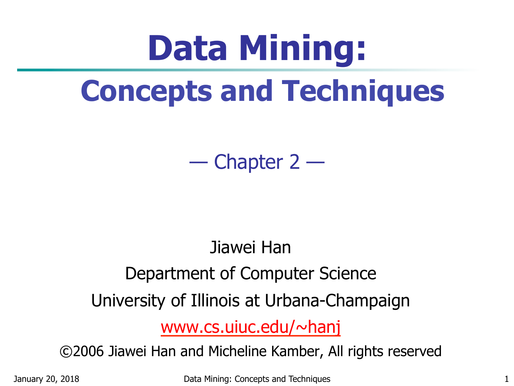

#### Chapter 2: Data Preprocessing

n Why preprocess the data?

n Descriptive data summarization

n Data cleaning

n Data integration and transformation

n Data reduction

n Discretization and concept hierarchy generation

n Summary

January 20, 2018 Data Mining: Concepts and Techniques 2

#### Why Data Preprocessing?

n Data in the real world is dirty

n incomplete: lacking attribute values, lacking

certain attributes of interest, or containing
only aggregate data

n e.g., occupation=“ ”

n noisy: containing errors or outliers

n e.g., Salary=“-10”

n inconsistent: containing discrepancies in codes

or names

n e.g., Age=“42” Birthday=“03/07/1997”

n e.g., Was rating “1,2,3”, now rating “A, B, C”

n e.g., discrepancy between duplicate records

January 20, 2018 Data Mining: Concepts and Techniques 3

#### Why Is Data Dirty?

n Incomplete data may come from

n “Not applicable” data value when collected

n Different considerations between the time when the data was

collected and when it is analyzed.

n Human/hardware/software problems

n Noisy data (incorrect values) may come from

n Faulty data collection instruments

n Human or computer error at data entry

n Errors in data transmission

n Inconsistent data may come from

n Different data sources

n Functional dependency violation (e.g., modify some linked data)

n Duplicate records also need data cleaning

January 20, 2018 Data Mining: Concepts and Techniques 4

###### Why Is Data Preprocessing Important?

n No quality data, no quality mining results!

n Quality decisions must be based on quality data

n e.g., duplicate or missing data may cause incorrect or even

misleading statistics.

n Data warehouse needs consistent integration of quality

data

n Data extraction, cleaning, and transformation comprises

the majority of the work of building a data warehouse

January 20, 2018 Data Mining: Concepts and Techniques 5

Multi-Dimensional Measure of Data Quality

n A well-accepted multidimensional view:

n Accuracy

n Completeness

n Consistency

n Timeliness

n Believability

n Value added

n Interpretability

n Accessibility

n Broad categories:

n Intrinsic, contextual, representational, and accessibility

January 20, 2018 Data Mining: Concepts and Techniques 6

Major Tasks in Data Preprocessing

n Data cleaning

n Fill in missing values, smooth noisy data, identify or remove

outliers, and resolve inconsistencies

n Data integration

n Integration of multiple databases, data cubes, or files

n Data transformation

n Normalization and aggregation

n Data reduction

n Obtains reduced representation in volume but produces the same

or similar analytical results

n Data discretization

n Part of data reduction but with particular importance, especially

for numerical data

January 20, 2018 Data Mining: Concepts and Techniques 7

Forms of Data Preprocessing

January 20, 2018 Data Mining: Concepts and Techniques 8

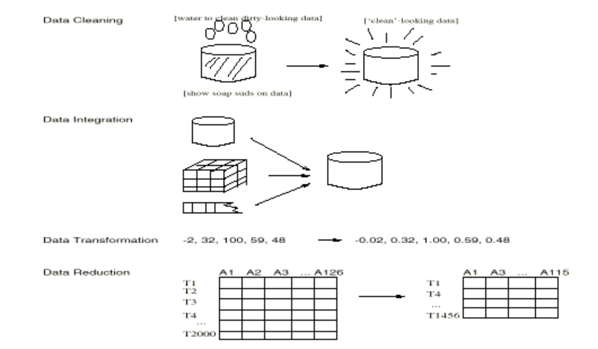
#### Chapter 2: Data Preprocessing

n Why preprocess the data?

n Descriptive data summarization

n Data cleaning

n Data integration and transformation

n Data reduction

n Discretization and concept hierarchy generation

n Summary

January 20, 2018 Data Mining: Concepts and Techniques 9

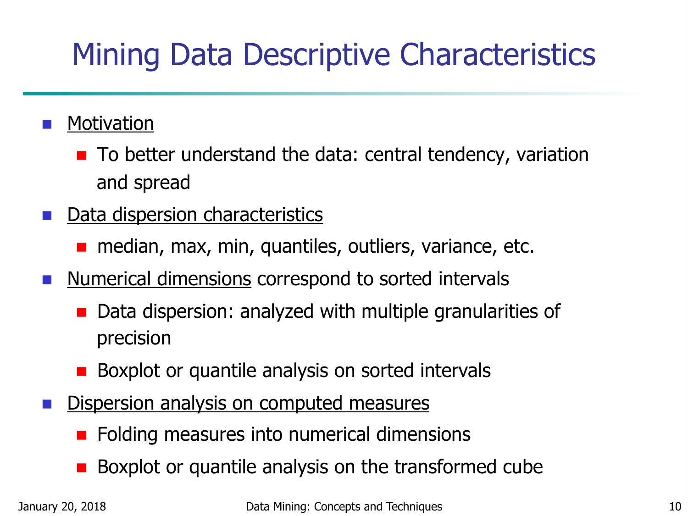

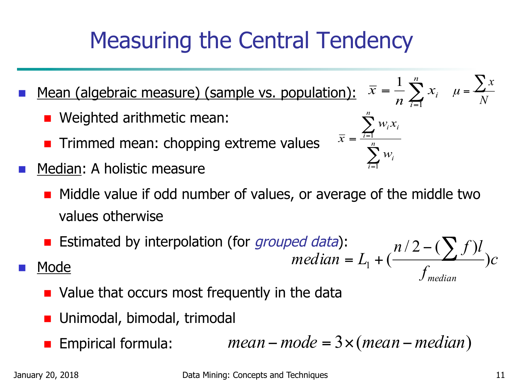

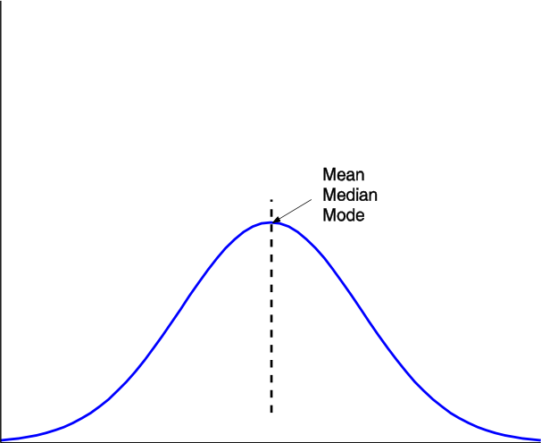

n Median, mean and mode of

symmetric, positively and
negatively skewed data

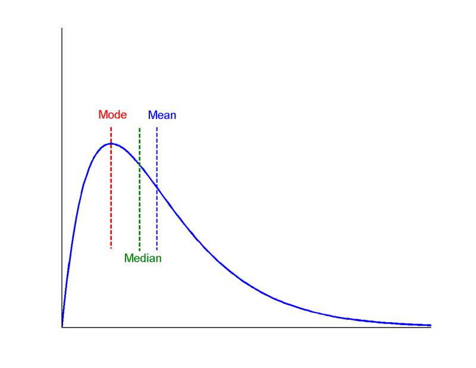

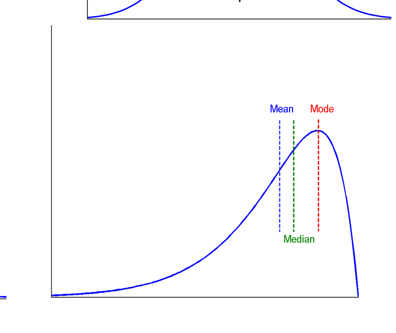
Measuring the Dispersion of Data

n Quartiles, outliers and boxplots

n Quartiles: Q (25 [th] percentile), Q (75 [th] percentile)
1 3

n Inter-quartile range: IQR = Q  - Q
3 1

n Five number summary: min, Q, M, Q, max
1 3

n Boxplot: ends of the box are the quartiles, median is marked, whiskers, and

plot outlier individually

n Outlier: usually, a value higher/lower than 1.5 x IQR

n Variance and standard deviation (sample: s, population: σ)

n Variance: (algebraic, scalable computation)

_n_

_n_

2 2

_n_

2 = 1 _n_ ( _xi_ - ~~_x_~~ )2 = 1 [ _n_ _xi_ 2 - 1 ( _n_ _xi_ )2 ] σ2 = 1 _n_ ( _xi_ −µ)2 = 1 _n_

∑ ∑ ∑ ∑ ∑

_n_ −1 _i_ 1 _n_ −1 _i_ 1 _n_ _i_ 1 _N_ _i_ 1 _N_ _i_ 1

_n_

σ2 = 1 _n_ ( _xi_ −µ)2 = 1 _n_ _xi_ 2 −µ

= ( _xi_ −µ) = _xi_ 

( _xi_ −µ)2 = _xi_

∑ ∑

_N_ _i_ =1 _N_ _i_ =1

_n_

_s_ 2 = ( _xi_ - ~~_x_~~ )2 = [ _xi_ - ( _xi_

∑ ∑ ∑

_n_ −1 _i_ 1 _n_ −1 _i_ 1 _n_ _i_ 1

_i_

( _xi_   - ~~_x_~~ ) = [ _xi_   - (

∑ ∑ ∑

2 2

= ( _xi_ - ~~_x_~~ ) = [ _xi_ 
∑ ∑

_n_ −1 _i_ =1 _n_ −1 _i_ =1

_i_

_i_ _i_

_i_

_i_

=1 _i_ =1 _i_ =

1

_i_

1 _i_ =1

=1 _i_ =

1

_i_

n Standard deviation s (or σ) is the square root of variance s [2 (] orσ [2) ]

January 20, 2018 Data Mining: Concepts and Techniques 13

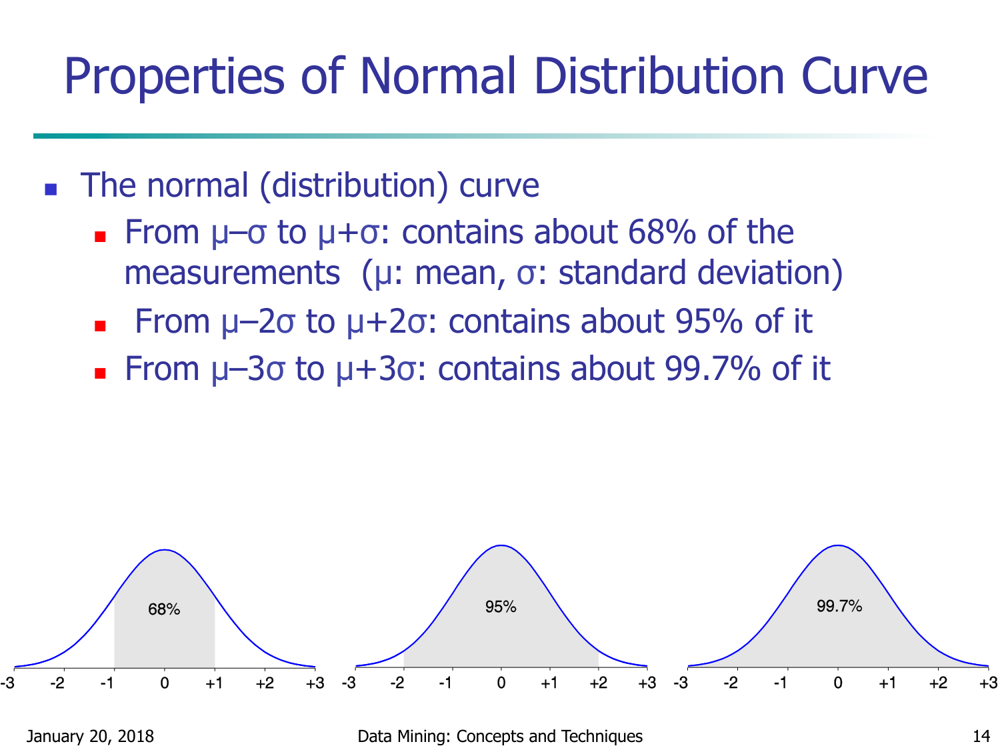

#### Boxplot Analysis

n Five-number summary of a distribution:

Minimum, Q1, M, Q3, Maximum

n Boxplot

n Data is represented with a box

n The ends of the box are at the first and third

quartiles, i.e., the height of the box is IRQ

n The median is marked by a line within the box

n Whiskers: two lines outside the box extend to

Minimum and Maximum

January 20, 2018 Data Mining: Concepts and Techniques 15

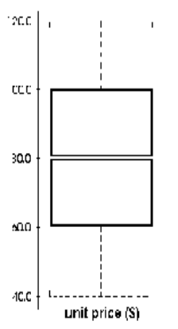
Visualization of Data Dispersion: Boxplot Analysis

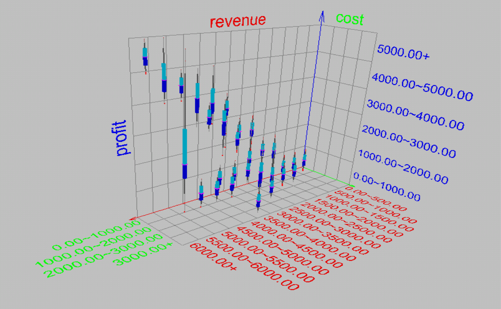
#### Histogram Analysis

n Graph displays of basic statistical class descriptions

n Frequency histograms

n A univariate graphical method

n Consists of a set of rectangles that reflect the counts or

frequencies of the classes present in the given data

January 20, 2018 Data Mining: Concepts and Techniques 17

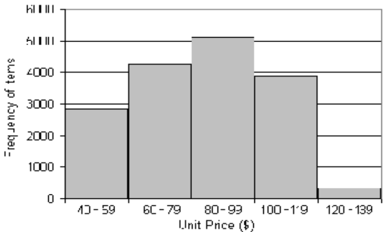
#### Quantile Plot

n Displays all of the data (allowing the user to assess both

the overall behavior and unusual occurrences)

n Plots quantile information

n For a data x data sorted in increasing order, f
i i

indicates that approximately 100 f% of the data are
i
below or equal to the value x

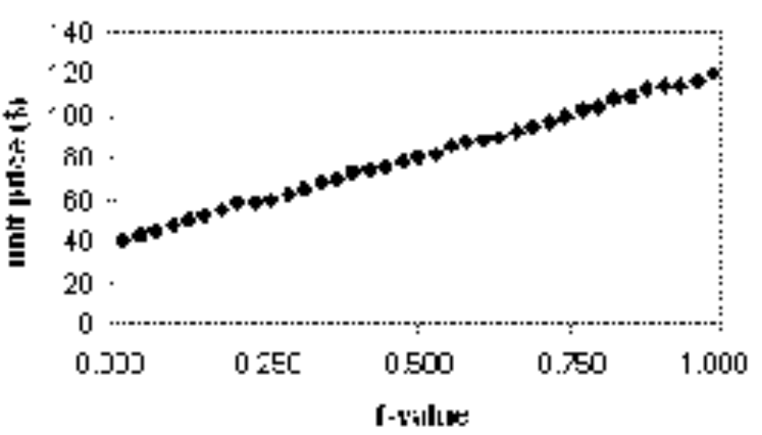
#### Quantile-Quantile (Q-Q) Plot

n Graphs the quantiles of one univariate distribution against

the corresponding quantiles of another

n Allows the user to view whether there is a shift in going

from one distribution to another

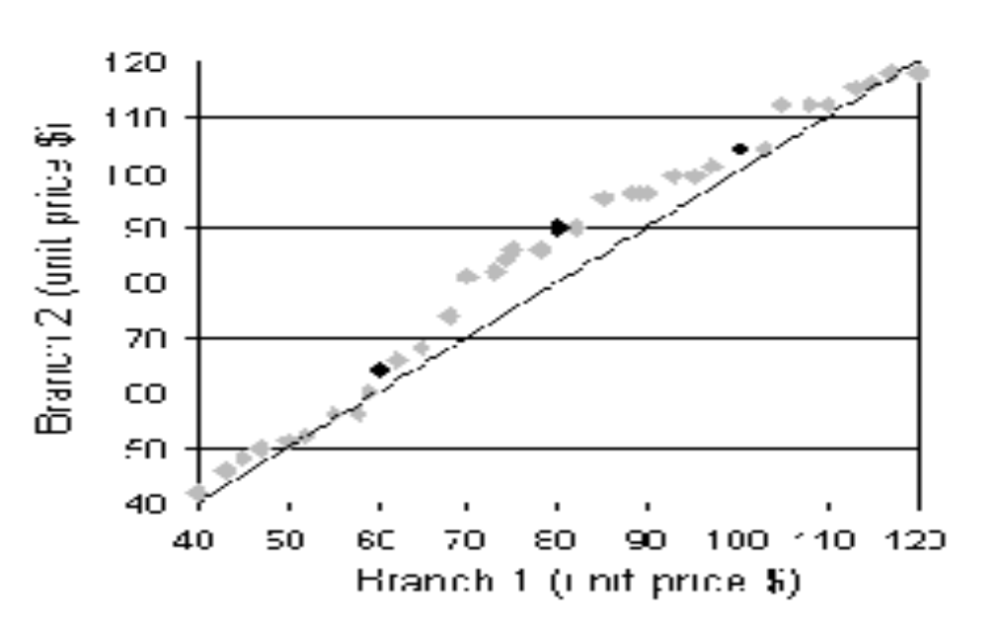
#### Scatter plot

n Provides a first look at bivariate data to see clusters of

points, outliers, etc

n Each pair of values is treated as a pair of coordinates and

plotted as points in the plane

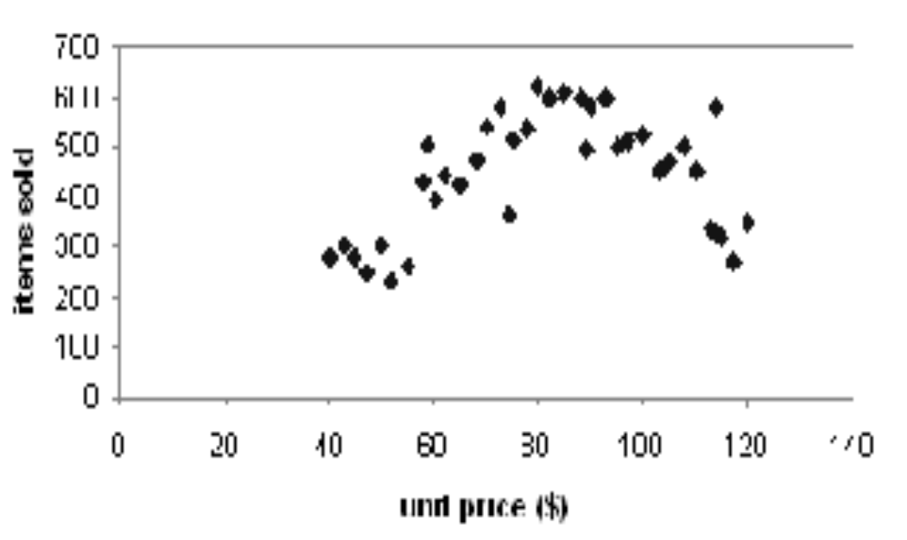
#### Loess Curve

n Adds a smooth curve to a scatter plot in order to

provide better perception of the pattern of dependence

n Loess curve is fitted by setting two parameters: a

smoothing parameter, and the degree of the
polynomials that are fitted by the regression

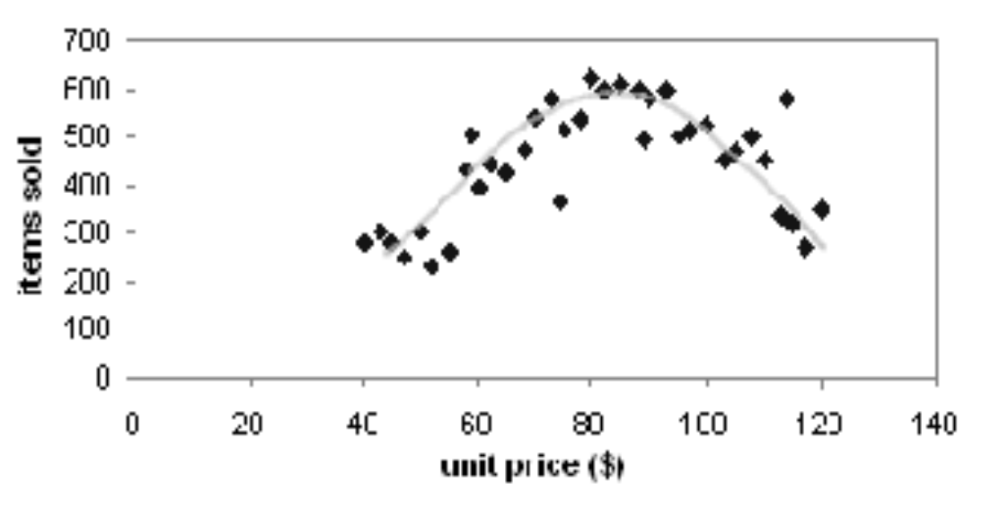
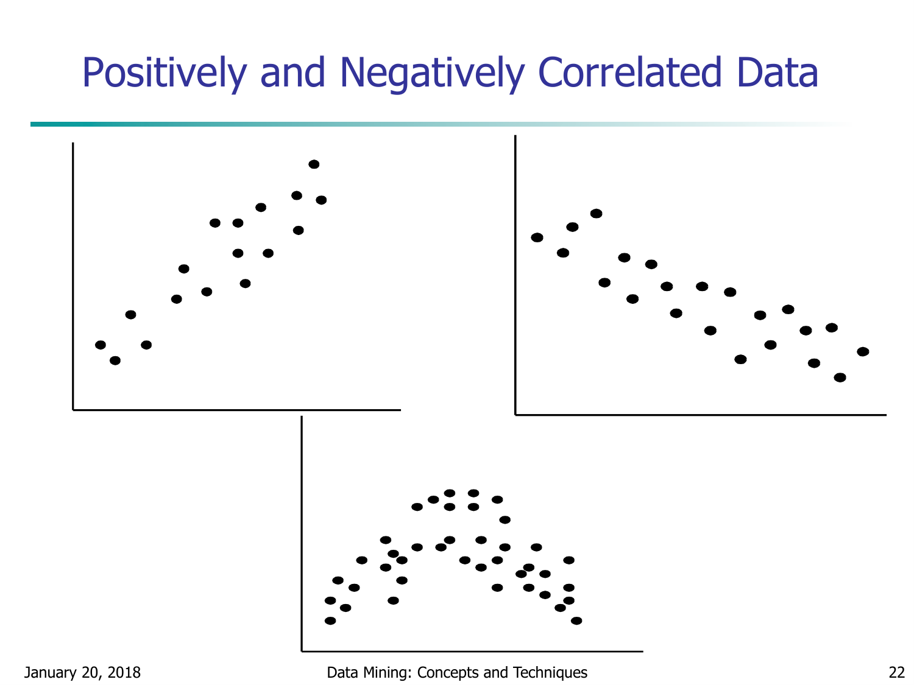

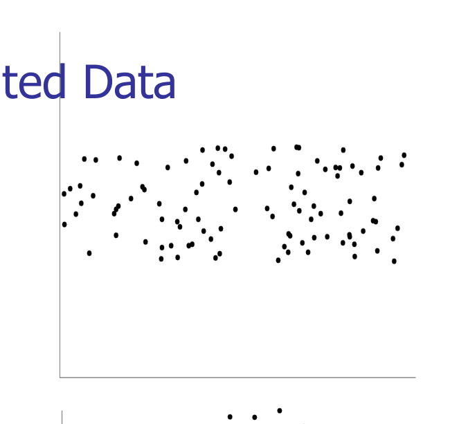

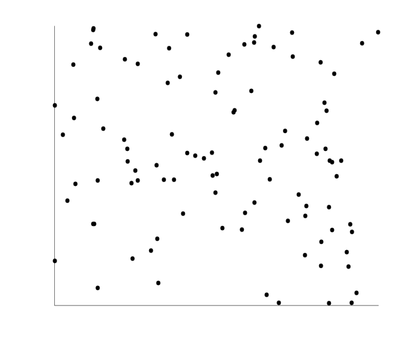

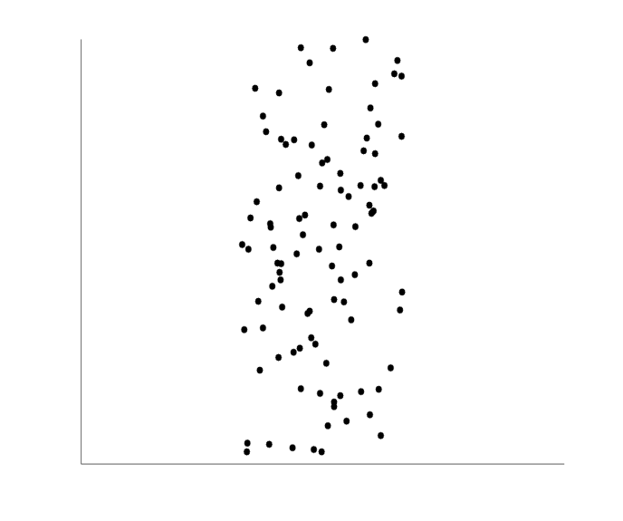
Graphic Displays of Basic Statistical Descriptions

n Histogram: (shown before)

n Boxplot: (covered before)

n Quantile plot: each value x is paired with f indicating
i i

that approximately 100 fi % of data are ≤ xi

n Quantile-quantile (q-q) plot: graphs the quantiles of one

univariant distribution against the corresponding quantiles
of another

n Scatter plot: each pair of values is a pair of coordinates

and plotted as points in the plane

n Loess (local regression) curve: add a smooth curve to a

scatter plot to provide better perception of the pattern of
dependence

January 20, 2018 Data Mining: Concepts and Techniques 24

#### Chapter 2: Data Preprocessing

n Why preprocess the data?

n Descriptive data summarization

n Data cleaning

n Data integration and transformation

n Data reduction

n Discretization and concept hierarchy generation

n Summary

January 20, 2018 Data Mining: Concepts and Techniques 25

#### Data Cleaning

n Importance

n “Data cleaning is one of the three biggest problems

in data warehousing”—Ralph Kimball

n “Data cleaning is the number one problem in data

warehousing”—DCI survey

n Data cleaning tasks

n Fill in missing values

n Identify outliers and smooth out noisy data

n Correct inconsistent data

n Resolve redundancy caused by data integration

January 20, 2018 Data Mining: Concepts and Techniques 26

#### Missing Data

n Data is not always available

n E.g., many tuples have no recorded value for several

attributes, such as customer income in sales data

n Missing data may be due to

n equipment malfunction

n inconsistent with other recorded data and thus deleted

n data not entered due to misunderstanding

n certain data may not be considered important at the time of

entry

n not register history or changes of the data

n Missing data may need to be inferred.

January 20, 2018 Data Mining: Concepts and Techniques 27

#### How to Handle Missing Data?

n Ignore the tuple: usually done when class label is missing (assuming

the tasks in classification—not effective when the percentage of

missing values per attribute varies considerably.

n Fill in the missing value manually: tedious + infeasible?

n Fill in it automatically with

n a global constant : e.g., “unknown”, a new class?!

n the attribute mean

n the attribute mean for all samples belonging to the same class:

smarter

n the most probable value: inference-based such as Bayesian

formula or decision tree

January 20, 2018 Data Mining: Concepts and Techniques 28

#### Noisy Data

n Noise: random error or variance in a measured variable

n Incorrect attribute values may due to

n faulty data collection instruments

n data entry problems

n data transmission problems

n technology limitation

n inconsistency in naming convention

n Other data problems which requires data cleaning

n duplicate records

n incomplete data

n inconsistent data

January 20, 2018 Data Mining: Concepts and Techniques 29

#### How to Handle Noisy Data?

n Binning

n first sort data and partition into (equal-frequency) bins

n then one can smooth by bin means, smooth by bin

median, smooth by bin boundaries, etc.

n Regression

n smooth by fitting the data into regression functions

n Clustering

n detect and remove outliers

n Combined computer and human inspection

n detect suspicious values and check by human (e.g.,

deal with possible outliers)

January 20, 2018 Data Mining: Concepts and Techniques 30

Simple Discretization Methods: Binning

n Equal-width (distance) partitioning

n Divides the range into N intervals of equal size: uniform grid

n if A and B are the lowest and highest values of the attribute, the

width of intervals will be: W = (B –A)/N.

n The most straightforward, but outliers may dominate presentation

n Skewed data is not handled well

n Equal-depth (frequency) partitioning

n Divides the range into N intervals, each containing approximately

same number of samples

n Good data scaling

n Managing categorical attributes can be tricky

January 20, 2018 Data Mining: Concepts and Techniques 31

#### Binning Methods for Data Smoothing

q Sorted data for price (in dollars): 4, 8, 9, 15, 21, 21, 24, 25, 26,

28, 29, 34

  - Partition into equal-frequency (equi-depth) bins:
  - Bin 1: 4, 8, 9, 15
  - Bin 2: 21, 21, 24, 25
  - Bin 3: 26, 28, 29, 34

  - Smoothing by bin means:
  - Bin 1: 9, 9, 9, 9
  - Bin 2: 23, 23, 23, 23
  - Bin 3: 29, 29, 29, 29

  - Smoothing by bin boundaries:
  - Bin 1: 4, 4, 4, 15
  - Bin 2: 21, 21, 25, 25
  - Bin 3: 26, 26, 26, 34

January 20, 2018 Data Mining: Concepts and Techniques 32

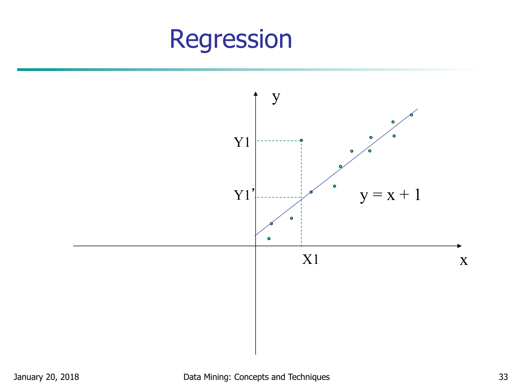

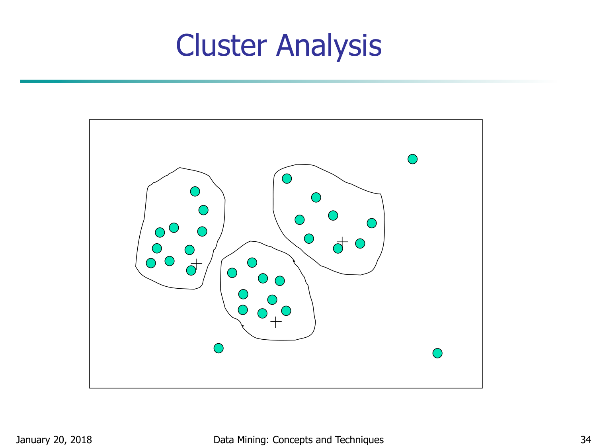

#### Data Cleaning as a Process

n Data discrepancy detection

n Use metadata (e.g., domain, range, dependency, distribution)

n Check field overloading

n Check uniqueness rule, consecutive rule and null rule

n Use commercial tools

n Data scrubbing: use simple domain knowledge (e.g., postal

code, spell-check) to detect errors and make corrections

n Data auditing: by analyzing data to discover rules and

relationship to detect violators (e.g., correlation and clustering
to find outliers)

n Data migration and integration

n Data migration tools: allow transformations to be specified

n ETL (Extraction/Transformation/Loading) tools: allow users to

specify transformations through a graphical user interface

n Integration of the two processes

n Iterative and interactive (e.g., Potter’s Wheels)

January 20, 2018 Data Mining: Concepts and Techniques 35

#### Chapter 2: Data Preprocessing

n Why preprocess the data?

n Data cleaning

n Data integration and transformation

n Data reduction

n Discretization and concept hierarchy generation

n Summary

January 20, 2018 Data Mining: Concepts and Techniques 36

#### Data Integration

n Data integration:

n Combines data from multiple sources into a coherent

store

n Schema integration: e.g., A.cust-id ≡ B.cust-#

n Integrate metadata from different sources

n Entity identification problem:

n Identify real world entities from multiple data sources,

e.g., Bill Clinton = William Clinton

n Detecting and resolving data value conflicts

n For the same real world entity, attribute values from

different sources are different

n Possible reasons: different representations, different

scales, e.g., metric vs. British units

January 20, 2018 Data Mining: Concepts and Techniques 37

Handling Redundancy in Data Integration

n Redundant data occur often when integration of multiple

databases

n Object identification: The same attribute or object

may have different names in different databases

n Derivable data: One attribute may be a “derived”

attribute in another table, e.g., annual revenue

n Redundant attributes may be able to be detected by

correlation analysis

n Careful integration of the data from multiple sources may

help reduce/avoid redundancies and inconsistencies and
improve mining speed and quality

January 20, 2018 Data Mining: Concepts and Techniques 38

Correlation Analysis (Numerical Data)

n Correlation coefficient (also called Pearson’s product

moment coefficient)

( _A_      - _A_ )( _B_      - _B_ ) ( _AB_ )      - _n_
## ∑ ∑

_rA_, _B_ = =

_A_ _B_ _A_ _B_

( _n_ −1)σσ ( _n_ −1)σσ

( _A_ - _A_ )( _B_ - _B_ )

_A_ - _A_ )( _B_ - _B_ ) ( _AB_ )
## ∑

=

_A_ _B_

( _n_ −1)σσ ( _n_ −1

 - _A_ )( _B_ - _B_ ) ( _AB_ ) - _n_ _AB_
## ∑

=

_A_ _B_ _A_ _B_

_n_ −1)σσ ( _n_ −1)σσ

( _A_    - _A_ )( _B_    - _B_ )
## ∑ ∑

= =

- _A_ )( _B_ - _B_ ) ( _AB_ ) ## ∑

=

_A_ _B_

−1)σσ ( _n_ −1)

, _B_

_A_ _B_

( _n_ −1)σσ ( _n_      

_A_ _B_ _A_ _B_

σ ( _n_ −1)σσ

where n is the number of tuples, _A_ and   are the respective _B_

_A_ _B_

means of A and B, σ and σ are the respective standard deviation
A B
of A and B, and Σ(AB) is the sum of the AB cross-product.

n If r - 0, A and B are positively correlated (A’s values
A,B

increase as B’s). The higher, the stronger correlation.

n r = 0: independent; r < 0: negatively correlated
A,B A,B

January 20, 2018 Data Mining: Concepts and Techniques 39

Correlation Analysis (Categorical Data)

n Χ [2] (chi-square) test

2 ( _Observed_  - _Expected_ )2
χ =

( _Observed_    
=
## ∑
_Expected_

## ∑

n The larger the Χ [2] value, the more likely the variables are

related

n The cells that contribute the most to the Χ [2] value are

those whose actual count is very different from the
expected count

n Correlation does not imply causality

n # of hospitals and # of car-theft in a city are correlated

n Both are causally linked to the third variable: population

January 20, 2018 Data Mining: Concepts and Techniques 40

Chi-Square Calculation: An Example

|Col1|Play chess|Not play chess|Sum (row)|
|---|---|---|---|
|Like science fiction|250(90)|200(360)|450|
|Not like science fiction|50(210)|1000(840)|1050|
|Sum(col.)|300|1200|1500|

n Χ [2] (chi-square) calculation (numbers in parenthesis are

expected counts calculated based on the data distribution
in the two categories)

2 (250  - 90)2 (50  - 210)2 (200  - 360)2 (1000  - 840)2
χ = + + + =

- 90)2 (50 - 210)
+

90 210

- 210)2 (200 - 360)
+

210 360

- 360)2 (1000 - 840)
+

360 840

= 507.93

840

n It shows that like_science_fiction and play_chess are

correlated in the group

January 20, 2018 Data Mining: Concepts and Techniques 41

#### Data Transformation

n Smoothing: remove noise from data

n Aggregation: summarization, data cube construction

n Generalization: concept hierarchy climbing

n Normalization: scaled to fall within a small, specified

range

n min-max normalization

n z-score normalization

n normalization by decimal scaling

n Attribute/feature construction

n New attributes constructed from the given ones

January 20, 2018 Data Mining: Concepts and Techniques 42

#### Data Transformation: Normalization

n Min-max normalization: to [new_min, new_max ]
A A

_v_   - _minA_
_v_ '= ( _new_ _ _maxA_ - _new_ _ _minA_ ) + _new_ _

_maxA_  - _minA_

_A_

( _new_ _ _maxA_        - _new_ _ _minA_ ) + _new_ _ _min_

_maxA_ - _minA_

_A_ _A_ _A_

_A_ _A_

n Ex. Let income range $12,000 to $98,000 normalized to [0.0,

73,600 −12,000

0.1(         - 0) + 0 =
98,000 −12,000

1.0]. Then $73,000 is mapped to

0.1(         - 0) + 0 = .0716
98,000 −12,000

n Z-score normalization (µ: mean, σ: standard deviation):

_v_ −µ _A_
_v_ ' =

_A_

σ

_v_ −µ _A_

' =

_A_

n Ex. Let µ = 54,000, σ = 16,000. Then

n Normalization by decimal scaling

73,600 - 54,000
= .1225

16,000

_v_
_v_ '= Where _j_ is the smallest integer such that Max(|ν’|) < 1
10 _j_

January 20, 2018 Data Mining: Concepts and Techniques 43

#### Chapter 2: Data Preprocessing

n Why preprocess the data?

n Data cleaning

n Data integration and transformation

n Data reduction

n Discretization and concept hierarchy generation

n Summary

January 20, 2018 Data Mining: Concepts and Techniques 44

Data Reduction Strategies

n Why data reduction?

n A database/data warehouse may store terabytes of data

n Complex data analysis/mining may take a very long time to run

on the complete data set

n Data reduction

n Obtain a reduced representation of the data set that is much

smaller in volume but yet produce the same (or almost the
same) analytical results

n Data reduction strategies

n Data cube aggregation:

n Dimensionality reduction — e.g., remove unimportant attributes

n Data Compression

n Numerosity reduction — e.g., fit data into models

n Discretization and concept hierarchy generation

January 20, 2018 Data Mining: Concepts and Techniques 45

#### Data Cube Aggregation

n The lowest level of a data cube (base cuboid)

n The aggregated data for an individual entity of interest

n E.g., a customer in a phone calling data warehouse

n Multiple levels of aggregation in data cubes

n Further reduce the size of data to deal with

n Reference appropriate levels

n Use the smallest representation which is enough to

solve the task

n Queries regarding aggregated information should be

answered using data cube, when possible

January 20, 2018 Data Mining: Concepts and Techniques 46

#### Attribute Subset Selection

n Feature selection (i.e., attribute subset selection):

n Select a minimum set of features such that the

probability distribution of different classes given the
values for those features is as close as possible to the
original distribution given the values of all features

n reduce # of patterns in the patterns, easier to

understand

n Heuristic methods (due to exponential # of choices):

n Step-wise forward selection

n Step-wise backward elimination

n Combining forward selection and backward elimination

n Decision-tree induction

January 20, 2018 Data Mining: Concepts and Techniques 47

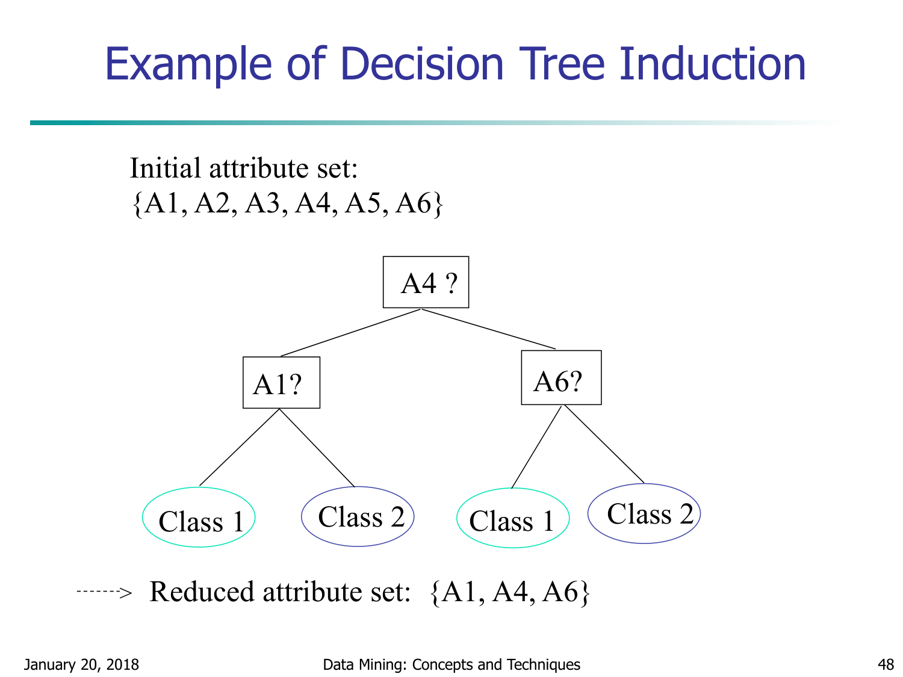

#### Heuristic Feature Selection Methods

n There are 2 [d ] possible sub-features of d features

n Several heuristic feature selection methods:

n Best single features under the feature independence

assumption: choose by significance tests

n Best step-wise feature selection:

n The best single-feature is picked first

n Then next best feature condition to the first, ...

n Step-wise feature elimination:

n Repeatedly eliminate the worst feature

n Best combined feature selection and elimination

n Optimal branch and bound:

n Use feature elimination and backtracking

January 20, 2018 Data Mining: Concepts and Techniques 49

#### Data Compression

n String compression

n There are extensive theories and well-tuned algorithms

n Typically lossless

n But only limited manipulation is possible without

expansion

n Audio/video compression

n Typically lossy compression, with progressive

refinement

n Sometimes small fragments of signal can be

reconstructed without reconstructing the whole

n Time sequence is not audio

n Typically short and vary slowly with time

January 20, 2018 Data Mining: Concepts and Techniques 50

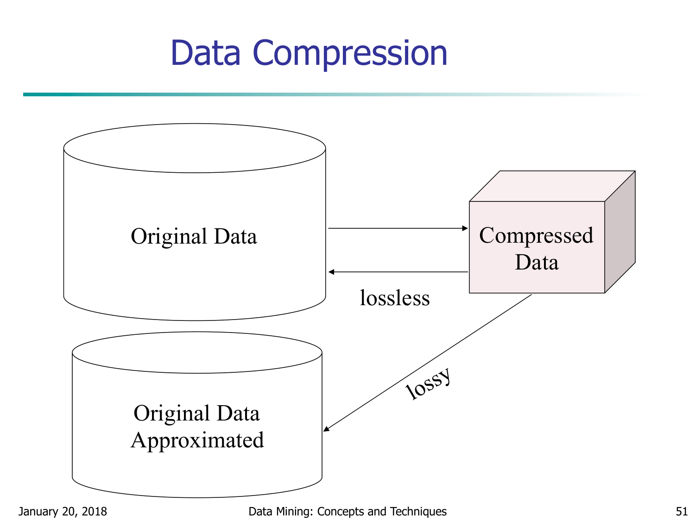

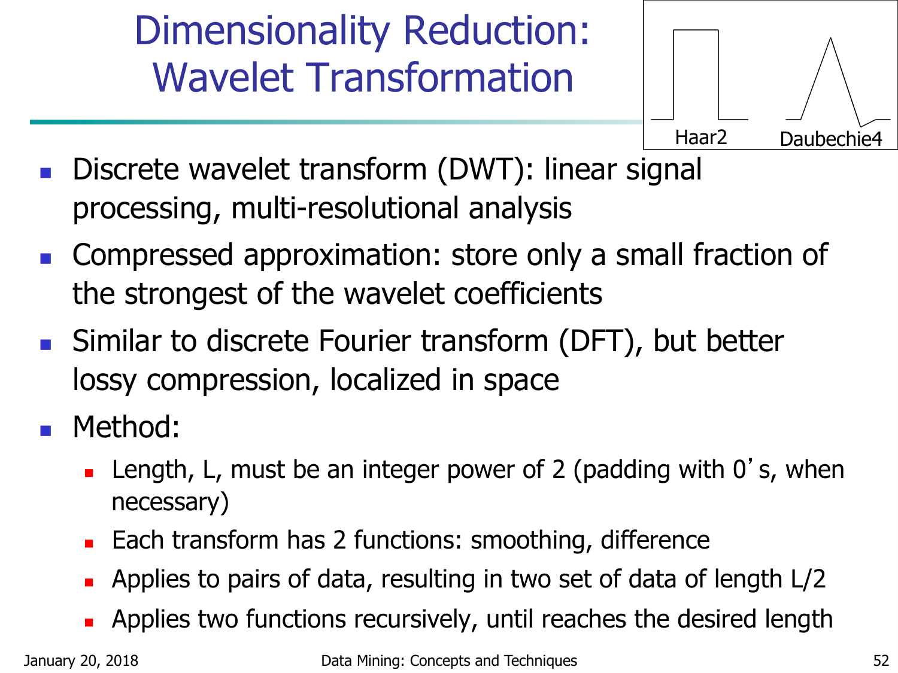

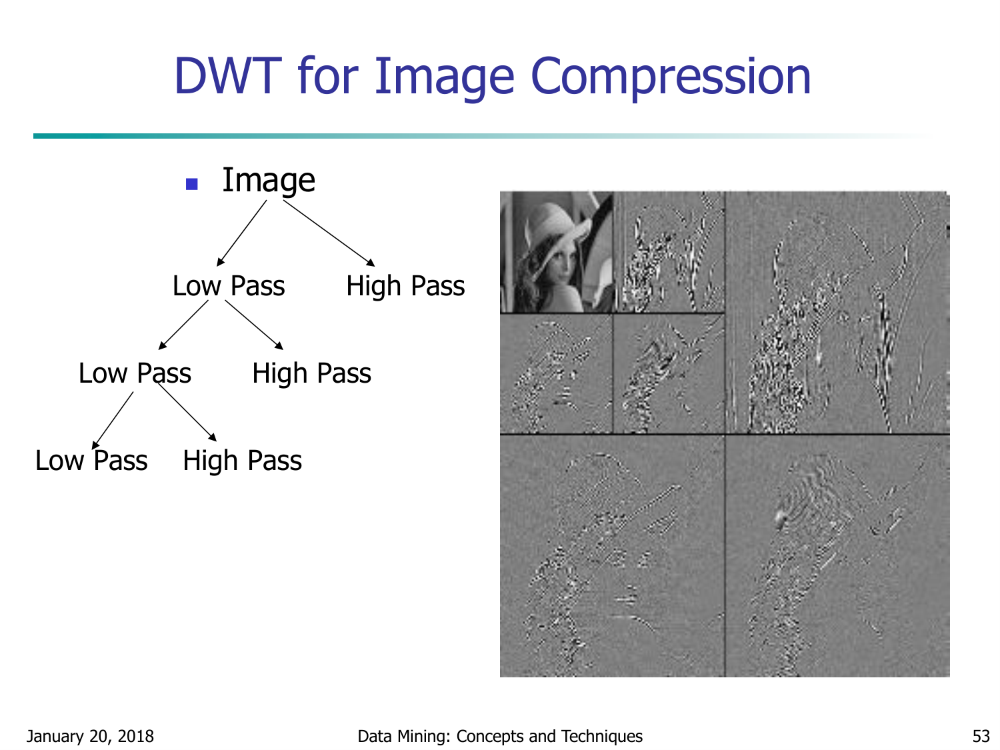

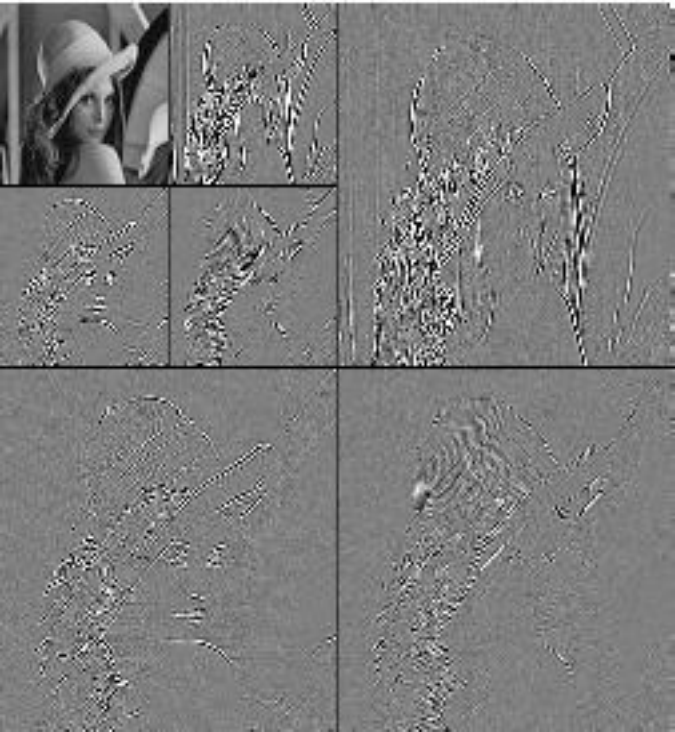
#### Dimensionality Reduction: Principal Component Analysis (PCA)

n Given N data vectors from n-dimensions, find k ≤ n orthogonal
vectors (principal components) that can be best used to represent data

n Steps

n Normalize input data: Each attribute falls within the same range

n Compute k orthonormal (unit) vectors, i.e., principal components

n Each input data (vector) is a linear combination of the k principal

component vectors

n The principal components are sorted in order of decreasing

“significance” or strength

n Since the components are sorted, the size of the data can be

reduced by eliminating the weak components, i.e., those with low
variance. (i.e., using the strongest principal components, it is
possible to reconstruct a good approximation of the original data

n Works for numeric data only

n Used when the number of dimensions is large

January 20, 2018 Data Mining: Concepts and Techniques 54

**Principal Component Analysis**

X2

Y1

X1

|Y2|Col2|
|---|---|
|||

January 20, 2018 Data Mining: Concepts and Techniques 55

#### Numerosity Reduction

n Reduce data volume by choosing alternative, smaller

forms of data representation

n Parametric methods

n Assume the data fits some model, estimate model

parameters, store only the parameters, and discard
the data (except possible outliers)

n Example: Log-linear models—obtain value at a point

in m-D space as the product on appropriate marginal
subspaces

n Non-parametric methods

n Do not assume models

n Major families: histograms, clustering, sampling

January 20, 2018 Data Mining: Concepts and Techniques 56

#### Data Reduction Method (1): Regression and Log-Linear Models

n Linear regression: Data are modeled to fit a straight line

n Often uses the least-square method to fit the line

n Multiple regression: allows a response variable Y to be

modeled as a linear function of multidimensional feature

vector

n Log-linear model: approximates discrete

multidimensional probability distributions

January 20, 2018 Data Mining: Concepts and Techniques 57

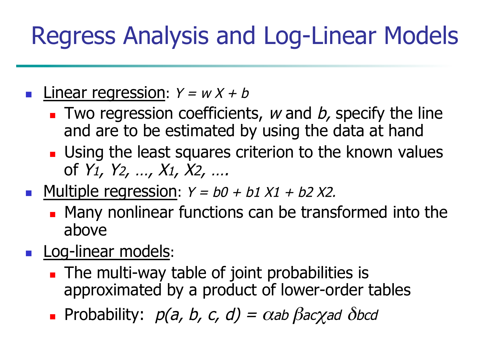

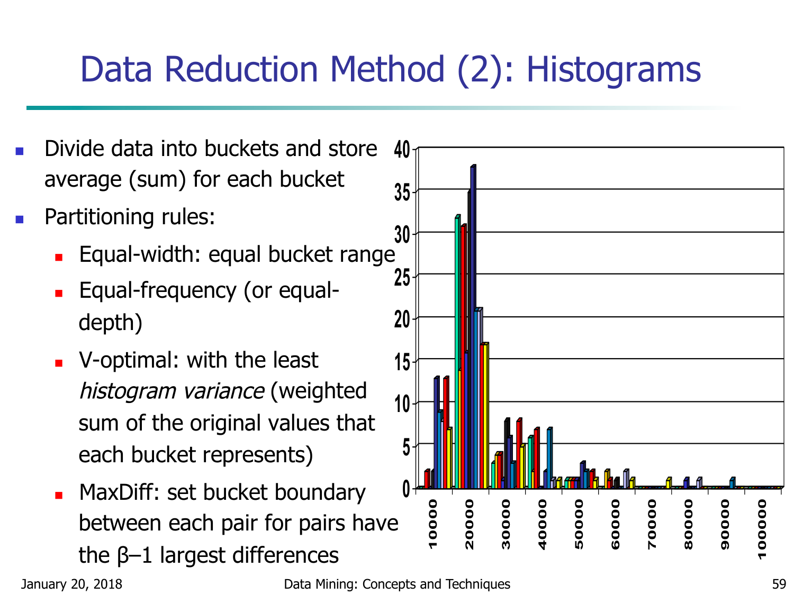

#### Data Reduction Method (3): Clustering

n Partition data set into clusters based on similarity, and store cluster

representation (e.g., centroid and diameter) only

n Can be very effective if data is clustered but not if data is

“smeared”

n Can have hierarchical clustering and be stored in multi-dimensional

index tree structures

n There are many choices of clustering definitions and clustering

algorithms

n Cluster analysis will be studied in depth in Chapter 7

January 20, 2018 Data Mining: Concepts and Techniques 60

Data Reduction Method (4): Sampling

n Sampling: obtaining a small sample s to represent the

whole data set N

n Allow a mining algorithm to run in complexity that is

potentially sub-linear to the size of the data

n Choose a representative subset of the data

n Simple random sampling may have very poor

performance in the presence of skew

n Develop adaptive sampling methods

n Stratified sampling:

n Approximate the percentage of each class (or

subpopulation of interest) in the overall database

n Used in conjunction with skewed data

n Note: Sampling may not reduce database I/Os (page at a

time)

January 20, 2018 Data Mining: Concepts and Techniques 61

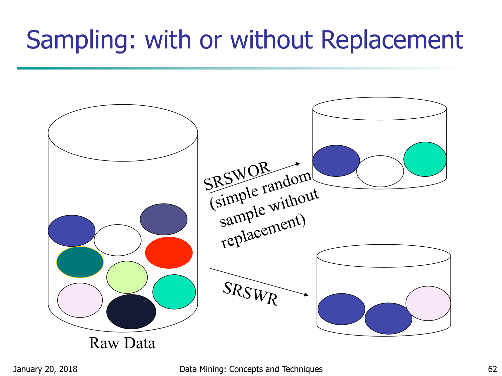

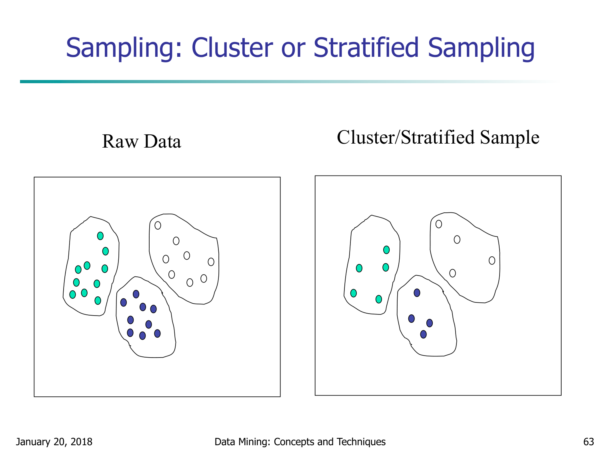

#### Chapter 2: Data Preprocessing

n Why preprocess the data?

n Data cleaning

n Data integration and transformation

n Data reduction

n Discretization and concept hierarchy generation

n Summary

January 20, 2018 Data Mining: Concepts and Techniques 64

#### Discretization

n Three types of attributes:

n Nominal — values from an unordered set, e.g., color, profession

n Ordinal — values from an ordered set, e.g., military or academic

rank

n Continuous — real numbers, e.g., integer or real numbers

n Discretization:

n Divide the range of a continuous attribute into intervals

n Some classification algorithms only accept categorical attributes.

n Reduce data size by discretization

n Prepare for further analysis

January 20, 2018 Data Mining: Concepts and Techniques 65

#### Discretization and Concept Hierarchy

n Discretization

n Reduce the number of values for a given continuous attribute by

dividing the range of the attribute into intervals

n Interval labels can then be used to replace actual data values

n Supervised vs. unsupervised

n Split (top-down) vs. merge (bottom-up)

n Discretization can be performed recursively on an attribute

n Concept hierarchy formation

n Recursively reduce the data by collecting and replacing low level

concepts (such as numeric values for age) by higher level concepts

(such as young, middle-aged, or senior)

January 20, 2018 Data Mining: Concepts and Techniques 66

Discretization and Concept Hierarchy

Generation for Numeric Data

n Typical methods: All the methods can be applied recursively

n Binning (covered above)

n Top-down split, unsupervised,

n Histogram analysis (covered above)

n Top-down split, unsupervised

n Clustering analysis (covered above)

n Either top-down split or bottom-up merge, unsupervised

n Entropy-based discretization: supervised, top-down split

n Interval merging by χ [2] Analysis: unsupervised, bottom-up merge

n Segmentation by natural partitioning: top-down split, unsupervised

January 20, 2018 Data Mining: Concepts and Techniques 67

#### Entropy-Based Discretization

n Given a set of samples S, if S is partitioned into two intervals S and S
1 2
using boundary T, the information gain after partitioning is

| _S_ 1 | | _S_ 2 |
_I_ ( _S_, _T_ ) = _Entropy_ ( _S_ 1) + _Entropy_ ( _S_ 2

| _S_ | | _S_ |

_S_ 1 | | _S_ 2 |
_Entropy_ ( _S_ 1) +

| _S_ | | _S_ |

2 _Entropy_ ( _S_ 2)

| _S_ |

n Entropy is calculated based on class distribution of the samples in the
set. Given m classes, the entropy of S is
1

_m_

_Entropy_ ( _S_ 1) = - _pi_ log 2 ( _pi_

( _S_ 1) = - _pi_ log 2 ( _pi_ )

∑

= 
_i_ =

_i_

1

where p is the probability of class i in S
i 1

n The boundary that minimizes the entropy function over all possible
boundaries is selected as a binary discretization

n The process is recursively applied to partitions obtained until some
stopping criterion is met

n Such a boundary may reduce data size and improve classification
accuracy

January 20, 2018 Data Mining: Concepts and Techniques 68

#### Interval Merge by  Analysis χ [2]

n Merging-based (bottom-up) vs. splitting-based methods

n Merge: Find the best neighboring intervals and merge them to form

larger intervals recursively

n ChiMerge [Kerber AAAI 1992, See also Liu et al. DMKD 2002]

n Initially, each distinct value of a numerical attr. A is considered to be

one interval

n χ [2 ] tests are performed for every pair of adjacent intervals

n Adjacent intervals with the least χ [2 ] values are merged together,

since low χ [2 ] values for a pair indicate similar class distributions

n This merge process proceeds recursively until a predefined stopping

criterion is met (such as significance level, max-interval, max

inconsistency, etc.)

January 20, 2018 Data Mining: Concepts and Techniques 69

#### Segmentation by Natural Partitioning

n A simply 3-4-5 rule can be used to segment numeric data

into relatively uniform, “natural” intervals.

n If an interval covers 3, 6, 7 or 9 distinct values at the

most significant digit, partition the range into 3 equi
width intervals

n If it covers 2, 4, or 8 distinct values at the most

significant digit, partition the range into 4 intervals

n If it covers 1, 5, or 10 distinct values at the most

significant digit, partition the range into 5 intervals

January 20, 2018 Data Mining: Concepts and Techniques 70

#### Example of 3-4-5 Rule

|count|Col2|
|---|---|
|||
|||

Step 1: -$351 -$159 profit $1,838 $4,700

Min       Low (i.e, 5%-tile) High(i.e, 95%-0 tile)    Max

Step 2:             msd=1,000 Low=-$1,000 High=$2,000

Step 3:

Step 4:

-$300)

-$200)

-$100)

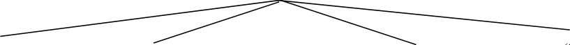

($4,000 $5,000)

(-$400 - 0)

($1,000 - $2,000)

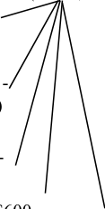

(0 $200)

(-$1,000 - 0) (0 -$ 1,000)

(-$400 -$5,000)

($1,000 $1,200)

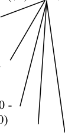

$1,400)

($1,600 ($1,800 $1,800)
$2,000)

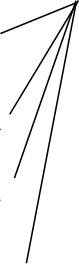

(-$100 0)

$800) ($800 $1,000)

January 20, 2018 Data Mining: Concepts and Techniques 71

Concept Hierarchy Generation for Categorical Data

n Specification of a partial/total ordering of attributes

explicitly at the schema level by users or experts

n street < city < state < country

n Specification of a hierarchy for a set of values by explicit

data grouping

n {Urbana, Champaign, Chicago} < Illinois

n Specification of only a partial set of attributes

n E.g., only street < city, not others

n Automatic generation of hierarchies (or attribute levels) by

the analysis of the number of distinct values

n E.g., for a set of attributes: {street, city, state, country}

January 20, 2018 Data Mining: Concepts and Techniques 72

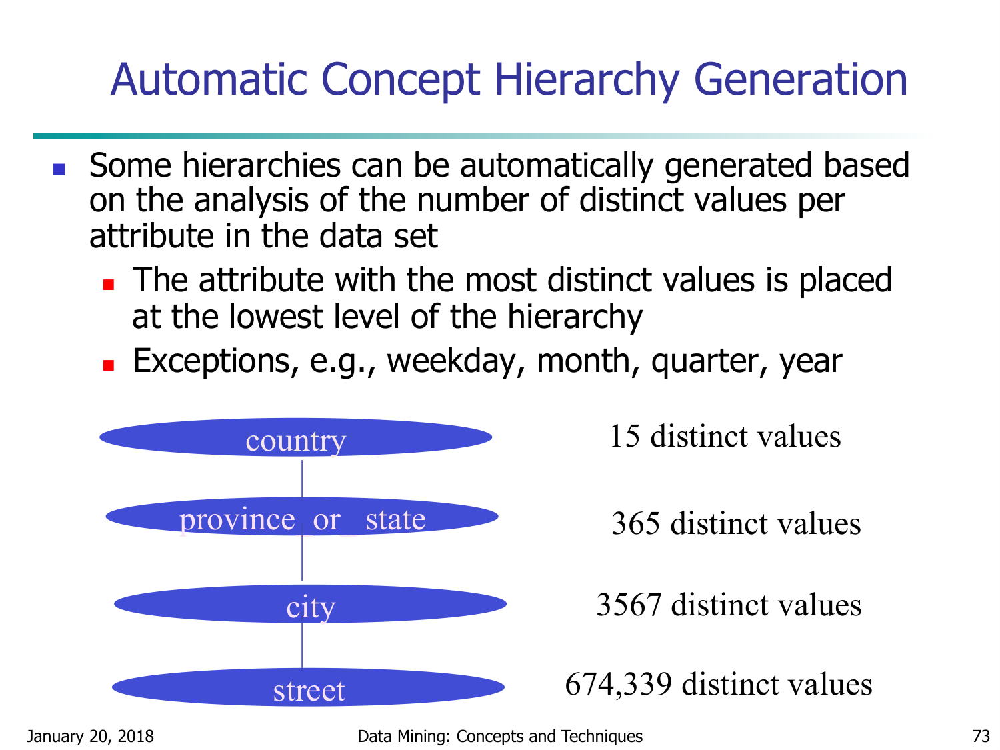

#### Chapter 2: Data Preprocessing

n Why preprocess the data?

n Data cleaning

n Data integration and transformation

n Data reduction

n Discretization and concept hierarchy

generation

n Summary

January 20, 2018 Data Mining: Concepts and Techniques 74

#### Summary

n Data preparation or preprocessing is a big issue for both

data warehousing and data mining

n Discriptive data summarization is need for quality data

preprocessing

n Data preparation includes

n Data cleaning and data integration

n Data reduction and feature selection

n Discretization

n A lot a methods have been developed but data

preprocessing still an active area of research

January 20, 2018 Data Mining: Concepts and Techniques 75

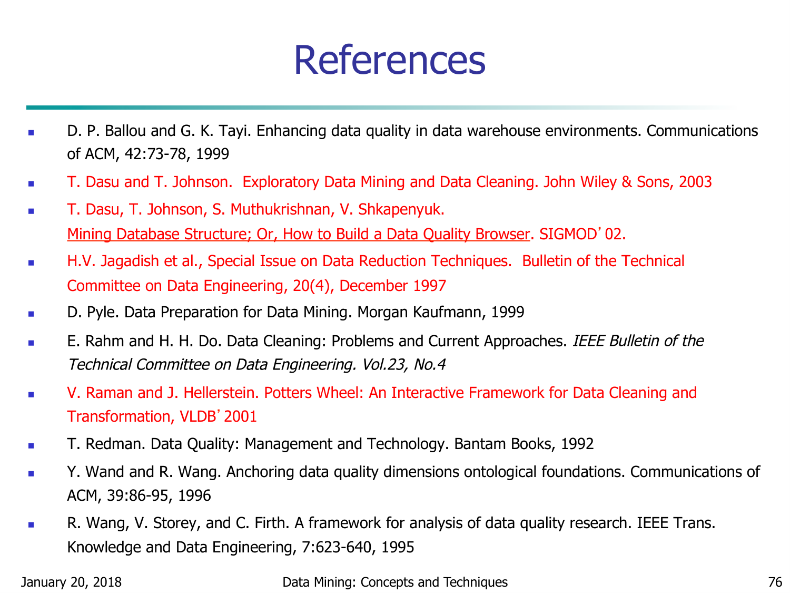

January 20, 2018 Data Mining: Concepts and Techniques 77

