##### **Data Preprocessing**
# **3**

**Today’s real-world databases are** highly susceptible to noisy, missing, and inconsistent data
due to their typically huge size (often several gigabytes or more) and their likely origin
from multiple, heterogenous sources. Low-quality data will lead to low-quality mining
results. _“How can the data be preprocessed in order to help improve the quality of the data_
_and, consequently, of the mining results? How can the data be preprocessed so as to improve_
_the efficiency and ease of the mining process?”_
There are several data preprocessing techniques. _Data cleaning_ can be applied to
remove noise and correct inconsistencies in data. _Data integration_ merges data from
multiple sources into a coherent data store such as a data warehouse. _Data reduction_
can reduce data size by, for instance, aggregating, eliminating redundant features, or
clustering. _Data transformations_ (e.g., normalization) may be applied, where data are
scaled to fall within a smaller range like 0.0 to 1.0. This can improve the accuracy and
efficiency of mining algorithms involving distance measurements. These techniques are
not mutually exclusive; they may work together. For example, data cleaning can involve
transformations to correct wrong data, such as by transforming all entries for a _date_ field
to a common format.
In Chapter 2, we learned about the different attribute types and how to use basic
statistical descriptions to study data characteristics. These can help identify erroneous
values and outliers, which will be useful in the data cleaning and integration steps.
Data processing techniques, when applied before mining, can substantially improve the
overall quality of the patterns mined and/or the time required for the actual mining.
In this chapter, we introduce the basic concepts of data preprocessing in Section 3.1.
The methods for data preprocessing are organized into the following categories: data
cleaning (Section 3.2), data integration (Section 3.3), data reduction (Section 3.4), and
data transformation (Section 3.5).

⃝ **Data Mining: Concepts and Techniques** c 2012 Elsevier Inc. All rights reserved. **83**

**84** Chapter 3 _Data Preprocessing_

**[Data Preprocessing: An Overview]**
## 3.1

This section presents an overview of data preprocessing. Section 3.1.1 illustrates the
many elements defining data quality. This provides the incentive behind data preprocessing. Section 3.1.2 outlines the major tasks in data preprocessing.

3.1.1 **Data Quality: Why Preprocess the Data?**

Data have quality if they satisfy the requirements of the intended use. There are many
factors comprising **data quality**, including _accuracy, completeness, consistency, timeliness,_
_believability_, and _interpretability_ .
Imagine that you are a manager at _AllElectronics_ and have been charged with analyzing the company’s data with respect to your branch’s sales. You immediately set out
to perform this task. You carefully inspect the company’s database and data warehouse,
identifying and selecting the attributes or dimensions (e.g., _item_, _price_, and _units_ _sold_ )
to be included in your analysis. Alas! You notice that several of the attributes for various
tuples have no recorded value. For your analysis, you would like to include information as to whether each item purchased was advertised as on sale, yet you discover that
this information has not been recorded. Furthermore, users of your database system
have reported errors, unusual values, and inconsistencies in the data recorded for some
transactions. In other words, the data you wish to analyze by data mining techniques are
_incomplete_ (lacking attribute values or certain attributes of interest, or containing only
aggregate data); _inaccurate_ or _noisy_ (containing errors, or values that deviate from the
expected); and _inconsistent_ (e.g., containing discrepancies in the department codes used
to categorize items). Welcome to the real world!
This scenario illustrates three of the elements defining data quality: **accuracy**, **com-**
**pleteness**, and **consistency** . Inaccurate, incomplete, and inconsistent data are commonplace properties of large real-world databases and data warehouses. There are many
possible reasons for inaccurate data (i.e., having incorrect attribute values). The data collection instruments used may be faulty. There may have been human or computer errors
occurring at data entry. Users may purposely submit incorrect data values for mandatory fields when they do not wish to submit personal information (e.g., by choosing
the default value “January 1” displayed for birthday). This is known as _disguised missing_
_data_ . Errors in data transmission can also occur. There may be technology limitations
such as limited buffer size for coordinating synchronized data transfer and consumption. Incorrect data may also result from inconsistencies in naming conventions or data
codes, or inconsistent formats for input fields (e.g., _date_ ). Duplicate tuples also require
data cleaning.
Incomplete data can occur for a number of reasons. Attributes of interest may not
always be available, such as customer information for sales transaction data. Other data
may not be included simply because they were not considered important at the time
of entry. Relevant data may not be recorded due to a misunderstanding or because of
equipment malfunctions. Data that were inconsistent with other recorded data may

3.1 Data Preprocessing: An Overview **85**

have been deleted. Furthermore, the recording of the data history or modifications may
have been overlooked. Missing data, particularly for tuples with missing values for some
attributes, may need to be inferred.
Recall that data quality depends on the intended use of the data. Two different users
may have very different assessments of the quality of a given database. For example, a
marketing analyst may need to access the database mentioned before for a list of customer addresses. Some of the addresses are outdated or incorrect, yet overall, 80% of
the addresses are accurate. The marketing analyst considers this to be a large customer
database for target marketing purposes and is pleased with the database’s accuracy,
although, as sales manager, you found the data inaccurate.
**Timeliness** also affects data quality. Suppose that you are overseeing the distribution of monthly sales bonuses to the top sales representatives at _AllElectronics_ . Several
sales representatives, however, fail to submit their sales records on time at the end of
the month. There are also a number of corrections and adjustments that flow in after
the month’s end. For a period of time following each month, the data stored in the
database are incomplete. However, once all of the data are received, it is correct. The fact
that the month-end data are not updated in a timely fashion has a negative impact on
the data quality.
Two other factors affecting data quality are believability and interpretability. **Believ-**
**ability** reflects how much the data are trusted by users, while **interpretability** reflects
how easy the data are understood. Suppose that a database, at one point, had several
errors, all of which have since been corrected. The past errors, however, had caused
many problems for sales department users, and so they no longer trust the data. The
data also use many accounting codes, which the sales department does not know how to
interpret. Even though the database is now accurate, complete, consistent, and timely,
sales department users may regard it as of low quality due to poor believability and
interpretability.

3.1.2 **Major Tasks in Data Preprocessing**

In this section, we look at the major steps involved in data preprocessing, namely, data
cleaning, data integration, data reduction, and data transformation.
**Data cleaning** routines work to “clean” the data by filling in missing values, smoothing noisy data, identifying or removing outliers, and resolving inconsistencies. If users
believe the data are dirty, they are unlikely to trust the results of any data mining that has
been applied. Furthermore, dirty data can cause confusion for the mining procedure,
resulting in unreliable output. Although most mining routines have some procedures
for dealing with incomplete or noisy data, they are not always robust. Instead, they may
concentrate on avoiding overfitting the data to the function being modeled. Therefore,
a useful preprocessing step is to run your data through some data cleaning routines.
Section 3.2 discusses methods for data cleaning.
Getting back to your task at _AllElectronics_, suppose that you would like to include
data from multiple sources in your analysis. This would involve integrating multiple
databases, data cubes, or files (i.e., **data integration** ). Yet some attributes representing a

**86** Chapter 3 _Data Preprocessing_

given concept may have different names in different databases, causing inconsistencies
and redundancies. For example, the attribute for customer identification may be referred
to as _customer_ _id_ in one data store and _cust_ _id_ in another. Naming inconsistencies may
also occur for attribute values. For example, the same first name could be registered as
“Bill” in one database, “William” in another, and “B.” in a third. Furthermore, you suspect that some attributes may be inferred from others (e.g., annual revenue). Having
a large amount of redundant data may slow down or confuse the knowledge discovery process. Clearly, in addition to data cleaning, steps must be taken to help avoid
redundancies during data integration. Typically, data cleaning and data integration are
performed as a preprocessing step when preparing data for a data warehouse. Additional data cleaning can be performed to detect and remove redundancies that may have
resulted from data integration.
_“Hmmm,”_ you wonder, as you consider your data even further. _“The data set I have_
_selected for analysis is HUGE, which is sure to slow down the mining process. Is there a_
_way I can reduce the size of my data set without jeopardizing the data mining results?”_
**Data reduction** obtains a reduced representation of the data set that is much smaller in
volume, yet produces the same (or almost the same) analytical results. Data reduction
strategies include _dimensionality reduction_ and _numerosity reduction_ .
In **dimensionality reduction**, data encoding schemes are applied so as to obtain a
reduced or “compressed” representation of the original data. Examples include data
compression techniques (e.g., _wavelet transforms_ and _principal components analysis_ ),
_attribute subset selection_ (e.g., removing irrelevant attributes), and _attribute construction_
(e.g., where a small set of more useful attributes is derived from the original set).
In **numerosity reduction**, the data are replaced by alternative, smaller representations using parametric models (e.g., _regression_ or _log-linear models_ ) or nonparametric
models (e.g., _histograms, clusters_, _sampling_, or _data aggregation_ ). Data reduction is the
topic of Section 3.4.
Getting back to your data, you have decided, say, that you would like to use a distancebased mining algorithm for your analysis, such as neural networks, nearest-neighbor
classifiers, or clustering. [1] Such methods provide better results if the data to be analyzed have been _normalized_, that is, scaled to a smaller range such as [0.0, 1.0]. Your
customer data, for example, contain the attributes _age_ and _annual salary_ . The _annual_
_salary_ attribute usually takes much larger values than _age_ . Therefore, if the attributes
are left unnormalized, the distance measurements taken on _annual salary_ will generally
outweigh distance measurements taken on _age_ . _Discretization_ and _concept hierarchy gen-_
_eration_ can also be useful, where raw data values for attributes are replaced by ranges or
higher conceptual levels. For example, raw values for _age_ may be replaced by higher-level
concepts, such as _youth_, _adult_, or _senior_ .
Discretization and concept hierarchy generation are powerful tools for data mining in that they allow data mining at multiple abstraction levels. Normalization, data

1Neural networks and nearest-neighbor classifiers are described in Chapter 9, and clustering is discussed
in Chapters 10 and 11.

3.2 Data Preprocessing: An Overview **87**

discretization, and concept hierarchy generation are forms of **data transformation** .
You soon realize such data transformation operations are additional data preprocessing
procedures that would contribute toward the success of the mining process. Data
integration and data discretization are discussed in Sections 3.5.
Figure 3.1 summarizes the data preprocessing steps described here. Note that the previous categorization is not mutually exclusive. For example, the removal of redundant
data may be seen as a form of data cleaning, as well as data reduction.
In summary, real-world data tend to be dirty, incomplete, and inconsistent. Data preprocessing techniques can improve data quality, thereby helping to improve the accuracy
and efficiency of the subsequent mining process. Data preprocessing is an important step
in the knowledge discovery process, because quality decisions must be based on quality data. Detecting data anomalies, rectifying them early, and reducing the data to be
analyzed can lead to huge payoffs for decision making.

**Data cleaning**

**Data integration**

**Data reduction**
Attributes Attributes

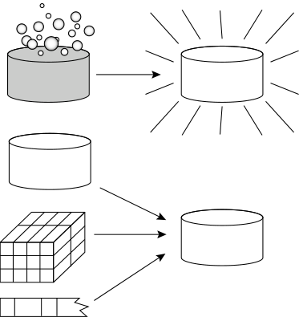

A1 A2 A3 ... A126

A1 A3 ... A115

T1
T2
T3
T4
...
T2000

T1
T4
...
T1456

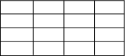

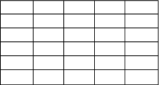

**Figure 3.1** Forms of data preprocessing.

**88** Chapter 3 _Data Preprocessing_

**[Data Cleaning]**
## 3.2

Real-world data tend to be incomplete, noisy, and inconsistent. _Data cleaning_ (or _data_
_cleansing_ ) routines attempt to fill in missing values, smooth out noise while identifying outliers, and correct inconsistencies in the data. In this section, you will study
basic methods for data cleaning. Section 3.2.1 looks at ways of handling missing values.
Section 3.2.2 explains data smoothing techniques. Section 3.2.3 discusses approaches to
data cleaning as a process.

3.2.1 **Missing Values**

Imagine that you need to analyze _AllElectronics_ sales and customer data. You note that
many tuples have no recorded value for several attributes such as customer _income_ . How
can you go about filling in the missing values for this attribute? Let’s look at the following
methods.

**1. Ignore the tuple** : This is usually done when the class label is missing (assuming the
mining task involves classification). This method is not very effective, unless the tuple
contains several attributes with missing values. It is especially poor when the percentage of missing values per attribute varies considerably. By ignoring the tuple, we do
not make use of the remaining attributes’ values in the tuple. Such data could have
been useful to the task at hand.

**2. Fill in the missing value manually** : In general, this approach is time consuming and
may not be feasible given a large data set with many missing values.

**3. Use a global constant to fill in the missing value** : Replace all missing attribute values
by the same constant such as a label like _“Unknown”_ or −∞. If missing values are
replaced by, say, _“Unknown_,” then the mining program may mistakenly think that
they form an interesting concept, since they all have a value in common—that of
_“Unknown.”_ Hence, although this method is simple, it is not foolproof.

**4. Use a measure of central tendency for the attribute (e.g., the mean or median) to**
**fill in the missing value** : Chapter 2 discussed measures of central tendency, which
indicate the “middle” value of a data distribution. For normal (symmetric) data distributions, the mean can be used, while skewed data distribution should employ
the median (Section 2.2). For example, suppose that the data distribution regarding the income of _AllElectronics_ customers is symmetric and that the mean income is
$56,000. Use this value to replace the missing value for _income_ .

**5. Use the attribute mean or median for all samples belonging to the same class as**
**the given tuple** : For example, if classifying customers according to _credit_ _risk_, we
may replace the missing value with the mean _income_ value for customers in the same
credit risk category as that of the given tuple. If the data distribution for a given class
is skewed, the median value is a better choice.

**6. Use the most probable value to fill in the missing value** : This may be determined
with regression, inference-based tools using a Bayesian formalism, or decision tree

3.2 Data Cleaning **89**

induction. For example, using the other customer attributes in your data set, you
may construct a decision tree to predict the missing values for _income_ . Decision trees
and Bayesian inference are described in detail in Chapters 8 and 9, respectively, while
regression is introduced in Section 3.4.5.

Methods 3 through 6 bias the data—the filled-in value may not be correct. Method 6,
however, is a popular strategy. In comparison to the other methods, it uses the most
information from the present data to predict missing values. By considering the other
attributes’ values in its estimation of the missing value for _income_, there is a greater
chance that the relationships between _income_ and the other attributes are preserved.
It is important to note that, in some cases, a missing value may not imply an error
in the data! For example, when applying for a credit card, candidates may be asked to
supply their driver’s license number. Candidates who do not have a driver’s license may
naturally leave this field blank. Forms should allow respondents to specify values such
as “not applicable.” Software routines may also be used to uncover other null values
(e.g., “don’t know,” “?” or “none”). Ideally, each attribute should have one or more rules
regarding the _null_ condition. The rules may specify whether or not nulls are allowed
and/or how such values should be handled or transformed. Fields may also be intentionally left blank if they are to be provided in a later step of the business process. Hence,
although we can try our best to clean the data after it is seized, good database and data
entry procedure design should help minimize the number of missing values or errors in
the first place.

3.2.2 **Noisy Data**

_“What is noise?”_ **Noise** is a random error or variance in a measured variable. In
Chapter 2, we saw how some basic statistical description techniques (e.g., boxplots
and scatter plots), and methods of data visualization can be used to identify outliers,
which may represent noise. Given a numeric attribute such as, say, _price_, how can we
“smooth” out the data to remove the noise? Let’s look at the following data smoothing
techniques.

**Binning:** Binning methods smooth a sorted data value by consulting its “neighborhood,” that is, the values around it. The sorted values are distributed into a number
of “buckets,” or _bins_ . Because binning methods consult the neighborhood of values,
they perform _local_ smoothing. Figure 3.2 illustrates some binning techniques. In this
example, the data for _price_ are first sorted and then partitioned into _equal-frequency_
bins of size 3 (i.e., each bin contains three values). In **smoothing by bin means**, each
value in a bin is replaced by the mean value of the bin. For example, the mean of the
values 4, 8, and 15 in Bin 1 is 9. Therefore, each original value in this bin is replaced
by the value 9.
Similarly, **smoothing by bin medians** can be employed, in which each bin value
is replaced by the bin median. In **smoothing by bin boundaries**, the minimum and
maximum values in a given bin are identified as the _bin boundaries_ . Each bin value
is then replaced by the closest boundary value. In general, the larger the width, the

**90** Chapter 3 _Data Preprocessing_

**Sorted data for** _**price**_ **(in dollars)** : 4, 8, 15, 21, 21, 24, 25, 28, 34

**Partition into (equal-frequency) bins** :

Bin 1: 4, 8, 15
Bin 2: 21, 21, 24
Bin 3: 25, 28, 34

**Smoothing by bin means** :

Bin 1: 9, 9, 9
Bin 2: 22, 22, 22
Bin 3: 29, 29, 29

**Smoothing by bin boundaries** :

Bin 1: 4, 4, 15
Bin 2: 21, 21, 24
Bin 3: 25, 25, 34

**Figure 3.2** Binning methods for data smoothing.

greater the effect of the smoothing. Alternatively, bins may be _equal width_, where the
interval range of values in each bin is constant. Binning is also used as a discretization
technique and is further discussed in Section 3.5.

**Regression:** Data smoothing can also be done by regression, a technique that conforms data values to a function. _Linear regression_ involves finding the “best” line to
fit two attributes (or variables) so that one attribute can be used to predict the other.
_Multiple linear regression_ is an extension of linear regression, where more than two
attributes are involved and the data are fit to a multidimensional surface. Regression
is further described in Section 3.4.5.

**Outlier analysis** : Outliers may be detected by clustering, for example, where similar
values are organized into groups, or “clusters.” Intuitively, values that fall outside of
the set of clusters may be considered outliers (Figure 3.3). Chapter 12 is dedicated to
the topic of outlier analysis.

Many data smoothing methods are also used for data discretization (a form of data
transformation) and data reduction. For example, the binning techniques described
before reduce the number of distinct values per attribute. This acts as a form of data
reduction for logic-based data mining methods, such as decision tree induction, which
repeatedly makes value comparisons on sorted data. Concept hierarchies are a form of
data discretization that can also be used for data smoothing. A concept hierarchy for
_price_, for example, may map real _price_ values into _inexpensive, moderately_ _priced_, and
_expensive_, thereby reducing the number of data values to be handled by the mining

3.2 Data Cleaning **91**

**Figure 3.3** A 2-D customer data plot with respect to customer locations in a city, showing three data
clusters. Outliers may be detected as values that fall outside of the cluster sets.

process. Data discretization is discussed in Section 3.5. Some methods of classification
(e.g., neural networks) have built-in data smoothing mechanisms. Classification is the
topic of Chapters 8 and 9.

3.2.3 **Data Cleaning as a Process**

Missing values, noise, and inconsistencies contribute to inaccurate data. So far, we have
looked at techniques for handling missing data and for smoothing data. _“But data clean-_
_ing is a big job. What about data cleaning as a process? How exactly does one proceed in_
_tackling this task? Are there any tools out there to help?”_
The first step in data cleaning as a process is _discrepancy detection_ . Discrepancies can
be caused by several factors, including poorly designed data entry forms that have many
optional fields, human error in data entry, deliberate errors (e.g., respondents not wanting to divulge information about themselves), and data decay (e.g., outdated addresses).
Discrepancies may also arise from inconsistent data representations and inconsistent use
of codes. Other sources of discrepancies include errors in instrumentation devices that
record data and system errors. Errors can also occur when the data are (inadequately)
used for purposes other than originally intended. There may also be inconsistencies due
to data integration (e.g., where a given attribute can have different names in different
databases). [2]

2Data integration and the removal of redundant data that can result from such integration are further
described in Section 3.3.

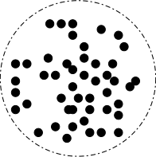

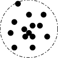

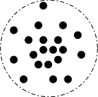
**92** Chapter 3 _Data Preprocessing_

_“So, how can we proceed with discrepancy detection?”_ As a starting point, use any
knowledge you may already have regarding properties of the data. Such knowledge or
“data about data” is referred to as **metadata** . This is where we can make use of the knowledge we gained about our data in Chapter 2. For example, what are the data type and
domain of each attribute? What are the acceptable values for each attribute? The basic
statistical data descriptions discussed in Section 2.2 are useful here to grasp data trends
and identify anomalies. For example, find the mean, median, and mode values. Are the
data symmetric or skewed? What is the range of values? Do all values fall within the
expected range? What is the standard deviation of each attribute? Values that are more
than two standard deviations away from the mean for a given attribute may be flagged
as potential outliers. Are there any known dependencies between attributes? In this step,
you may write your own scripts and/or use some of the tools that we discuss further later.
From this, you may find noise, outliers, and unusual values that need investigation.
As a data analyst, you should be on the lookout for the inconsistent use of codes and
any inconsistent data representations (e.g., “2010/12/25” and “25/12/2010” for _date_ ).
**Field overloading** is another error source that typically results when developers squeeze
new attribute definitions into unused (bit) portions of already defined attributes (e.g.,
an unused bit of an attribute that has a value range that uses only, say, 31 out of
32 bits).
The data should also be examined regarding unique rules, consecutive rules, and null
rules. A **unique rule** says that each value of the given attribute must be different from
all other values for that attribute. A **consecutive rule** says that there can be no missing values between the lowest and highest values for the attribute, and that all values
must also be unique (e.g., as in check numbers). A **null rule** specifies the use of blanks,
question marks, special characters, or other strings that may indicate the null condition
(e.g., where a value for a given attribute is not available), and how such values should
be handled. As mentioned in Section 3.2.1, reasons for missing values may include
(1) the person originally asked to provide a value for the attribute refuses and/or finds
that the information requested is not applicable (e.g., a _license_ _number_ attribute left
blank by nondrivers); (2) the data entry person does not know the correct value; or (3)
the value is to be provided by a later step of the process. The null rule should specify how
to record the null condition, for example, such as to store zero for numeric attributes, a
blank for character attributes, or any other conventions that may be in use (e.g., entries
like “don’t know” or “?” should be transformed to blank).
There are a number of different commercial tools that can aid in the discrepancy
detection step. **Data scrubbing tools** use simple domain knowledge (e.g., knowledge
of postal addresses and spell-checking) to detect errors and make corrections in the
data. These tools rely on parsing and fuzzy matching techniques when cleaning data
from multiple sources. **Data auditing tools** find discrepancies by analyzing the data to
discover rules and relationships, and detecting data that violate such conditions. They
are variants of data mining tools. For example, they may employ statistical analysis to
find correlations, or clustering to identify outliers. They may also use the basic statistical
data descriptions presented in Section 2.2.
Some data inconsistencies may be corrected manually using external references.
For example, errors made at data entry may be corrected by performing a paper

3.3 Data Integration **93**

trace. Most errors, however, will require _data transformations_ . That is, once we find
discrepancies, we typically need to define and apply (a series of) transformations to
correct them.
Commercial tools can assist in the data transformation step. **Data migration tools**
allow simple transformations to be specified such as to replace the string _“gender”_ by
_“sex.”_ **ETL (extraction/transformation/loading) tools** allow users to specify transforms
through a graphical user interface (GUI). These tools typically support only a restricted
set of transforms so that, often, we may also choose to write custom scripts for this step
of the data cleaning process.
The two-step process of discrepancy detection and data transformation (to correct
discrepancies) iterates. This process, however, is error-prone and time consuming. Some
transformations may introduce more discrepancies. Some _nested discrepancies_ may only
be detected after others have been fixed. For example, a typo such as “20010” in a year
field may only surface once all date values have been converted to a uniform format.
Transformations are often done as a batch process while the user waits without feedback.
Only after the transformation is complete can the user go back and check that no new
anomalies have been mistakenly created. Typically, numerous iterations are required
before the user is satisfied. Any tuples that cannot be automatically handled by a given
transformation are typically written to a file without any explanation regarding the reasoning behind their failure. As a result, the entire data cleaning process also suffers from
a lack of interactivity.
New approaches to data cleaning emphasize increased interactivity. Potter’s Wheel,
for example, is a publicly available data cleaning tool that integrates discrepancy detection and transformation. Users gradually build a series of transformations by composing
and debugging individual transformations, one step at a time, on a spreadsheet-like
interface. The transformations can be specified graphically or by providing examples.
Results are shown immediately on the records that are visible on the screen. The user
can choose to undo the transformations, so that transformations that introduced additional errors can be “erased.” The tool automatically performs discrepancy checking in
the background on the latest transformed view of the data. Users can gradually develop
and refine transformations as discrepancies are found, leading to more effective and
efficient data cleaning.
Another approach to increased interactivity in data cleaning is the development of
declarative languages for the specification of data transformation operators. Such work
focuses on defining powerful extensions to SQL and algorithms that enable users to
express data cleaning specifications efficiently.
As we discover more about the data, it is important to keep updating the metadata
to reflect this knowledge. This will help speed up data cleaning on future versions of the
same data store.

**[Data Integration]**
## 3.3

Data mining often requires data integration—the merging of data from multiple data
stores. Careful integration can help reduce and avoid redundancies and inconsistencies

**94** Chapter 3 _Data Preprocessing_

in the resulting data set. This can help improve the accuracy and speed of the subsequent
data mining process.
The semantic heterogeneity and structure of data pose great challenges in data integration. How can we match schema and objects from different sources? This is the
essence of the _entity identification problem_, described in Section 3.3.1. Are any attributes
correlated? Section 3.3.2 presents correlation tests for numeric and nominal data. Tuple
duplication is described in Section 3.3.3. Finally, Section 3.3.4 touches on the detection
and resolution of data value conflicts.

3.3.1 **Entity Identification Problem**

It is likely that your data analysis task will involve _data integration_, which combines data
from multiple sources into a coherent data store, as in data warehousing. These sources
may include multiple databases, data cubes, or flat files.
There are a number of issues to consider during data integration. _Schema integration_
and _object matching_ can be tricky. How can equivalent real-world entities from multiple
data sources be matched up? This is referred to as the **entity identification problem** .
For example, how can the data analyst or the computer be sure that _customer_ _id_ in one
database and _cust_ _number_ in another refer to the same attribute? Examples of metadata
for each attribute include the name, meaning, data type, and range of values permitted
for the attribute, and null rules for handling blank, zero, or null values (Section 3.2).
Such metadata can be used to help avoid errors in schema integration. The metadata
may also be used to help transform the data (e.g., where data codes for _pay_ ~~_t_~~ _ype_ in one
database may be _“H”_ and _“S”_ but _1_ and _2_ in another). Hence, this step also relates to
data cleaning, as described earlier.
When matching attributes from one database to another during integration, special
attention must be paid to the _structure_ of the data. This is to ensure that any attribute
functional dependencies and referential constraints in the source system match those in
the target system. For example, in one system, a _discount_ may be applied to the order,
whereas in another system it is applied to each individual line item within the order.
If this is not caught before integration, items in the target system may be improperly
discounted.

3.3.2 **Redundancy and Correlation Analysis**

_Redundancy_ is another important issue in data integration. An attribute (such as _annual_
_revenue_, for instance) may be redundant if it can be “derived” from another attribute
or set of attributes. Inconsistencies in attribute or dimension naming can also cause
redundancies in the resulting data set.
Some redundancies can be detected by **correlation analysis** . Given two attributes,
such analysis can measure how strongly one attribute implies the other, based on the
available data. For nominal data, we use the _χ_ [2] ( _chi-square_ ) test. For numeric attributes,
we can use the _correlation coefficient_ and _covariance_, both of which access how one
attribute’s values vary from those of another.

3.3 Data Integration **95**

_**χ**_ **[2]** **Correlation Test for Nominal Data**

For nominal data, a correlation relationship between two attributes, _A_ and _B_, can be
discovered by a _χ_ [2] ( **chi-square** ) test. Suppose _A_ has _c_ distinct values, namely _a_ 1, _a_ 2, _..._ _ac_ .
_B_ has _r_ distinct values, namely _b_ 1, _b_ 2, _..._ _br_ . The data tuples described by _A_ and _B_ can be
shown as a **contingency table**, with the _c_ values of _A_ making up the columns and the _r_
values of _B_ making up the rows. Let _(Ai_, _Bj)_ denote the joint event that attribute _A_ takes
on value _ai_ and attribute _B_ takes on value _bj_, that is, where _(A_ = _ai_, _B_ = _bj)_ . Each and
every possible _(Ai_, _Bj)_ joint event has its own cell (or slot) in the table. The _χ_ [2] value
(also known as the _Pearson χ_ [2] _statistic_ ) is computed as

_r_

_j_ =1

_χ_ [2] =

_c_

_i_ =1

_(oij_ - _eij)_ [2]

, (3.1)
_eij_

where _oij_ is the _observed frequency_ (i.e., actual count) of the joint event _(Ai_, _Bj)_ and _eij_ is
the _expected frequency_ of _(Ai_, _Bj)_, which can be computed as

_eij_ = _[count][(][A]_ [ =] _[ a][i][)]_ [ ×] _[ count][(][B]_ [ =] _[ b][j][)]_, (3.2)

_n_

where _n_ is the number of data tuples, _count(A_ = _ai)_ is the number of tuples having value
_ai_ for _A_, and _count(B_ = _bj)_ is the number of tuples having value _bj_ for _B_ . The sum in
Eq. (3.1) is computed over all of the _r_ × _c_ cells. Note that the cells that contribute the
most to the _χ_ [2] value are those for which the actual count is very different from that
expected.
The _χ_ [2] statistic tests the hypothesis that _A_ and _B_ are _independent_, that is, there is no
correlation between them. The test is based on a significance level, with _(r_         - 1 _)_ × _(c_         - 1 _)_
degrees of freedom. We illustrate the use of this statistic in Example 3.1. If the hypothesis
can be rejected, then we say that _A_ and _B_ are statistically correlated.

**Example 3.1 Correlation analysis of nominal attributes using** _**χ**_ **[2]** **.** Suppose that a group of 1500
people was surveyed. The gender of each person was noted. Each person was polled as
to whether his or her preferred type of reading material was fiction or nonfiction. Thus,
we have two attributes, _gender_ and _preferred_ _reading_ . The observed frequency (or count)
of each possible joint event is summarized in the contingency table shown in Table 3.1,
where the numbers in parentheses are the expected frequencies. The expected frequencies are calculated based on the data distribution for both attributes using Eq. (3.2).
Using Eq. (3.2), we can verify the expected frequencies for each cell. For example,
the expected frequency for the cell ( _male, fiction_ ) is

_[ction][)]_
_e_ 11 = _[count(male][)]_ [ ×] _[ count][(]_ _[f]_

= 90,
1500

_[ count][(]_ _[f][ction][)]_

= [300][ ×][ 450]
_n_ 1500

and so on. Notice that in any row, the sum of the expected frequencies must equal the
total observed frequency for that row, and the sum of the expected frequencies in any
column must also equal the total observed frequency for that column.

**96** Chapter 3 _Data Preprocessing_

**Table 3.1** Example 2.1’s 2 × 2 Contingency Table Data

_male_ _female_ _Total_

_fiction_ 250 (90) 200 (360) 450
_non_ _fiction_ 50 (210) 1000 (840) 1050
Total 300 1200 1500

_Note:_ Are _gender_ and _preferred_ ~~_r_~~ _eading_ correlated?

Using Eq. (3.1) for _χ_ [2] computation, we get

[ −] [90] _[)]_ [2]

+ _[(]_ [50][ −] [210] _[)]_ [2]
90 210

[ −] [360] _[)]_ [2]

+ _[(]_ [1000][ −] [840] _[)]_ [2]
360 840

_χ_ [2] = _[(]_ [250][ −] [90] _[)]_ [2]

[210] _[)]_ [2]

+ _[(]_ [200][ −] [360] _[)]_ [2]
210 360

90 210 360 840

= 284.44 + 121.90 + 71.11 + 30.48 = 507.93.

For this 2 × 2 table, the degrees of freedom are _(_ 2 − 1 _)(_ 2 − 1 _)_ = 1. For 1 degree of freedom, the _χ_ [2] value needed to reject the hypothesis at the 0.001 significance level is 10.828
(taken from the table of upper percentage points of the _χ_ [2] distribution, typically available from any textbook on statistics). Since our computed value is above this, we can
reject the hypothesis that _gender_ and _preferred_ _reading_ are independent and conclude
that the two attributes are (strongly) correlated for the given group of people.

**Correlation Coefficient for Numeric Data**

For numeric attributes, we can evaluate the correlation between two attributes, _A_ and _B_,
by computing the **correlation coefficient** (also known as **Pearson’s product moment**
**coefficient**, named after its inventer, Karl Pearson). This is

_n_

_n_

_rA_, _B_ =

_(ai_   - _A_ [¯] _)(bi_   - _B_ [¯] _)_

_i_ =1

=
_nσAσB_

_(aibi)_   - _nA_ [¯] _B_ [¯]

_i_ =1

, (3.3)
_nσAσB_

where _n_ is the number of tuples, _ai_ and _bi_ are the respective values of _A_ and _B_ in tuple _i_,
_A_ ¯ and ¯ _B_ are the respective mean values of _A_ and _B_, _σA_ and _σB_ are the respective standard
deviations of _A_ and _B_ (as defined in Section 2.2.2), and _�(aibi)_ is the sum of the _AB_
cross-product (i.e., for each tuple, the value for _A_ is multiplied by the value for _B_ in that
tuple). Note that −1 ≤ _rA_, _B_ ≤+1. If _rA_, _B_ is greater than 0, then _A_ and _B_ are _positively_
_correlated_, meaning that the values of _A_ increase as the values of _B_ increase. The higher
the value, the stronger the correlation (i.e., the more each attribute implies the other).
Hence, a higher value may indicate that _A_ (or _B_ ) may be removed as a redundancy.
If the resulting value is equal to 0, then _A_ and _B_ are _independent_ and there is no
correlation between them. If the resulting value is less than 0, then _A_ and _B_ are _negatively_
_correlated_, where the values of one attribute increase as the values of the other attribute
decrease. This means that each attribute discourages the other. Scatter plots can also be
used to view correlations between attributes (Section 2.2.3). For example, Figure 2.8’s

3.3 Data Integration **97**

scatter plots respectively show positively correlated data and negatively correlated data,
while Figure 2.9 displays uncorrelated data.
Note that correlation does not imply causality. That is, if _A_ and _B_ are correlated, this
does not necessarily imply that _A_ causes _B_ or that _B_ causes _A_ . For example, in analyzing a
demographic database, we may find that attributes representing the number of hospitals
and the number of car thefts in a region are correlated. This does not mean that one
causes the other. Both are actually causally linked to a third attribute, namely, _population_ .

**Covariance of Numeric Data**

In probability theory and statistics, correlation and covariance are two similar measures
for assessing how much two attributes change together. Consider two numeric attributes
_A_ and _B_, and a set of _n_ observations { _(a_ 1, _b_ 1 _)_, _..._, _(an_, _bn)_ }. The mean values of _A_ and _B_,
respectively, are also known as the **expected values** on _A_ and _B_, that is,

         - _n_
_E(A)_ = _A_ [¯] = _i_ =1 _[a][i]_

_n_

and

         - _n_
_E(B)_ = _B_ [¯] = _i_ =1 _[b][i]_ .

_n_

The **covariance** between _A_ and _B_ is defined as

          - _n_
_Cov(A_, _B)_ = _E((A_       - _A_ [¯] _)(B_       - _B_ [¯] _))_ = _i_ =1 _[(][a][i]_ [ −¯] _[A][)(][b][i]_ [ −¯] _[B][)]_ . (3.4)

_n_

If we compare Eq. (3.3) for _rA_, _B_ (correlation coefficient) with Eq. (3.4) for covariance,
we see that

_rA_, _B_ = _[Cov]_ _σA_ _[(][A]_ _σB_ [,] _[B][)]_, (3.5)

where _σA_ and _σB_ are the standard deviations of _A_ and _B_, respectively. It can also be
shown that

_Cov(A_, _B)_ = _E(A_            - _B)_            - _A_ [¯] _B_ [¯] . (3.6)

This equation may simplify calculations.
For two attributes _A_ and _B_ that tend to change together, if _A_ is larger than _A_ [¯] (the
expected value of _A_ ), then _B_ is likely to be larger than _B_ [¯] (the expected value of _B_ ).
Therefore, the covariance between _A_ and _B_ is _positive_ . On the other hand, if one of
the attributes tends to be above its expected value when the other attribute is below its
expected value, then the covariance of _A_ and _B_ is _negative_ .
If _A_ and _B_ are _independent_ (i.e., they do not have correlation), then _E(A_   - _B)_ = _E(A)_   _E(B)_ . Therefore, the covariance is _Cov(A_, _B)_ = _E(A_ - _B)_ - _A_ [¯] _B_ [¯] = _E(A)_ - _E(B)_ - _A_ [¯] _B_ [¯] = 0.
However, the converse is not true. Some pairs of random variables (attributes) may have
a covariance of 0 but are not independent. Only under some additional assumptions

**98** Chapter 3 _Data Preprocessing_

**Table 3.2** Stock Prices for _AllElectronics_ and _HighTech_

_Time point_ _AllElectronics_ _HighTech_

t1 6 20
t2 5 10
t3 4 14
t4 3 5
t5 2 5

(e.g., the data follow multivariate normal distributions) does a covariance of 0 imply
independence.

**Example 3.2 Covariance analysis of numeric attributes.** Consider Table 3.2, which presents a simplified example of stock prices observed at five time points for _AllElectronics_ and
_HighTech_, a high-tech company. If the stocks are affected by the same industry trends,
will their prices rise or fall together?

_E(AllElectronics)_ = [6][ +][ 5][ +][ 4][ +][ 3][ +][ 2]

5 [=][ $][4]

[ +][ 3][ +][ 2]

= [20]
5 5

and

[ 14][ +][ 5][ +][ 5]

= [54]
5 5

_E(HighTech)_ = [20][ +][ 10][ +][ 14][ +][ 5][ +][ 5]

5 [=][ $][10.80.]

Thus, using Eq. (3.4), we compute

_Cov(AllElectroncis_, _HighTech)_ = [6][ ×][ 20][ +][ 5][ ×][ 10][ +][ 4][ ×][ 14][ +][ 3][ ×][ 5][ +][ 2][ ×][ 5]     - 4 × 10.80

5

= 50.2 − 43.2 = 7.

Therefore, given the positive covariance we can say that stock prices for both companies
rise together.

_Variance_ is a special case of covariance, where the two attributes are identical (i.e., the
covariance of an attribute with itself). Variance was discussed in Chapter 2.

3.3.3 **Tuple Duplication**

In addition to detecting redundancies between attributes, duplication should also be
detected at the tuple level (e.g., where there are two or more identical tuples for a given
unique data entry case). The use of denormalized tables (often done to improve performance by avoiding joins) is another source of data redundancy. Inconsistencies often
arise between various duplicates, due to inaccurate data entry or updating some but not
all data occurrences. For example, if a purchase order database contains attributes for

3.4 Data Reduction **99**

the purchaser’s name and address instead of a key to this information in a purchaser
database, discrepancies can occur, such as the same purchaser’s name appearing with
different addresses within the purchase order database.

3.3.4 **Data Value Conflict Detection and Resolution**

Data integration also involves the _detection and resolution of data value conflicts_ . For
example, for the same real-world entity, attribute values from different sources may differ. This may be due to differences in representation, scaling, or encoding. For instance,
a _weight_ attribute may be stored in metric units in one system and British imperial
units in another. For a hotel chain, the _price_ of rooms in different cities may involve
not only different currencies but also different services (e.g., free breakfast) and taxes.
When exchanging information between schools, for example, each school may have its
own curriculum and grading scheme. One university may adopt a quarter system, offer
three courses on database systems, and assign grades from A+ to F, whereas another
may adopt a semester system, offer two courses on databases, and assign grades from 1
to 10. It is difficult to work out precise course-to-grade transformation rules between
the two universities, making information exchange difficult.
Attributes may also differ on the abstraction level, where an attribute in one system is recorded at, say, a lower abstraction level than the “same” attribute in another.
For example, the _total_ _sales_ in one database may refer to one branch of _All_ ~~_E_~~ _lectronics_,
while an attribute of the same name in another database may refer to the total sales
for _All_ _Electronics_ stores in a given region. The topic of discrepancy detection is further
described in Section 3.2.3 on data cleaning as a process.

**[Data Reduction]**
## 3.4

Imagine that you have selected data from the _AllElectronics_ data warehouse for analysis.
The data set will likely be huge! Complex data analysis and mining on huge amounts of
data can take a long time, making such analysis impractical or infeasible.
**Data reduction** techniques can be applied to obtain a reduced representation of the
data set that is much smaller in volume, yet closely maintains the integrity of the original
data. That is, mining on the reduced data set should be more efficient yet produce the
same (or almost the same) analytical results. In this section, we first present an overview
of data reduction strategies, followed by a closer look at individual techniques.

3.4.1 **Overview of Data Reduction Strategies**

Data reduction strategies include _dimensionality reduction_, _numerosity reduction_, and
_data compression_ .
**Dimensionality reduction** is the process of reducing the number of random variables
or attributes under consideration. Dimensionality reduction methods include _wavelet_

**100** Chapter 3 _Data Preprocessing_

_transforms_ (Section 3.4.2) and _principal components analysis_ (Section 3.4.3), which
transform or project the original data onto a smaller space. _Attribute subset selection_ is a
method of dimensionality reduction in which irrelevant, weakly relevant, or redundant
attributes or dimensions are detected and removed (Section 3.4.4).
**Numerosity reduction** techniques replace the original data volume by alternative,
smaller forms of data representation. These techniques may be parametric or nonparametric. For _parametric methods_, a model is used to estimate the data, so that
typically only the data parameters need to be stored, instead of the actual data. (Outliers may also be stored.) Regression and log-linear models (Section 3.4.5) are examples.
_Nonparametric methods_ for storing reduced representations of the data include _his-_
_tograms_ (Section 3.4.6), _clustering_ (Section 3.4.7), _sampling_ (Section 3.4.8), and _data_
_cube aggregation_ (Section 3.4.9).
In **data compression**, transformations are applied so as to obtain a reduced or “compressed” representation of the original data. If the original data can be _reconstructed_
from the compressed data without any information loss, the data reduction is called
**lossless** . If, instead, we can reconstruct only an approximation of the original data, then
the data reduction is called **lossy** . There are several lossless algorithms for string compression; however, they typically allow only limited data manipulation. Dimensionality
reduction and numerosity reduction techniques can also be considered forms of data
compression.
There are many other ways of organizing methods of data reduction. The computational time spent on data reduction should not outweigh or “erase” the time saved by
mining on a reduced data set size.

3.4.2 **Wavelet Transforms**

The **discrete wavelet transform (DWT)** is a linear signal processing technique that,
when applied to a data vector _**X**_, transforms it to a numerically different vector, _**X**_ [′], of
**wavelet coefficients** . The two vectors are of the same length. When applying this technique to data reduction, we consider each tuple as an _n_ -dimensional data vector, that
is, _**X**_ = _(x_ 1, _x_ 2, _..._, _xn)_, depicting _n_ measurements made on the tuple from _n_ database
attributes. [3]

_“How can this technique be useful for data reduction if the wavelet transformed data are_
_of the same length as the original data?”_ The usefulness lies in the fact that the wavelet
transformed data can be truncated. A compressed approximation of the data can be
retained by storing only a small fraction of the strongest of the wavelet coefficients.
For example, all wavelet coefficients larger than some user-specified threshold can be
retained. All other coefficients are set to 0. The resulting data representation is therefore
very sparse, so that operations that can take advantage of data sparsity are computationally very fast if performed in wavelet space. The technique also works to remove
noise without smoothing out the main features of the data, making it effective for data

3In our notation, any variable representing a vector is shown in bold italic font; measurements depicting
the vector are shown in italic font.

3.4 Data Reduction **101**

cleaning as well. Given a set of coefficients, an approximation of the original data can be
constructed by applying the _inverse_ of the DWT used.
The DWT is closely related to the _discrete Fourier transform (DFT)_, a signal processing technique involving sines and cosines. In general, however, the DWT achieves better
lossy compression. That is, if the same number of coefficients is retained for a DWT and
a DFT of a given data vector, the DWT version will provide a more accurate approximation of the original data. Hence, for an equivalent approximation, the DWT requires less
space than the DFT. Unlike the DFT, wavelets are quite localized in space, contributing
to the conservation of local detail.
There is only one DFT, yet there are several families of DWTs. Figure 3.4 shows
some wavelet families. Popular wavelet transforms include the Haar-2, Daubechies-4,
and Daubechies-6. The general procedure for applying a discrete wavelet transform uses
a hierarchical _pyramid algorithm_ that halves the data at each iteration, resulting in fast
computational speed. The method is as follows:

**1.** The length, _L_, of the input data vector must be an integer power of 2. This condition
can be met by padding the data vector with zeros as necessary ( _L_ ≥ _n_ ).

**2.** Each transform involves applying two functions. The first applies some data smoothing, such as a sum or weighted average. The second performs a weighted difference,
which acts to bring out the detailed features of the data.

**3.** The two functions are applied to pairs of data points in _**X**_, that is, to all pairs of
measurements _(x_ 2 _i_, _x_ 2 _i_ +1 _)_ . This results in two data sets of length _L/_ 2. In general,
these represent a smoothed or low-frequency version of the input data and the highfrequency content of it, respectively.

**4.** The two functions are recursively applied to the data sets obtained in the previous
loop, until the resulting data sets obtained are of length 2.

**5.** Selected values from the data sets obtained in the previous iterations are designated
the wavelet coefficients of the transformed data.

0.8

0.6

0.4

0.2

0.0

0.6

0.4

0.2

0.0

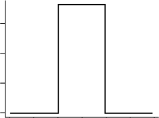

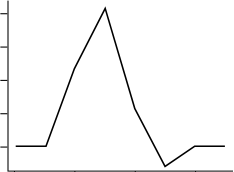

�1.0 �0.5 0.0 0.5 1.0 1.5 2.0 0 2 4 6
**(a)** Haar-2 **(b)** Daubechies-4

**Figure 3.4** Examples of wavelet families. The number next to a wavelet name is the number of _vanishing_
_moments_ of the wavelet. This is a set of mathematical relationships that the coefficients must
satisfy and is related to the number of coefficients.

**102** Chapter 3 _Data Preprocessing_

Equivalently, a matrix multiplication can be applied to the input data in order to
obtain the wavelet coefficients, where the matrix used depends on the given DWT. The
matrix must be **orthonormal**, meaning that the columns are unit vectors and are mutually orthogonal, so that the matrix inverse is just its transpose. Although we do not have
room to discuss it here, this property allows the reconstruction of the data from the
smooth and smooth-difference data sets. By factoring the matrix used into a product of
a few sparse matrices, the resulting “fast DWT” algorithm has a complexity of _O(n)_ for
an input vector of length _n_ .
Wavelet transforms can be applied to multidimensional data such as a data cube. This
is done by first applying the transform to the first dimension, then to the second, and so
on. The computational complexity involved is linear with respect to the number of cells
in the cube. Wavelet transforms give good results on sparse or skewed data and on data
with ordered attributes. Lossy compression by wavelets is reportedly better than JPEG
compression, the current commercial standard. Wavelet transforms have many realworld applications, including the compression of fingerprint images, computer vision,
analysis of time-series data, and data cleaning.

3.4.3 **Principal Components Analysis**

In this subsection we provide an intuitive introduction to principal components analysis as a method of dimesionality reduction. A detailed theoretical explanation is beyond
the scope of this book. For additional references, please see the bibliographic notes
(Section 3.8) at the end of this chapter.
Suppose that the data to be reduced consist of tuples or data vectors described
by _n_ attributes or dimensions. **Principal components analysis** ( **PCA** ; also called the
Karhunen-Loeve, or K-L, method) searches for _k n_ -dimensional orthogonal vectors that
can best be used to represent the data, where _k_ ≤ _n_ . The original data are thus projected
onto a much smaller space, resulting in dimensionality reduction. Unlike attribute subset selection (Section 3.4.4), which reduces the attribute set size by retaining a subset of
the initial set of attributes, PCA “combines” the essence of attributes by creating an alternative, smaller set of variables. The initial data can then be projected onto this smaller
set. PCA often reveals relationships that were not previously suspected and thereby
allows interpretations that would not ordinarily result.
The basic procedure is as follows:

**1.** The input data are normalized, so that each attribute falls within the same range. This
step helps ensure that attributes with large domains will not dominate attributes with
smaller domains.

**2.** PCA computes _k_ orthonormal vectors that provide a basis for the normalized input
data. These are unit vectors that each point in a direction perpendicular to the others.
These vectors are referred to as the _principal components_ . The input data are a linear
combination of the principal components.

**3.** The principal components are sorted in order of decreasing “significance” or
strength. The principal components essentially serve as a new set of axes for the data,

3.4 Data Reduction **103**

_X_ 2

_X_ 1

|Y 2|Col2|
|---|---|
|||

**Figure 3.5** Principal components analysis. _**Y**_ 1 and _**Y**_ 2 are the first two principal components for the
given data.

providing important information about variance. That is, the sorted axes are such
that the first axis shows the most variance among the data, the second axis shows the
next highest variance, and so on. For example, Figure 3.5 shows the first two principal components, _**Y**_ 1 and _**Y**_ 2, for the given set of data originally mapped to the axes _X_ 1
and _X_ 2. This information helps identify groups or patterns within the data.

**4.** Because the components are sorted in decreasing order of “significance,” the data size
can be reduced by eliminating the weaker components, that is, those with low variance. Using the strongest principal components, it should be possible to reconstruct
a good approximation of the original data.

PCA can be applied to ordered and unordered attributes, and can handle sparse data
and skewed data. Multidimensional data of more than two dimensions can be handled by reducing the problem to two dimensions. Principal components may be used
as inputs to multiple regression and cluster analysis. In comparison with wavelet transforms, PCA tends to be better at handling sparse data, whereas wavelet transforms are
more suitable for data of high dimensionality.

3.4.4 **Attribute Subset Selection**

Data sets for analysis may contain hundreds of attributes, many of which may be irrelevant to the mining task or redundant. For example, if the task is to classify customers
based on whether or not they are likely to purchase a popular new CD at _AllElectronics_
when notified of a sale, attributes such as the customer’s telephone number are likely to
be irrelevant, unlike attributes such as _age_ or _music_ _taste_ . Although it may be possible for
a domain expert to pick out some of the useful attributes, this can be a difficult and timeconsuming task, especially when the data’s behavior is not well known. (Hence, a reason
behind its analysis!) Leaving out relevant attributes or keeping irrelevant attributes may
be detrimental, causing confusion for the mining algorithm employed. This can result
in discovered patterns of poor quality. In addition, the added volume of irrelevant or
redundant attributes can slow down the mining process.

**104** Chapter 3 _Data Preprocessing_

**Attribute subset selection** [4] reduces the data set size by removing irrelevant or
redundant attributes (or dimensions). The goal of attribute subset selection is to find
a minimum set of attributes such that the resulting probability distribution of the data
classes is as close as possible to the original distribution obtained using all attributes.
Mining on a reduced set of attributes has an additional benefit: It reduces the number
of attributes appearing in the discovered patterns, helping to make the patterns easier to
understand.
_“How can we find a ‘good’ subset of the original attributes?”_ For _n_ attributes, there are
2 _[n]_ possible subsets. An exhaustive search for the optimal subset of attributes can be prohibitively expensive, especially as _n_ and the number of data classes increase. Therefore,
heuristic methods that explore a reduced search space are commonly used for attribute
subset selection. These methods are typically **greedy** in that, while searching through
attribute space, they always make what looks to be the best choice at the time. Their
strategy is to make a locally optimal choice in the hope that this will lead to a globally
optimal solution. Such greedy methods are effective in practice and may come close to
estimating an optimal solution.
The “best” (and “worst”) attributes are typically determined using tests of statistical
significance, which assume that the attributes are independent of one another. Many
other attribute evaluation measures can be used such as the _information gain_ measure
used in building decision trees for classification. [5]

Basic heuristic methods of attribute subset selection include the techniques that
follow, some of which are illustrated in Figure 3.6.

|Forward selection|Backward elimination|Decision tree induction|
|---|---|---|
|Initial attribute set: {_A_1,_ A_2,_ A_3,_ A_4,_ A_5,_ A_6} Initial reduced set: {} => {_A_1} => {_A_1, _A_4} => Reduced attribute set:      {_A_1,_ A_4,_ A_6}|Initial attribute set: {_A_1,_ A_2,_ A_3,_ A_4,_ A_5,_ A_6} => {_A_1,_ A_3,_ A_4,_ A_5,_ A_6} => {_A_1,_ A_4,_ A_5,_ A_6} => Reduced attribute set:      {_A_1, _A_4,_ A_6}|Initial attribute set: {_A_1,_ A_2,_ A_3,_ A_4,_ A_5,_ A_6} => Reduced attribute set:      {_A_1,_ A_4,_ A_6} _A_4? _A_1? _A_6? Class 1 Class 2 Class 1 Class 2 Y N Y N Y N|

**Figure 3.6** Greedy (heuristic) methods for attribute subset selection.

4In machine learning, attribute subset selection is known as _feature subset selection_ .

5The information gain measure is described in detail in Chapter 8.

3.4 Data Reduction **105**

**1. Stepwise forward selection** : The procedure starts with an empty set of attributes as
the reduced set. The best of the original attributes is determined and added to the
reduced set. At each subsequent iteration or step, the best of the remaining original
attributes is added to the set.

**2. Stepwise backward elimination** : The procedure starts with the full set of attributes.
At each step, it removes the worst attribute remaining in the set.

**3. Combination of forward selection and backward elimination** : The stepwise forward selection and backward elimination methods can be combined so that, at each
step, the procedure selects the best attribute and removes the worst from among the
remaining attributes.

**4. Decision tree induction** : Decision tree algorithms (e.g., ID3, C4.5, and CART) were
originally intended for classification. Decision tree induction constructs a flowchartlike structure where each internal (nonleaf) node denotes a test on an attribute, each
branch corresponds to an outcome of the test, and each external (leaf) node denotes a
class prediction. At each node, the algorithm chooses the “best” attribute to partition
the data into individual classes.
When decision tree induction is used for attribute subset selection, a tree is constructed from the given data. All attributes that do not appear in the tree are assumed
to be irrelevant. The set of attributes appearing in the tree form the reduced subset
of attributes.

The stopping criteria for the methods may vary. The procedure may employ a threshold
on the measure used to determine when to stop the attribute selection process.
In some cases, we may want to create new attributes based on others. Such **attribute**
**construction** [6] can help improve accuracy and understanding of structure in highdimensional data. For example, we may wish to add the attribute _area_ based on the
attributes _height_ and _width_ . By combining attributes, attribute construction can discover missing information about the relationships between data attributes that can be
useful for knowledge discovery.

3.4.5 **Regression and Log-Linear Models: Parametric**
**Data Reduction**

Regression and log-linear models can be used to approximate the given data. In (simple)
**linear regression**, the data are modeled to fit a straight line. For example, a random
variable, _y_ (called a _response variable_ ), can be modeled as a linear function of another
random variable, _x_ (called a _predictor variable_ ), with the equation

_y_ = _wx_ + _b_, (3.7)

where the variance of _y_ is assumed to be constant. In the context of data mining, _x_ and _y_
are numeric database attributes. The coefficients, _w_ and _b_ (called _regression coefficients_ ),

6In the machine learning literature, attribute construction is known as _feature construction_ .

**106** Chapter 3 _Data Preprocessing_

specify the slope of the line and the _y_ -intercept, respectively. These coefficients can
be solved for by the _method of least squares_, which minimizes the error between the
actual line separating the data and the estimate of the line. **Multiple linear regression**
is an extension of (simple) linear regression, which allows a response variable, _y_, to be
modeled as a linear function of two or more predictor variables.
**Log-linear models** approximate discrete multidimensional probability distributions.
Given a set of tuples in _n_ dimensions (e.g., described by _n_ attributes), we can consider each tuple as a point in an _n_ -dimensional space. Log-linear models can be used
to estimate the probability of each point in a multidimensional space for a set of discretized attributes, based on a smaller subset of dimensional combinations. This allows
a higher-dimensional data space to be constructed from lower-dimensional spaces.
Log-linear models are therefore also useful for dimensionality reduction (since the
lower-dimensional points together typically occupy less space than the original data
points) and data smoothing (since aggregate estimates in the lower-dimensional space
are less subject to sampling variations than the estimates in the higher-dimensional
space).
Regression and log-linear models can both be used on sparse data, although their
application may be limited. While both methods can handle skewed data, regression
does exceptionally well. Regression can be computationally intensive when applied to
high-dimensional data, whereas log-linear models show good scalability for up to 10 or
so dimensions.
Several software packages exist to solve regression problems. Examples include SAS
( _www.sas.com_ ), SPSS ( _www.spss.com_ ), and S-Plus ( _www.insightful.com_ ). Another useful
resource is the book _Numerical Recipes in C,_ by Press, Teukolsky, Vetterling, and Flannery

[PTVF07], and its associated source code.

3.4.6 **Histograms**

Histograms use binning to approximate data distributions and are a popular form
of data reduction. Histograms were introduced in Section 2.2.3. A **histogram** for an
attribute, _A_, partitions the data distribution of _A_ into disjoint subsets, referred to as
_buckets_ or _bins_ . If each bucket represents only a single attribute–value/frequency pair, the
buckets are called _singleton buckets_ . Often, buckets instead represent continuous ranges
for the given attribute.

**Example 3.3 Histograms.** The following data are a list of _AllElectronics_ prices for commonly sold
items (rounded to the nearest dollar). The numbers have been sorted: 1, 1, 5, 5, 5,
5, 5, 8, 8, 10, 10, 10, 10, 12, 14, 14, 14, 15, 15, 15, 15, 15, 15, 18, 18, 18, 18, 18,
18, 18, 18, 20, 20, 20, 20, 20, 20, 20, 21, 21, 21, 21, 25, 25, 25, 25, 25, 28, 28, 30,
30, 30.
Figure 3.7 shows a histogram for the data using singleton buckets. To further reduce
the data, it is common to have each bucket denote a continuous value range for
the given attribute. In Figure 3.8, each bucket represents a different $10 range for
_price_ .

3.4 Data Reduction **107**

10

9

8

7

6

5

4

3

2

1

0

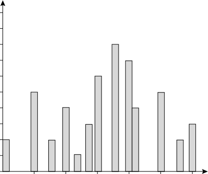

5 10

15 20 25 30
_price_ ($)

**Figure 3.7** A histogram for _price_ using singleton buckets—each bucket represents one price–value/
frequency pair.

25

20

15

10

5

0

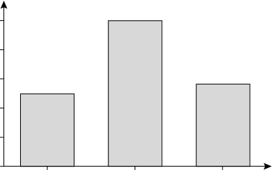

1–10 11–20 21–30
_price_ ($)

**Figure 3.8** An equal-width histogram for _price_, where values are aggregated so that each bucket has a
uniform width of $10.

_“How are the buckets determined and the attribute values partitioned?”_ There are
several partitioning rules, including the following:

**Equal-width** : In an equal-width histogram, the width of each bucket range is
uniform (e.g., the width of $10 for the buckets in Figure 3.8).

**Equal-frequency** (or equal-depth): In an equal-frequency histogram, the buckets are
created so that, roughly, the frequency of each bucket is constant (i.e., each bucket
contains roughly the same number of contiguous data samples).

**108** Chapter 3 _Data Preprocessing_

Histograms are highly effective at approximating both sparse and dense data, as
well as highly skewed and uniform data. The histograms described before for single
attributes can be extended for multiple attributes. _Multidimensional histograms_ can capture dependencies between attributes. These histograms have been found effective in
approximating data with up to five attributes. More studies are needed regarding the
effectiveness of multidimensional histograms for high dimensionalities.
Singleton buckets are useful for storing high-frequency outliers.

3.4.7 **Clustering**

Clustering techniques consider data tuples as objects. They partition the objects into
groups, or _clusters_, so that objects within a cluster are “similar” to one another and “dissimilar” to objects in other clusters. Similarity is commonly defined in terms of how
“close” the objects are in space, based on a distance function. The “quality” of a cluster
may be represented by its _diameter_, the maximum distance between any two objects in
the cluster. **Centroid distance** is an alternative measure of cluster quality and is defined
as the average distance of each cluster object from the cluster centroid (denoting the
“average object,” or average point in space for the cluster). Figure 3.3 showed a 2-D plot
of customer data with respect to customer locations in a city. Three data clusters are
visible.
In data reduction, the cluster representations of the data are used to replace the actual
data. The effectiveness of this technique depends on the data’s nature. It is much more
effective for data that can be organized into distinct clusters than for smeared data.
There are many measures for defining clusters and cluster quality. Clustering methods are further described in Chapters 10 and 11.

3.4.8 **Sampling**

Sampling can be used as a data reduction technique because it allows a large data set to
be represented by a much smaller random data sample (or subset). Suppose that a large
data set, _D_, contains _N_ tuples. Let’s look at the most common ways that we could sample
_D_ for data reduction, as illustrated in Figure 3.9.

**Simple random sample without replacement (SRSWOR) of size** _s_ : This is created
by drawing _s_ of the _N_ tuples from _D_ ( _s < N_ ), where the probability of drawing any
tuple in _D_ is 1 _/N_, that is, all tuples are equally likely to be sampled.

**Simple random sample with replacement (SRSWR) of size** _s_ : This is similar to
SRSWOR, except that each time a tuple is drawn from _D_, it is recorded and then
_replaced_ . That is, after a tuple is drawn, it is placed back in _D_ so that it may be drawn
again.

**Cluster sample** : If the tuples in _D_ are grouped into _M_ mutually disjoint “clusters,”
then an SRS of _s_ clusters can be obtained, where _s < M_ . For example, tuples in a
database are usually retrieved a page at a time, so that each page can be considered

3.4 Data Reduction **109**

**Cluster sample**

**Startified sample**

**Figure 3.9** Sampling can be used for data reduction.

a cluster. A reduced data representation can be obtained by applying, say, SRSWOR
to the pages, resulting in a cluster sample of the tuples. Other clustering criteria conveying rich semantics can also be explored. For example, in a spatial database, we
may choose to define clusters geographically based on how closely different areas are
located.

**Stratified sample** : If _D_ is divided into mutually disjoint parts called _strata,_ a stratified
sample of _D_ is generated by obtaining an SRS at each stratum. This helps ensure a

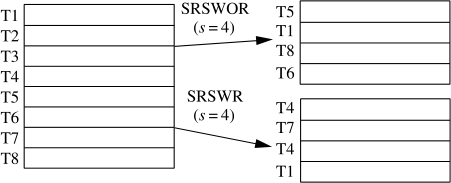

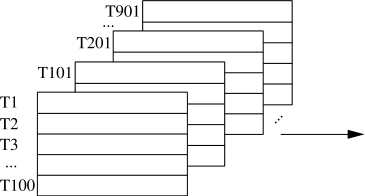

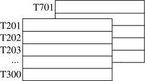

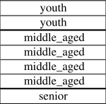

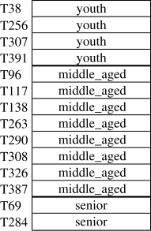
**110** Chapter 3 _Data Preprocessing_

representative sample, especially when the data are skewed. For example, a stratified
sample may be obtained from customer data, where a stratum is created for each customer age group. In this way, the age group having the smallest number of customers
will be sure to be represented.

An advantage of sampling for data reduction is that the cost of obtaining a sample
_is proportional to the size of the sample_, _s_, as opposed to _N_, the data set size. Hence,
sampling complexity is potentially _sublinear_ to the size of the data. Other data reduction techniques can require at least one complete pass through _D_ . For a fixed sample
size, sampling complexity increases only linearly as the number of data dimensions,
_n_, increases, whereas techniques using histograms, for example, increase exponentially
in _n_ .
When applied to data reduction, sampling is most commonly used to estimate the
answer to an aggregate query. It is possible (using the central limit theorem) to determine a sufficient sample size for estimating a given function within a specified degree
of error. This sample size, _s_, may be extremely small in comparison to _N_ . Sampling is
a natural choice for the progressive refinement of a reduced data set. Such a set can be
further refined by simply increasing the sample size.

3.4.9 **Data Cube Aggregation**

Imagine that you have collected the data for your analysis. These data consist of the
_AllElectronics_ sales per quarter, for the years 2008 to 2010. You are, however, interested
in the annual sales (total per year), rather than the total per quarter. Thus, the data can
be _aggregated_ so that the resulting data summarize the total sales per year instead of per
quarter. This aggregation is illustrated in Figure 3.10. The resulting data set is smaller in
volume, without loss of information necessary for the analysis task.
Data cubes are discussed in detail in Chapter 4 on data warehousing and Chapter 5
on data cube technology. We briefly introduce some concepts here. Data cubes store

|Col1|Col2|Year 2010|Col4|Col5|Col6|Col7|Col8|
|---|---|---|---|---|---|---|---|
|||Quarter|Quarter|Quarter|Sales |Sales |Sales |
|||||||||
|||Q1 ~~Year 20~~|Q1 ~~Year 20~~|Q1 ~~Year 20~~|$224,00 ~~ 09~~|$224,00 ~~ 09~~|0 0 0 0|
|||Q2 |Q2 ||$408,00  Sales |$408,00  Sales |$408,00  Sales |
|||uarter |uarter ||Sales |Sales |Sales |
|||~~Q3~~  Q1 ~~Year 20~~|~~Q3~~  Q1 ~~Year 20~~|$ ~~ 08~~|~~$350~~  224,0 |~~00~~ ~~,~~00 0 0|~~00~~ ~~,~~00 0 0|
|Q|~~Q~~  Q2  uarter|~~Q~~  Q2 rter|~~4~~|$ S|~~$586~~  408,0 les|~~$586~~  408,0 les|~~$586~~  408,0 les|
|Q|~~Q~~  Q2  uarter|~~Q~~  Q2 rter||||0 0|0 0|
|~~Q3~~ Q4 Q1 Q2 Q3 Q4|~~Q3~~ Q4 Q1 Q2|~~Q3~~ Q4 Q1 Q2|$ $|~~$350,0~~ $586,00 224,000 408,000|~~$350,0~~ $586,00 224,000 408,000|~~$350,0~~ $586,00 224,000 408,000|~~$350,0~~ $586,00 224,000 408,000|
|~~Q3~~ Q4 Q1 Q2 Q3 Q4|~~Q3~~ Q4 Q1 Q2|~~Q3~~ Q4 Q1 Q2|$350,000 $586,000|$350,000 $586,000|$350,000 $586,000|$350,000 $586,000|$350,000 $586,000|

|Year|Sales|
|---|---|
|2008 2009 2010|$1,568,000 $2,356,000 $3,594,000|

**Figure 3.10** Sales data for a given branch of _AllElectronics_ for the years 2008 through 2010. On the _left_,
the sales are shown per quarter. On the _right_, the data are aggregated to provide the annual
sales.

3.5 Data Transformation and Data Discretization **111**

|D ranch C B 568 750 150 50|Col2|Col3|
|---|---|---|
|568|||
|750|||
|150|||
|50|||

2010

A

home
entertainment

computer

phone

security

2008 2009

_year_

**Figure 3.11** A data cube for sales at _AllElectronics_ .

multidimensional aggregated information. For example, Figure 3.11 shows a data cube
for multidimensional analysis of sales data with respect to annual sales per item type
for each _AllElectronics_ branch. Each cell holds an aggregate data value, corresponding
to the data point in multidimensional space. (For readability, only some cell values are
shown.) _Concept hierarchies_ may exist for each attribute, allowing the analysis of data
at multiple abstraction levels. For example, a hierarchy for _branch_ could allow branches
to be grouped into regions, based on their address. Data cubes provide fast access to
precomputed, summarized data, thereby benefiting online analytical processing as well
as data mining.
The cube created at the lowest abstraction level is referred to as the **base cuboid** . The
base cuboid should correspond to an individual entity of interest such as _sales_ or _cus-_
_tomer_ . In other words, the lowest level should be usable, or useful for the analysis. A cube
at the highest level of abstraction is the **apex cuboid** . For the sales data in Figure 3.11,
the apex cuboid would give one total—the total _sales_ for all three years, for all item
types, and for all branches. Data cubes created for varying levels of abstraction are often
referred to as _cuboids_, so that a data cube may instead refer to a _lattice of cuboids_ . Each
higher abstraction level further reduces the resulting data size. When replying to data
mining requests, the _smallest_ available cuboid relevant to the given task should be used.
This issue is also addressed in Chapter 4.

**[Data Transformation and Data Discretization]**
## 3.5

This section presents methods of data transformation. In this preprocessing step, the
data are transformed or consolidated so that the resulting mining process may be more
efficient, and the patterns found may be easier to understand. Data discretization, a form
of data transformation, is also discussed.

**112** Chapter 3 _Data Preprocessing_

3.5.1 **Data Transformation Strategies Overview**

In _data transformation_, the data are transformed or consolidated into forms appropriate
for mining. Strategies for data transformation include the following:

**1. Smoothing**, which works to remove noise from the data. Techniques include binning,
regression, and clustering.

**2. Attribute construction** (or _feature construction_ ), where new attributes are constructed and added from the given set of attributes to help the mining process.

**3. Aggregation**, where summary or aggregation operations are applied to the data. For
example, the daily sales data may be aggregated so as to compute monthly and annual
total amounts. This step is typically used in constructing a data cube for data analysis
at multiple abstraction levels.

**4. Normalization**, where the attribute data are scaled so as to fall within a smaller range,
such as −1.0 to 1.0, or 0.0 to 1.0.

**5. Discretization**, where the raw values of a numeric attribute (e.g., _age_ ) are replaced by
interval labels (e.g., 0–10, 11–20, etc.) or conceptual labels (e.g., _youth, adult_, _senior_ ).
The labels, in turn, can be recursively organized into higher-level concepts, resulting
in a _concept hierarchy_ for the numeric attribute. Figure 3.12 shows a concept hierarchy
for the attribute _price_ . More than one concept hierarchy can be defined for the same
attribute to accommodate the needs of various users.

**6. Concept hierarchy generation for nominal data**, where attributes such as _street_ can
be generalized to higher-level concepts, like _city_ or _country_ . Many hierarchies for
nominal attributes are implicit within the database schema and can be automatically
defined at the schema definition level.

Recall that there is much overlap between the major data preprocessing tasks. The first
three of these strategies were discussed earlier in this chapter. Smoothing is a form of

|($0...$1000] ($0...$200] ($200...$400] ($400...$600] ($600...$800] ($800...$1000] ($0... ($100... ($200... ($300... ($400... ($500... ($600... ($700... ($800... ($900... $100] $200] $300] $400] $500] $600] $700] $800] $900] $1000]|Col2|
|---|---|
|($0... $100]|($900... $1000]|

**Figure 3.12** A concept hierarchy for the attribute _price_, where an interval _(_ $ _X ..._ $ _Y_ ] denotes the range
from $ _X_ (exclusive) to $ _Y_ (inclusive).

3.5 Data Transformation and Data Discretization **113**

data cleaning and was addressed in Section 3.2.2. Section 3.2.3 on the data cleaning
process also discussed ETL tools, where users specify transformations to correct data
inconsistencies. Attribute construction and aggregation were discussed in Section 3.4
on data reduction. In this section, we therefore concentrate on the latter three strategies.
Discretization techniques can be categorized based on how the discretization is performed, such as whether it uses class information or which direction it proceeds (i.e.,
top-down vs. bottom-up). If the discretization process uses class information, then we
say it is _supervised discretization_ . Otherwise, it is _unsupervised_ . If the process starts by first
finding one or a few points (called _split points_ or _cut points_ ) to split the entire attribute
range, and then repeats this recursively on the resulting intervals, it is called _top-down_
_discretization_ or _splitting_ . This contrasts with _bottom-up discretization_ or _merging_, which
starts by considering all of the continuous values as potential split-points, removes some
by merging neighborhood values to form intervals, and then recursively applies this
process to the resulting intervals.
Data discretization and concept hierarchy generation are also forms of data reduction. The raw data are replaced by a smaller number of interval or concept labels. This
simplifies the original data and makes the mining more efficient. The resulting patterns
mined are typically easier to understand. Concept hierarchies are also useful for mining
at multiple abstraction levels.
The rest of this section is organized as follows. First, normalization techniques are
presented in Section 3.5.2. We then describe several techniques for data discretization,
each of which can be used to generate concept hierarchies for numeric attributes. The
techniques include _binning_ (Section 3.5.3) and _histogram analysis_ (Section 3.5.4), as
well as _cluster analysis_, _decision tree analysis_, and _correlation analysis_ (Section 3.5.5).
Finally, Section 3.5.6 describes the automatic generation of concept hierarchies for
nominal data.

3.5.2 **Data Transformation by Normalization**

The measurement unit used can affect the data analysis. For example, changing measurement units from meters to inches for _height_, or from kilograms to pounds for _weight_,
may lead to very different results. In general, expressing an attribute in smaller units will
lead to a larger range for that attribute, and thus tend to give such an attribute greater
effect or “weight.” To help avoid dependence on the choice of measurement units, the
data should be _normalized_ or _standardized_ . This involves transforming the data to fall
within a smaller or common range such as [−1,1] or [0.0, 1.0]. (The terms _standardize_
and _normalize_ are used interchangeably in data preprocessing, although in statistics, the
latter term also has other connotations.)
Normalizing the data attempts to give all attributes an equal weight. Normalization is particularly useful for classification algorithms involving neural networks or
distance measurements such as nearest-neighbor classification and clustering. If using
the neural network backpropagation algorithm for classification mining (Chapter 9),
normalizing the input values for each attribute measured in the training tuples will help
speed up the learning phase. For distance-based methods, normalization helps prevent

**114** Chapter 3 _Data Preprocessing_

attributes with initially large ranges (e.g., _income_ ) from outweighing attributes with
initially smaller ranges (e.g., binary attributes). It is also useful when given no prior
knowledge of the data.
There are many methods for data normalization. We study _min-max normalization,_
_z-score normalization,_ and _normalization by decimal scaling._ For our discussion, let _A_ be
a numeric attribute with _n_ observed values, _v_ 1, _v_ 2, _..._, _vn_ .
**Min-max normalization** performs a linear transformation on the original data. Suppose that _minA_ and _maxA_ are the minimum and maximum values of an attribute, _A_ .
Min-max normalization maps a value, _vi_, of _A_ to _vi_ [′] [in the range [] _[new]_ _[min][A]_ [,] _[new]_ _[max][A]_ []]
by computing

_vi_                          - _minA_
_vi_ [′] [=] _maxA_                     - _minA_ _(new_ _maxA_                     - _new_ _minA)_ + _new_ _minA_ . (3.8)

Min-max normalization preserves the relationships among the original data values. It
will encounter an “out-of-bounds” error if a future input case for normalization falls
outside of the original data range for _A_ .

**Example 3.4 Min-max normalization.** Suppose that the minimum and maximum values for the
attribute _income_ are $12,000 and $98,000, respectively. We would like to map _income_
to the range [0.0,1.0]. By min-max normalization, a value of $73,600 for _income_ is
transformed to 98,000 [73,600]         - [−] 12,000 [12,000] _[(]_ [1.0][ −] [0] _[)]_ [ +][ 0][ =][ 0.716.]

In _**z**_ **-score normalization** (or _zero-mean normalization_ ), the values for an attribute,
_A_, are normalized based on the mean (i.e., average) and standard deviation of _A_ . A value,
_vi_, of _A_ is normalized to _vi_ [′] [by computing]

_vi_ [′] [=] _[v][i]_ [ −¯] _σA_ _[A]_, (3.9)

where _A_ [¯] and _σA_ are the mean and standard deviation, respectively, of attribute _A_ . The
mean and standard deviation were discussed in Section 2.2, where _A_ [¯] = _n_ [1] _[(][v]_ [1][ +] _[ v]_ [2][ + ··· +]

_vn)_ and _σA_ is computed as the square root of the variance of _A_ (see Eq. (2.6)). This
method of normalization is useful when the actual minimum and maximum of attribute
_A_ are unknown, or when there are outliers that dominate the min-max normalization.

**Example 3.5 z-score normalization.** Suppose that the mean and standard deviation of the values for
the attribute _income_ are $54,000 and $16,000, respectively. With z-score normalization,
a value of $73,600 for _income_ is transformed to [73,600] 16,000 [−] [54,000] = 1.225.

A variation of this z-score normalization replaces the standard deviation of Eq. (3.9)
by the _mean absolute deviation_ of _A_ . The _mean absolute deviation_ of _A_, denoted _sA_, is

_sA_ = [1] (3.10)

_n_ _[(]_ [|] _[v]_ [1][ −¯] _[A]_ [| + |] _[v]_ [2][ −¯] _[A]_ [| + ··· + |] _[v][n]_ [ −¯] _[A]_ [|] _[)]_ [.]

3.5 Data Transformation and Data Discretization **115**

Thus, z-score normalization using the mean absolute deviation is

_vi_ [′] [=] _[v][i]_ [ −¯] _sA_ _[A]_ . (3.11)

The mean absolute deviation, _sA_, is more robust to outliers than the standard deviation,
_σA_ . When computing the mean absolute deviation, the deviations from the mean (i.e.,
| _xi_ −¯ _x_ |) are not squared; hence, the effect of outliers is somewhat reduced.
**Normalization by decimal scaling** normalizes by moving the decimal point of values
of attribute _A_ . The number of decimal points moved depends on the maximum absolute
value of _A_ . A value, _vi_, of _A_ is normalized to _vi_ [′] [by computing]

_vi_ [′] [=] 10 _[v][i][j]_ [,] (3.12)

where _j_ is the smallest integer such that _max(_ | _vi_ [′][|] _[) <]_ [ 1.]

**Example 3.6 Decimal scaling.** Suppose that the recorded values of _A_ range from −986 to 917. The
maximum absolute value of _A_ is 986. To normalize by decimal scaling, we therefore
divide each value by 1000 (i.e., _j_ = 3) so that −986 normalizes to −0.986 and 917
normalizes to 0.917.

Note that normalization can change the original data quite a bit, especially when
using z-score normalization or decimal scaling. It is also necessary to save the normalization parameters (e.g., the mean and standard deviation if using z-score normalization)
so that future data can be normalized in a uniform manner.

3.5.3 **Discretization by Binning**

Binning is a top-down splitting technique based on a specified number of bins.
Section 3.2.2 discussed binning methods for data smoothing. These methods are also
used as discretization methods for data reduction and concept hierarchy generation. For
example, attribute values can be discretized by applying equal-width or equal-frequency
binning, and then replacing each bin value by the bin mean or median, as in _smoothing_
_by bin means_ or _smoothing by bin medians_, respectively. These techniques can be applied
recursively to the resulting partitions to generate concept hierarchies.
Binning does not use class information and is therefore an unsupervised discretization technique. It is sensitive to the user-specified number of bins, as well as the presence
of outliers.

3.5.4 **Discretization by Histogram Analysis**

Like binning, histogram analysis is an unsupervised discretization technique because it
does not use class information. Histograms were introduced in Section 2.2.3. A histogram partitions the values of an attribute, _A_, into disjoint ranges called _buckets_
or _bins_ .

**116** Chapter 3 _Data Preprocessing_

Various partitioning rules can be used to define histograms (Section 3.4.6). In an
_equal-width_ histogram, for example, the values are partitioned into equal-size partitions
or ranges (e.g., earlier in Figure 3.8 for _price_, where each bucket has a width of $10).
With an _equal-frequency_ histogram, the values are partitioned so that, ideally, each partition contains the same number of data tuples. The histogram analysis algorithm can be
applied recursively to each partition in order to automatically generate a multilevel concept hierarchy, with the procedure terminating once a prespecified number of concept
levels has been reached. A _minimum interval size_ can also be used per level to control the
recursive procedure. This specifies the minimum width of a partition, or the minimum
number of values for each partition at each level. Histograms can also be partitioned
based on cluster analysis of the data distribution, as described next.

3.5.5 **Discretization by Cluster, Decision Tree,**
**and Correlation Analyses**

Clustering, decision tree analysis, and correlation analysis can be used for data discretization. We briefly study each of these approaches.
Cluster analysis is a popular data discretization method. A clustering algorithm can
be applied to discretize a numeric attribute, _A_, by partitioning the values of _A_ into clusters or groups. Clustering takes the distribution of _A_ into consideration, as well as the
closeness of data points, and therefore is able to produce high-quality discretization
results.
Clustering can be used to generate a concept hierarchy for _A_ by following either a
top-down splitting strategy or a bottom-up merging strategy, where each cluster forms
a node of the concept hierarchy. In the former, each initial cluster or partition may
be further decomposed into several subclusters, forming a lower level of the hierarchy. In the latter, clusters are formed by repeatedly grouping neighboring clusters in
order to form higher-level concepts. Clustering methods for data mining are studied in
Chapters 10 and 11.
Techniques to generate decision trees for classification (Chapter 8) can be applied to
discretization. Such techniques employ a top-down splitting approach. Unlike the other
methods mentioned so far, decision tree approaches to discretization are supervised,
that is, they make use of class label information. For example, we may have a data set of
patient symptoms (the attributes) where each patient has an associated _diagnosis_ class
label. Class distribution information is used in the calculation and determination of
split-points (data values for partitioning an attribute range). Intuitively, the main idea
is to select split-points so that a given resulting partition contains as many tuples of the
same class as possible. _Entropy_ is the most commonly used measure for this purpose. To
discretize a numeric attribute, _A_, the method selects the value of _A_ that has the minimum
entropy as a split-point, and recursively partitions the resulting intervals to arrive at a
hierarchical discretization. Such discretization forms a concept hierarchy for _A_ .
Because decision tree–based discretization uses class information, it is more likely
that the interval boundaries (split-points) are defined to occur in places that may help
improve classification accuracy. Decision trees and the entropy measure are described in
greater detail in Section 8.2.2.

3.5 Data Transformation and Data Discretization **117**

Measures of correlation can be used for discretization. _ChiMerge_ is a _χ_ [2] -based
discretization method. The discretization methods that we have studied up to this
point have all employed a top-down, splitting strategy. This contrasts with ChiMerge,
which employs a bottom-up approach by finding the best neighboring intervals and
then merging them to form larger intervals, recursively. As with decision tree analysis,
ChiMerge is supervised in that it uses class information. The basic notion is that for
accurate discretization, the relative class frequencies should be fairly consistent within
an interval. Therefore, if two adjacent intervals have a very similar distribution of classes,
then the intervals can be merged. Otherwise, they should remain separate.
ChiMerge proceeds as follows. Initially, each distinct value of a numeric attribute _A_ is
considered to be one interval. _χ_ [2] tests are performed for every pair of adjacent intervals.
Adjacent intervals with the least _χ_ [2] values are merged together, because low _χ_ [2] values
for a pair indicate similar class distributions. This merging process proceeds recursively
until a predefined stopping criterion is met.

3.5.6 **Concept Hierarchy Generation for Nominal Data**

We now look at data transformation for nominal data. In particular, we study concept
hierarchy generation for nominal attributes. Nominal attributes have a finite (but possibly large) number of distinct values, with no ordering among the values. Examples
include _geographic_ ~~_l_~~ _ocation_, _job_ _category_, and _item_ _type_ .
Manual definition of concept hierarchies can be a tedious and time-consuming task
for a user or a domain expert. Fortunately, many hierarchies are implicit within the
database schema and can be automatically defined at the schema definition level. The
concept hierarchies can be used to transform the data into multiple levels of granularity. For example, data mining patterns regarding sales may be found relating to specific
regions or countries, in addition to individual branch locations.
We study four methods for the generation of concept hierarchies for nominal data,
as follows.

**1. Specification of a partial ordering of attributes explicitly at the schema level by**
**users or experts:** Concept hierarchies for nominal attributes or dimensions typically
involve a group of attributes. A user or expert can easily define a concept hierarchy by
specifying a partial or total ordering of the attributes at the schema level. For example, suppose that a relational database contains the following group of attributes:
_street, city, province_ _or_ _state_, and _country_ . Similarly, a data warehouse _location_ dimension may contain the same attributes. A hierarchy can be defined by specifying the
total ordering among these attributes at the schema level such as _street < city <_
_province_ _or_ _state < country_ .

**2. Specification of a portion of a hierarchy by explicit data grouping:** This is essentially the manual definition of a portion of a concept hierarchy. In a large database,
it is unrealistic to define an entire concept hierarchy by explicit value enumeration. On the contrary, we can easily specify explicit groupings for a small portion
of intermediate-level data. For example, after specifying that _province_ and _country_

**118** Chapter 3 _Data Preprocessing_

form a hierarchy at the schema level, a user could define some intermediate levels
manually, such as “{ _Alberta, Saskatchewan, Manitoba_ } ⊂ _prairies_ _Canada_ ” and
“{ _British Columbia, prairies_ _Canada_ } ⊂ _Western_ ~~_C_~~ _anada_ .”

**3. Specification of a** _**set of attributes**_ **, but not of their partial ordering:** A user may
specify a set of attributes forming a concept hierarchy, but omit to explicitly state
their partial ordering. The system can then try to automatically generate the attribute
ordering so as to construct a meaningful concept hierarchy.
_“Without knowledge of data semantics, how can a hierarchical ordering for an_
_arbitrary set of nominal attributes be found?”_ Consider the observation that since
higher-level concepts generally cover several subordinate lower-level concepts, an
attribute defining a high concept level (e.g., _country_ ) will usually contain a smaller
number of distinct values than an attribute defining a lower concept level (e.g.,
_street_ ). Based on this observation, a concept hierarchy can be automatically generated based on the number of distinct values per attribute in the given attribute set.
The attribute with the most distinct values is placed at the lowest hierarchy level. The
lower the number of distinct values an attribute has, the higher it is in the generated concept hierarchy. This heuristic rule works well in many cases. Some local-level
swapping or adjustments may be applied by users or experts, when necessary, after
examination of the generated hierarchy.

Let’s examine an example of this third method.

**Example 3.7 Concept hierarchy generation based on the number of distinct values per attribute.**
Suppose a user selects a set of location-oriented attributes— _street, country, province_
_or_ _state_, and _city_ —from the _AllElectronics_ database, but does not specify the hierarchical
ordering among the attributes.
A concept hierarchy for _location_ can be generated automatically, as illustrated in
Figure 3.13. First, sort the attributes in ascending order based on the number of distinct values in each attribute. This results in the following (where the number of distinct
values per attribute is shown in parentheses): _country_ (15), _province_ _or_ _state_ (365), _city_
(3567), and _street_ (674,339). Second, generate the hierarchy from the top down according to the sorted order, with the first attribute at the top level and the last attribute at the
bottom level. Finally, the user can examine the generated hierarchy, and when necessary,
modify it to reflect desired semantic relationships among the attributes. In this example,
it is obvious that there is no need to modify the generated hierarchy.

Note that this heuristic rule is not foolproof. For example, a time dimension in a
database may contain 20 distinct years, 12 distinct months, and 7 distinct days of the
week. However, this does not suggest that the time hierarchy should be “ _year < month <_
_days_ _of_ _the_ _week_,” with _days_ _of_ _the_ _week_ at the top of the hierarchy.

**4. Specification of only a partial set of attributes:** Sometimes a user can be careless
when defining a hierarchy, or have only a vague idea about what should be included
in a hierarchy. Consequently, the user may have included only a small subset of the

3.5 Data Transformation and Data Discretization **119**

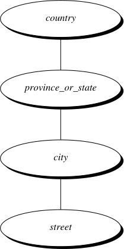

365 distinct values

3567 distinct values

674,339 distinct values

**Figure 3.13** Automatic generation of a schema concept hierarchy based on the number of distinct
attribute values.

relevant attributes in the hierarchy specification. For example, instead of including
all of the hierarchically relevant attributes for _location_, the user may have specified
only _street_ and _city_ . To handle such partially specified hierarchies, it is important to
embed data semantics in the database schema so that attributes with tight semantic
connections can be pinned together. In this way, the specification of one attribute
may trigger a whole group of semantically tightly linked attributes to be “dragged in”
to form a complete hierarchy. Users, however, should have the option to override this
feature, as necessary.

**Example 3.8 Concept hierarchy generation using prespecified semantic connections.** Suppose that
a data mining expert (serving as an administrator) has pinned together the five attributes _number, street, city, province_ _or_ _state_, and _country_, because they are closely linked
semantically regarding the notion of _location_ . If a user were to specify only the attribute
_city_ for a hierarchy defining _location_, the system can automatically drag in all five semantically related attributes to form a hierarchy. The user may choose to drop any of
these attributes (e.g., _number_ and _street_ ) from the hierarchy, keeping _city_ as the lowest
conceptual level.

In summary, information at the schema level and on attribute–value counts can be
used to generate concept hierarchies for nominal data. Transforming nominal data with
the use of concept hierarchies allows higher-level knowledge patterns to be found. It
allows mining at multiple levels of abstraction, which is a common requirement for data
mining applications.

**120** Chapter 3 _Data Preprocessing_

**[Summary]**
## 3.6

**Data quality** is defined in terms of _accuracy, completeness, consistency, timeliness,_
_believability_, and _interpretabilty_ . These qualities are assessed based on the intended
use of the data.

**Data cleaning** routines attempt to fill in missing values, smooth out noise while
identifying outliers, and correct inconsistencies in the data. Data cleaning is usually
performed as an iterative two-step process consisting of discrepancy detection and
data transformation.

**Data integration** combines data from multiple sources to form a coherent data
store. The resolution of semantic heterogeneity, metadata, correlation analysis,
tuple duplication detection, and data conflict detection contribute to smooth data
integration.

**Data reduction** techniques obtain a reduced representation of the data while minimizing the loss of information content. These include methods of _dimensionality_
_reduction_, _numerosity reduction_, and _data compression_ . **Dimensionality reduction**
reduces the number of random variables or attributes under consideration. Methods
include _wavelet transforms, principal components analysis, attribute subset selection_,
and _attribute creation_ . **Numerosity reduction** methods use parametric or nonparatmetric models to obtain smaller representations of the original data. Parametric
models store only the model parameters instead of the actual data. Examples
include regression and log-linear models. Nonparamteric methods include histograms, clustering, sampling, and data cube aggregation. **Data compression** methods apply transformations to obtain a reduced or “compressed” representation of
the original data. The data reduction is _lossless_ if the original data can be reconstructed from the compressed data without any loss of information; otherwise, it is
_lossy_ .

**Data transformation** routines convert the data into appropriate forms for mining. For example, in **normalization**, attribute data are scaled so as to fall within a
small range such as 0.0 to 1.0. Other examples are **data discretization** and **concept**
**hierarchy generation** .

**Data discretization** transforms numeric data by mapping values to interval or concept labels. Such methods can be used to automatically generate _concept hierarchies_
for the data, which allows for mining at multiple levels of granularity. Discretization techniques include binning, histogram analysis, cluster analysis, decision tree
analysis, and correlation analysis. For nominal data, **concept hierarchies** may be
generated based on schema definitions as well as the number of distinct values per
attribute.

Although numerous methods of data preprocessing have been developed, data preprocessing remains an active area of research, due to the huge amount of inconsistent
or dirty data and the complexity of the problem.

3.7 Exercises **121**

**[Exercises]**
## 3.7

**3.1** _Data quality_ can be assessed in terms of several issues, including accuracy, completeness,
and consistency. For each of the above three issues, discuss how data quality assessment can depend on the _intended use_ of the data, giving examples. Propose two other
dimensions of data quality.

**3.2** In real-world data, tuples with _missing values_ for some attributes are a common
occurrence. Describe various methods for handling this problem.

**3.3** Exercise 2.2 gave the following data (in increasing order) for the attribute _age_ : 13, 15,
16, 16, 19, 20, 20, 21, 22, 22, 25, 25, 25, 25, 30, 33, 33, 35, 35, 35, 35, 36, 40, 45, 46,
52, 70.

(a) Use _smoothing by bin means_ to smooth these data, using a bin depth of 3. Illustrate
your steps. Comment on the effect of this technique for the given data.
(b) How might you determine _outliers_ in the data?
(c) What other methods are there for _data smoothing_ ?

**3.4** Discuss issues to consider during _data integration_ .

**3.5** What are the value ranges of the following _normalization methods_ ?

(a) min-max normalization
(b) z-score normalization
(c) z-score normalization using the mean absolute deviation instead of standard deviation
(d) normalization by decimal scaling

**3.6** Use these methods to _normalize_ the following group of data:

200,300,400,600,1000

(a) min-max normalization by setting _min_ = 0 and _max_ = 1
(b) z-score normalization
(c) z-score normalization using the mean absolute deviation instead of standard deviation
(d) normalization by decimal scaling

**3.7** Using the data for _age_ given in Exercise 3.3, answer the following:

(a) Use min-max normalization to transform the value 35 for _age_ onto the range

[0.0,1.0].
(b) Use z-score normalization to transform the value 35 for _age_, where the standard
deviation of _age_ is 12.94 years.
(c) Use normalization by decimal scaling to transform the value 35 for _age_ .
(d) Comment on which method you would prefer to use for the given data, giving
reasons as to why.

**122** Chapter 3 _Data Preprocessing_

**3.8** Using the data for _age_ and _body fat_ given in Exercise 2.4, answer the following:

(a) Normalize the two attributes based on _z-score normalization_ .
(b) Calculate the _correlation coefficient_ (Pearson’s product moment coefficient). Are
these two attributes positively or negatively correlated? Compute their covariance.

**3.9** Suppose a group of 12 _sales price_ records has been sorted as follows:

5,10,11,13,15,35,50,55,72,92,204,215.

Partition them into three bins by each of the following methods:

(a) equal-frequency (equal-depth) partitioning
(b) equal-width partitioning
(c) clustering

**3.10** Use a flowchart to summarize the following procedures for _attribute subset selection_ :

(a) stepwise forward selection
(b) stepwise backward elimination
(c) a combination of forward selection and backward elimination

**3.11** Using the data for _age_ given in Exercise 3.3,

(a) Plot an equal-width histogram of width 10.
(b) Sketch examples of each of the following sampling techniques: SRSWOR, SRSWR,
cluster sampling, and stratified sampling. Use samples of size 5 and the strata
“youth,” “middle-aged,” and “senior.”

**3.12** ChiMerge [Ker92] is a supervised, bottom-up (i.e., merge-based) _data discretization_
method. It relies on _χ_ [2] analysis: Adjacent intervals with the least _χ_ [2] values are merged
together until the chosen stopping criterion satisfies.

(a) Briefly describe how ChiMerge works.
(b) Take the IRIS data set, obtained from the University of California–Irvine Machine
Learning Data Repository ( _www.ics.uci.edu/_ ∼ _mlearn/MLRepository.html_ ), as a data
set to be discretized. Perform data discretization for each of the four numeric
attributes using the ChiMerge method. (Let the stopping criteria be: _max-interval_
= 6). You need to write a small program to do this to avoid clumsy numerical
computation. Submit your simple analysis and your test results: split-points, final
intervals, and the documented source program.

**3.13** Propose an algorithm, in pseudocode or in your favorite programming language, for the
following:

(a) The automatic generation of a concept hierarchy for nominal data based on the
number of distinct values of attributes in the given schema.
(b) The automatic generation of a concept hierarchy for numeric data based on the
_equal-width_ partitioning rule.

3.8 Bibliographic Notes **123**

(c) The automatic generation of a concept hierarchy for numeric data based on the
_equal-frequency_ partitioning rule.

**3.14** Robust data loading poses a challenge in database systems because the input data are
often dirty. In many cases, an input record may miss multiple values; some records
could be _contaminated_, with some data values out of range or of a different data type
than expected. Work out an automated _data cleaning and loading_ algorithm so that the
erroneous data will be marked and contaminated data will not be mistakenly inserted
into the database during data loading.

**[Bibliographic Notes]**
## 3.8

Data preprocessing is discussed in a number of textbooks, including English [Eng99],
Pyle [Pyl99], Loshin [Los01], Redman [Red01], and Dasu and Johnson [DJ03]. More
specific references to individual preprocessing techniques are given later.
For discussion regarding data quality, see Redman [Red92]; Wang, Storey, and
Firth [WSF95]; Wand and Wang [WW96]; Ballou and Tayi [BT99]; and Olson [Ols03].
Potter’s Wheel ( _control.cx.berkely.edu/abc_ ), the interactive data cleaning tool described in
Section 3.2.3, is presented in Raman and Hellerstein [RH01]. An example of the development of declarative languages for the specification of data transformation operators is
given in Galhardas et al. [GFS [+] 01]. The handling of missing attribute values is discussed
in Friedman [Fri77]; Breiman, Friedman, Olshen, and Stone [BFOS84]; and Quinlan

[Qui89]. Hua and Pei [HP07] presented a heuristic approach to cleaning _disguised miss-_
_ing data_, where such data are captured when users falsely select default values on forms
(e.g., “January 1” for _birthdate_ ) when they do not want to disclose personal information.
A method for the detection of outlier or “garbage” patterns in a handwritten character database is given in Guyon, Matic, and Vapnik [GMV96]. Binning and data
normalization are treated in many texts, including Kennedy et al. [KLV [+] 98], Weiss
and Indurkhya [WI98], and Pyle [Pyl99]. Systems that include attribute (or feature)
construction include BACON by Langley, Simon, Bradshaw, and Zytkow [LSBZ87];
Stagger by Schlimmer [Sch86]; FRINGE by Pagallo [Pag89]; and AQ17-DCI by Bloedorn and Michalski [BM98]. Attribute construction is also described in Liu and Motoda

[LM98a, LM98b]. Dasu et al. built a BELLMAN system and proposed a set of interesting
methods for building a data quality browser by mining database structures [DJMS02].
A good survey of data reduction techniques can be found in Barbar´a et al. [BDF [+] 97].
For algorithms on data cubes and their precomputation, see Sarawagi and Stonebraker

[SS94]; Agarwal et al. [AAD [+] 96]; Harinarayan, Rajaraman, and Ullman [HRU96]; Ross
and Srivastava [RS97]; and Zhao, Deshpande, and Naughton [ZDN97]. Attribute subset selection (or _feature subset selection_ ) is described in many texts such as Neter, Kutner,
Nachtsheim, and Wasserman [NKNW96]; Dash and Liu [DL97]; and Liu and Motoda

[LM98a, LM98b]. A combination forward selection and backward elimination method

**124** Chapter 3 _Data Preprocessing_

was proposed in Siedlecki and Sklansky [SS88]. A wrapper approach to attribute selection is described in Kohavi and John [KJ97]. Unsupervised attribute subset selection is
described in Dash, Liu, and Yao [DLY97].
For a description of wavelets for dimensionality reduction, see Press, Teukolosky, Vetterling, and Flannery [PTVF07]. A general account of wavelets can be found in Hubbard

[Hub96]. For a list of wavelet software packages, see Bruce, Donoho, and Gao [BDG96].
Daubechies transforms are described in Daubechies [Dau92]. The book by Press et al.

[PTVF07] includes an introduction to singular value decomposition for principal components analysis. Routines for PCA are included in most statistical software packages
such as SAS ( _www.sas.com/SASHome.html_ ).
An introduction to regression and log-linear models can be found in several
textbooks such as James [Jam85]; Dobson [Dob90]; Johnson and Wichern [JW92];
Devore [Dev95]; and Neter, Kutner, Nachtsheim, and Wasserman [NKNW96]. For loglinear models (known as _multiplicative models_ in the computer science literature), see
Pearl [Pea88]. For a general introduction to histograms, see Barbar´a et al. [BDF [+] 97]
and Devore and Peck [DP97]. For extensions of single-attribute histograms to multiple
attributes, see Muralikrishna and DeWitt [MD88] and Poosala and Ioannidis [PI97].
Several references to clustering algorithms are given in Chapters 10 and 11 of this book,
which are devoted to the topic.
A survey of multidimensional indexing structures is given in Gaede and G¨unther

[GG98]. The use of multidimensional index trees for data aggregation is discussed in
Aoki [Aok98]. Index trees include R-trees (Guttman [Gut84]), quad-trees (Finkel and
Bentley [FB74]), and their variations. For discussion on sampling and data mining, see
Kivinen and Mannila [KM94] and John and Langley [JL96].
There are many methods for assessing attribute relevance. Each has its own bias. The
information gain measure is biased toward attributes with many values. Many alternatives have been proposed, such as gain ratio (Quinlan [Qui93]), which considers the
probability of each attribute value. Other relevance measures include the Gini index
(Breiman, Friedman, Olshen, and Stone [BFOS84]), the _χ_ [2] contingency table statistic, and the uncertainty coefficient (Johnson and Wichern [JW92]). For a comparison
of attribute selection measures for decision tree induction, see Buntine and Niblett

[BN92]. For additional methods, see Liu and Motoda [LM98a], Dash and Liu [DL97],
and Almuallim and Dietterich [AD91].
Liu et al. [LHTD02] performed a comprehensive survey of data discretization
methods. Entropy-based discretization with the C4.5 algorithm is described in Quinlan [Qui93]. In Catlett [Cat91], the D-2 system binarizes a numeric feature recursively.
ChiMerge by Kerber [Ker92] and Chi2 by Liu and Setiono [LS95] are methods for the
automatic discretization of numeric attributes that both employ the _χ_ [2] statistic. Fayyad
and Irani [FI93] apply the minimum description length principle to determine the number of intervals for numeric discretization. Concept hierarchies and their automatic
generation from categorical data are described in Han and Fu [HF94].

##### **Data Warehousing and Online** **Analytical Processing**
# **4**

**Data warehouses generalize** and consolidate data in multidimensional space. The construction
of data warehouses involves data cleaning, data integration, and data transformation,
and can be viewed as an important preprocessing step for data mining. Moreover, data
warehouses provide _online analytical processing (OLAP)_ tools for the interactive analysis
of multidimensional data of varied granularities, which facilitates effective data generalization and data mining. Many other data mining functions, such as association,
classification, prediction, and clustering, can be integrated with OLAP operations to
enhance interactive mining of knowledge at multiple levels of abstraction. Hence, the
data warehouse has become an increasingly important platform for data analysis and
OLAP and will provide an effective platform for data mining. Therefore, data warehousing and OLAP form an essential step in the knowledge discovery process. This chapter
presents an overview of data warehouse and OLAP technology. This overview is essential
for understanding the overall data mining and knowledge discovery process.
In this chapter, we study a well-accepted definition of the data warehouse and see
why more and more organizations are building data warehouses for the analysis of
their data (Section 4.1). In particular, we study the _data cube_, a multidimensional data
model for data warehouses and OLAP, as well as OLAP operations such as roll-up, drilldown, slicing, and dicing (Section 4.2). We also look at data warehouse design and
usage (Section 4.3). In addition, we discuss _multidimensional data mining_, a powerful paradigm that integrates data warehouse and OLAP technology with that of data
mining. An overview of data warehouse implementation examines general strategies
for efficient data cube computation, OLAP data indexing, and OLAP query processing (Section 4.4). Finally, we study data generalization by attribute-oriented induction
(Section 4.5). This method uses concept hierarchies to generalize data to multiple levels
of abstraction.

**[Data Warehouse: Basic Concepts]**
## 4.1

This section gives an introduction to data warehouses. We begin with a definition of the
data warehouse (Section 4.1.1). We outline the differences between operational database

⃝ **Data Mining: Concepts and Techniques** c 2012 Elsevier Inc. All rights reserved. **125**

