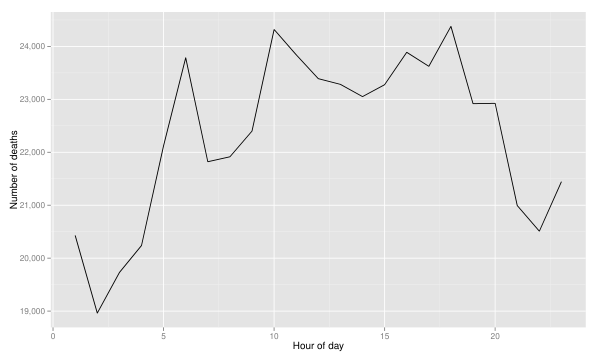
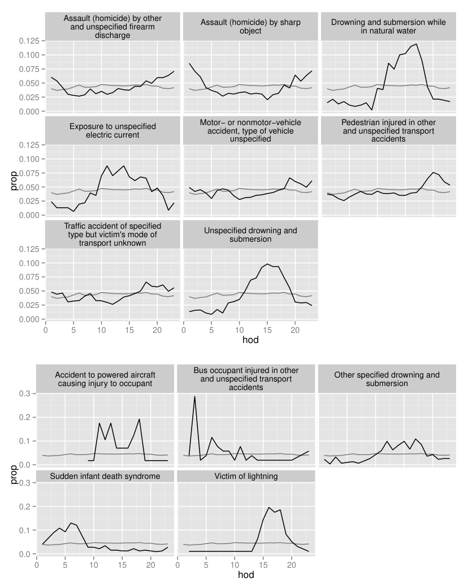

_MMMMMM YYYY, Volume VV, Issue II._ _[http://www.jstatsoft.org/](http://www.jstatsoft.org/)_

## **Tidy Data**


**Hadley Wickham**
RStudio


**Abstract**


A huge amount of effort is spent cleaning data to get it ready for analysis, but there
has been little research on how to make data cleaning as easy and effective as possible.
This paper tackles a small, but important, component of data cleaning: data tidying.
Tidy datasets are easy to manipulate, model and visualise, and have a specific structure:
each variable is a column, each observation is a row, and each type of observational unit
is a table. This framework makes it easy to tidy messy datasets because only a small
set of tools are needed to deal with a wide range of un-tidy datasets. This structure
also makes it easier to develop tidy tools for data analysis, tools that both input and
output tidy datasets. The advantages of a consistent data structure and matching tools
are demonstrated with a case study free from mundane data manipulation chores.


_Keywords_ : data cleaning, data tidying, relational databases, R.

### **1. Introduction**


It is often said that 80% of data analysis is spent on the process of cleaning and preparing
the data (Dasu and Johnson 2003). Data preparation is not just a first step, but must be
repeated many over the course of analysis as new problems come to light or new data is
collected. Despite the amount of time it takes, there has been surprisingly little research
on how to clean data well. Part of the challenge is the breadth of activities it encompasses:
from outlier checking, to date parsing, to missing value imputation. To get a handle on the
problem, this paper focusses on a small, but important, aspect of data cleaning that I call
data **tidying** : structuring datasets to facilitate analysis.


The principles of tidy data provide a standard way to organise data values within a dataset.
A standard makes initial data cleaning easier because you don’t need to start from scratch
and reinvent the wheel every time. The tidy data standard has been designed to facilitate
initial exploration and analysis of the data, and to simplify the development of data analysis
tools that work well together. Current tools often require translation. You have to spend time


2 _Tidy Data_


munging the output from one tool so you can input it into another. Tidy datasets and tidy
tools work hand in hand to make data analysis easier, allowing you to focus on the interesting
domain problem, not on the uninteresting logistics of data.


The principles of tidy data are closely tied to those of relational databases and Codd’s relational algebra (Codd 1990), but are framed in a language familiar to statisticians. Computer
scientists have also contributed much to the study of data cleaning. For example, Lakshmanan, Sadri, and Subramanian (1996) define an extension to SQL to allow it to operate on
messy datasets, Raman and Hellerstein (2001) provide a framework for cleaning datasets, and
Kandel, Paepcke, Hellerstein, and Heer (2011) develop an interactive tool with a friendly user
interface which automatically creates code to clean data. These tools are useful but they are
presented in a language foreign to most statisticians, they fail to give much advice on how
datasets should be structured, and they lack connections to the tools of data analysis.


The development of tidy data has been driven by my experience working with real-world
datasets. With few, if any, constraints on their organisation, such datasets are often constructed in bizarre ways. I have spent countless hours struggling to get such datasets organised in a way that makes data analysis possible, let alone easy. I have also struggled to impart
these skills to my students so they could tackle real-world datasets on their own. In the course
of these struggles I developed the **reshape** and **reshape2** (Wickham 2007) packages. While I
could intuitively use the tools and teach them through examples, I lacked the framework to
make my intuition explicit. This paper provides that framework. It provides a comprehensive
“philosophy of data”: one that underlies my work in the **plyr** (Wickham 2011) and **ggplot2**
(Wickham 2009) packages.


The paper proceeds as follows. Section 2 begins by defining the three characteristics that
make a dataset tidy. Since most real world datasets are not tidy, Section 3 describes the
operations needed to make messy datasets tidy, and illustrates the techniques with a range
of real examples. Section 4 defines tidy tools, tools that input and output tidy datasets,
and discusses how tidy data and tidy tools together can make data analysis easier. These
principles are illustrated with a small case study in Section 5. Section 6 concludes with a
discussion of what this framework misses and what other approaches might be fruitful to
pursue.

### **2. Defining tidy data**


Happy families are all alike; every
unhappy family is unhappy in its own
way


Leo Tolstoy


Like families, tidy datasets are all alike but every messy dataset is messy in its own way. Tidy
datasets provide a standardized way to link the structure of a dataset (its physical layout)
with its semantics (its meaning). In this section, I’ll provide some standard vocabulary for
describing the structure and semantics of a dataset, and then use those definitions to define
tidy data.


_Journal of Statistical Software_ 3


**2.1. Data structure**


Most statistical datasets are rectangular tables made up of **rows** and **columns** . The columns
are almost always labelled and the rows are sometimes labelled. Table 1 provides some data
about an imaginary experiment in a format commonly seen in the wild. The table has two
columns and three rows, and both rows and columns are labelled.


treatmenta treatmentb


John Smith            - 2
Jane Doe 16 11
Mary Johnson 3 1


Table 1: Typical presentation dataset.


There are many ways to structure the same underlying data. Table 2 shows the same data
as Table 1, but the rows and columns have been transposed. The data is the same, but the
layout is different. Our vocabulary of rows and columns is simply not rich enough to describe
why the two tables represent the same data. In addition to appearance, we need a way to
describe the underlying semantics, or meaning, of the values displayed in table.


John Smith Jane Doe Mary Johnson


treatmenta         - 16 3
treatmentb 2 11 1


Table 2: The same data as in Table 1 but structured differently.


**2.2. Data semantics**


A dataset is a collection of **values**, usually either numbers (if quantitative) or strings (if
qualitative). Values are organised in two ways. Every value belongs to a **variable** and an
**observation** . A variable contains all values that measure the same underlying attribute (like
height, temperature, duration) across units. An observation contains all values measured on
the same unit (like a person, or a day, or a race) across attributes.


Table 3 reorganises Table 1 to make the values, variables and obserations more clear. The
dataset contains 18 values representing three variables and six observations. The variables
are:


1. `person`, with three possible values (John, Mary, and Jane).


2. `treatment`, with two possible values (a and b).


3. `result`, with five or six values depending on how you think of the missing value (-, 16,
3, 2, 11, 1).


The experimental design tells us more about the structure of the observations. In this experiment, every combination of of `person` and `treatment` was measured, a completely crossed
design. The experimental design also determines whether or not missing values can be safely


4 _Tidy Data_


dropped. In this experiment, the missing value represents an observation that should have
been made, but wasn’t, so it’s important to keep it. Structural missing values, which represent
measurements that can’t be made (e.g., the count of pregnant males) can be safely removed.


name trt result


John Smith a               Jane Doe a 16
Mary Johnson a 3
John Smith b 2
Jane Doe b 11
Mary Johnson b 1


Table 3: The same data as in Table 1 but with variables in columns and observations in rows.


For a given dataset, it’s usually easy to figure out what are observations and what are variables,
but it is surprisingly difficult to precisely define variables and observations in general. For
example, if the columns in the Table 1 were `height` and `weight` we would have been happy
to call them variables. If the columns were `height` and `width`, it would be less clear cut, as
we might think of height and width as values of a `dimension` variable. If the columns were
`home phone` and `work phone`, we could treat these as two variables, but in a fraud detection
environment we might want variables `phone number` and `number type` because the use of one
phone number for multiple people might suggest fraud. A general rule of thumb is that it is
easier to describe functional relationships between variables (e.g., `z` is a linear combination
of `x` and `y`, `density` is the ratio of `weight` to `volume` ) than between rows, and it is easier
to make comparisons between groups of observations (e.g., average of group a vs. average of
group b) than between groups of columns.


In a given analysis, there may be multiple levels of observation. For example, in a trial of new
allergy medication we might have three observational types: demographic data collected from
each person ( `age`, `sex`, `race` ), medical data collected from each person on each day ( `number`
`of sneezes`, `redness of eyes` ), and meterological data collected on each day ( `temperature`,
`pollen count` ).


**2.3. Tidy data**


Tidy data is a standard way of mapping the meaning of a dataset to its structure. A dataset is
messy or tidy depending on how rows, columns and tables are matched up with observations,
variables and types. In **tidy data** :


1. Each variable forms a column.


2. Each observation forms a row.


3. Each type of observational unit forms a table.


This is Codd’s 3rd normal form (Codd 1990), but with the constraints framed in statistical
language, and the focus put on a single dataset rather than the many connected datasets
common in relational databases. **Messy data** is any other other arrangement of the data.


_Journal of Statistical Software_ 5


Table 3 is the tidy version of Table 1. Each row represents an observation, the `result` of one
`treatment` on one `person`, and each column is a variable.


Tidy data makes it easy for an analyst or a computer to extract needed variables because it
provides a standard way of structuring a dataset. Compare Table 3 to Table 1: in Table 1
you need to use different strategies to extract different variables. This slows analysis and
invites errors. If you consider how many data analysis operations involve all of the values in a
variable (every aggregation function), you can see how important it is to extract these values
in a simple, standard way. Tidy data is particularly well suited for vectorised programming
languages like R, because the layout ensures that values of different variables from the same
observation are always paired.


While the order of variables and observations does not affect analysis, a good ordering makes
it easier to scan the raw values. One way of organising variables is by their role in the analysis:
are values fixed by the design of the data collection, or are they measured during the course of
the experiment? Fixed variables describe the experimental design and are known in advance.
Computer scientists often call fixed variables dimensions, and statisticians usually denote them
with subscripts on random variables. Measured variables are what we actually measure in the
study. Fixed variables should come first, followed by measured variables, each ordered so that
related variables are contiguous. Rows can then be ordered by the first variable, breaking
ties with the second and subsequent (fixed) variables. This is the convention adopted by all
tabular displays in this paper.

### **3. Tidying messy datasets**


Real datasets can, and often do, violate the three precepts of tidy data in almost every way
imaginable. While occasionally you do get a dataset that you can start analysing immediately,
this is the exception, not the rule. This section describes the five most common problems
with messy datasets, along with their remedies:


  - Column headers are values, not variable names.


  - Multiple variables are stored in one column.


  - Variables are stored in both rows and columns.


  - Multiple types of observational units are stored in the same table.


  - A single observational unit is stored in multiple tables.


Surprisingly, most messy datasets, including types of messiness not explicitly described above,
can be tidied with a small set of tools: melting, string splitting, and casting. The following
sections illustrate each problem with a real dataset that I have encountered, and show how
to tidy them. The complete datasets and the R code used to tidy them are available online
at `[https://github.com/hadley/tidy-data](https://github.com/hadley/tidy-data)`, and in the online supplementary materials for
this paper.


**3.1. Column headers are values, not variable names**


A common type of messy dataset is tabular data designed for presentation, where variables
form both the rows and columns, and column headers are values, not variable names. While


6 _Tidy Data_


I would call this arrangement messy, in some cases it can be extremely useful. It provides
efficient storage for completely crossed designs, and it can lead to extremely efficient computation if desired operations can be expressed as matrix operations. This issue is discussed in
depth in Section 6.


Table 4 shows a subset of a typical dataset of this form. This dataset explores the relationship
between income and religion in the US. It comes from a report [1] produced by the Pew Research
Center, an American think-tank that collects data on attitudes to topics ranging from religion
to the internet, and produces many reports that contain datasets in this format.


religion _<_ $10k $10-20k $20-30k $30-40k $40-50k $50-75k


Agnostic 27 34 60 81 76 137
Atheist 12 27 37 52 35 70
Buddhist 27 21 30 34 33 58
Catholic 418 617 732 670 638 1116
Don’t know/refused 15 14 15 11 10 35
Evangelical Prot 575 869 1064 982 881 1486
Hindu 1 9 7 9 11 34
Historically Black Prot 228 244 236 238 197 223
Jehovah’s Witness 20 27 24 24 21 30
Jewish 19 19 25 25 30 95


Table 4: The first ten rows of data on income and religion from the Pew Forum. Three columns,
`$75-100k`, `$100-150k` and `>150k`, have been omitted


This dataset has three variables, `religion`, `income` and `frequency` . To tidy it, we need
to **melt**, or stack it. In other words, we need to turn columns into rows. While this is
often described as making wide datasets long or tall, I will avoid those terms because they are
imprecise. Melting is parameterised by a list of columns that are already variables, or **colvar** s
for short. The other columns are converted into two variables: a new variable called `column`
that contains repeated column headings and a new variable called `value` that contains the
concatenated data values from the previously separate columns. This is illustrated in Table 5
with a toy dataset. The result of melting is a **molten** dataset.


The Pew dataset has one colvar, `religion`, and melting yields Table 6. To better reflect
their roles in this dataset, the `variable` column has been renamed to `income`, and the `value`
column to `freq` . This form is tidy because each column represents a variable and each row
represents an observation, in this case a demographic unit corresponding to a combination of
`religion` and `income` .


Another common use of this data format is to record regularly spaced observations over time.
For example, the Billboard dataset shown in Table 7 records the date a song first entered the
Billboard Top 100. It has variables for `artist`, `track`, `date.entered`, `rank` and `week` . The
rank in each week after it enters the top 100 is recorded in 75 columns, `wk1` to `wk75` . If a song
is in the Top 100 for less than 75 weeks the remaining columns are filled with missing values.
This form of storage is not tidy, but it is useful for data entry. It reduces duplication since


1 `[http://religions.pewforum.org/pdf/comparison-Income%20Distribution%20of%20Religious%](http://religions.pewforum.org/pdf/comparison-Income%20Distribution%20of%20Religious%20Traditions.pdf)`
```
20Traditions.pdf

```

_Journal of Statistical Software_ 7


row column value


row a b c


A 1 4 7
B 2 5 8
C 3 6 9


(a) Raw data


A a 1
B a 2
C a 3
A b 4
B b 5
C b 6
A c 7
B c 8
C c 9


(b) Molten data


Table 5: A simple example of melting. (a) is melted with one colvar, row, yielding the molten dataset
(b). The information in each table is exactly the same, just stored in a different way.


religion income freq


Agnostic _<_ $10k 27
Agnostic $10-20k 34
Agnostic $20-30k 60
Agnostic $30-40k 81
Agnostic $40-50k 76
Agnostic $50-75k 137
Agnostic $75-100k 122
Agnostic $100-150k 109
Agnostic _>_ 150k 84
Agnostic Don’t know/refused 96


Table 6: The first ten rows of the tidied Pew survey dataset on income and religion. The `column` has
been renamed to `income`, and `value` to `freq` .


8 _Tidy Data_


otherwise each song in each week would need its own row, and song metadata like title and
artist would need to be repeated. This issue will be discussed in more depth in Section 3.4.


year artist track time date.entered wk1 wk2 wk3


2000 2 Pac Baby Don’t Cry 4:22 2000-02-26 87 82 72
2000 2Ge+her The Hardest Part Of ... 3:15 2000-09-02 91 87 92
2000 3 Doors Down Kryptonite 3:53 2000-04-08 81 70 68
2000 98 `^` 0 Give Me Just One Nig... 3:24 2000-08-19 51 39 34
2000 A*Teens Dancing Queen 3:44 2000-07-08 97 97 96
2000 Aaliyah I Don’t Wanna 4:15 2000-01-29 84 62 51
2000 Aaliyah Try Again 4:03 2000-03-18 59 53 38
2000 Adams, Yolanda Open My Heart 5:30 2000-08-26 76 76 74


Table 7: The first eight Billboard top hits for 2000. Other columns not shown are `wk4`, `wk5`, ..., `wk75` .


This dataset has colvars `year`, `artist`, `track`, `time`, and `date.entered` . Melting yields
Table 8. I have also done a little cleaning as well as tidying: `column` has been converted to
`week` by extracting the number, and `date` has been computed from `date.entered` and `week` .


year artist time track date week rank


2000 2 Pac 4:22 Baby Don’t Cry 2000-02-26 1 87
2000 2 Pac 4:22 Baby Don’t Cry 2000-03-04 2 82
2000 2 Pac 4:22 Baby Don’t Cry 2000-03-11 3 72
2000 2 Pac 4:22 Baby Don’t Cry 2000-03-18 4 77
2000 2 Pac 4:22 Baby Don’t Cry 2000-03-25 5 87
2000 2 Pac 4:22 Baby Don’t Cry 2000-04-01 6 94
2000 2 Pac 4:22 Baby Don’t Cry 2000-04-08 7 99
2000 2Ge+her 3:15 The Hardest Part Of ... 2000-09-02 1 91
2000 2Ge+her 3:15 The Hardest Part Of ... 2000-09-09 2 87
2000 2Ge+her 3:15 The Hardest Part Of ... 2000-09-16 3 92
2000 3 Doors Down 3:53 Kryptonite 2000-04-08 1 81
2000 3 Doors Down 3:53 Kryptonite 2000-04-15 2 70
2000 3 Doors Down 3:53 Kryptonite 2000-04-22 3 68
2000 3 Doors Down 3:53 Kryptonite 2000-04-29 4 67
2000 3 Doors Down 3:53 Kryptonite 2000-05-06 5 66


Table 8: First fifteen rows of the tidied billboard dataset. The `date` column does not appear in the
original table, but can be computed from `date.entered` and `week` .


**3.2. Multiple variables stored in one column**


After melting, the `column` variable names often becomes a combination of multiple underlying
variable names. This is illustrated by the tuberculosis (TB) dataset, a sample of which is
shown in Table 9. This dataset comes from the World Health Organisation, and records
the counts of confirmed tuberculosis cases by `country`, `year`, and demographic group. The
demographic groups are broken down by `sex` (m, f) and `age` (0–14, 15–25, 25–34, 35–44,


_Journal of Statistical Software_ 9


45–54, 55–64, unknown).


country year m014 m1524 m2534 m3544 m4554 m5564 m65 mu f014


AD 2000 0 0 1 0 0 0 0  -  AE 2000 2 4 4 6 5 12 10  - 3
AF 2000 52 228 183 149 129 94 80  - 93
AG 2000 0 0 0 0 0 0 1  - 1
AL 2000 2 19 21 14 24 19 16  - 3
AM 2000 2 152 130 131 63 26 21 - 1
AN 2000 0 0 1 2 0 0 0  - 0
AO 2000 186 999 1003 912 482 312 194  - 247
AR 2000 97 278 594 402 419 368 330  - 121
AS 2000  -  -  -  - 1 1  -  -  

Table 9: Original TB dataset. Corresponding to each ‘m’ column for males, there is also an ‘f’ column
for females, `f1524`, `f2534` and so on. These are not shown to conserve space. Note the mixture of 0s
and missing values (—). This is due to the data collection process and the distinction is important for
this dataset.


Column headers in this format are often separated by some character ( `.`, `-`, `_`, `:` ). While the
string can be broken into pieces using that character as a divider, in other cases, such as for
this dataset, more careful string processing is required. For example, the variable names can
be matched to a lookup table that converts single compound value into multiple component
values.


Table 10(a) shows the results of melting the TB dataset, and Table 10(b) shows the results
of splitting the single column `column` into two real variables: `age` and `sex` .


Storing the values in this form resolves another problem in the original data. We want to
compare rates, not counts. But to compute rates, we need to know the population. In the
original format, there is no easy way to add a population variable. It has to be stored in a
separate table, which makes it hard to correctly match populations to counts. In tidy form,
adding variables for population and rate is easy. They are just additional columns.


**3.3. Variables are stored in both rows and columns**


The most complicated form of messy data occurs when variables are stored in both rows and
columns. Table 11 shows daily weather data from the Global Historical Climatology Network
for one weather station (MX17004) in Mexico for five months in 2010. It has variables in
individual columns ( `id`, `year`, `month` ), spread across columns ( `day`, d1–d31) and across rows
( `tmin`, `tmax` ) (minimum and maximum temperature). Months with less than 31 days have
structural missing values for the last day(s) of the month. The `element` column is not a
variable; it stores the names of variables.


To tidy this dataset we first melt it with colvars `id`, `year`, `month` and the column that contains
variable names, `element` . This yields Table 12(a). For presentation, we have dropped the
missing values, making them implicit rather than explicit. This is permissible because we know
how many days are in each month and can easily reconstruct the explicit missing values.


This dataset is mostly tidy, but we have two variables stored in rows: `tmin` and `tmax`, the


10 _Tidy Data_


country year column cases


AD 2000 m014 0
AD 2000 m1524 0
AD 2000 m2534 1
AD 2000 m3544 0
AD 2000 m4554 0
AD 2000 m5564 0
AD 2000 m65 0
AE 2000 m014 2
AE 2000 m1524 4
AE 2000 m2534 4
AE 2000 m3544 6
AE 2000 m4554 5
AE 2000 m5564 12
AE 2000 m65 10
AE 2000 f014 3


(a) Molten data


country year sex age cases


AD 2000 m 0-14 0
AD 2000 m 15-24 0
AD 2000 m 25-34 1
AD 2000 m 35-44 0
AD 2000 m 45-54 0
AD 2000 m 55-64 0
AD 2000 m 65+ 0
AE 2000 m 0-14 2
AE 2000 m 15-24 4
AE 2000 m 25-34 4
AE 2000 m 35-44 6
AE 2000 m 45-54 5
AE 2000 m 55-64 12
AE 2000 m 65+ 10
AE 2000 f 0-14 3


(b) Tidy data


Table 10: Tidying the TB dataset requires first melting, and then splitting the `column` column into
two variables: `sex` and `age` .


type of observation. Not shown in this example are the other meteorological variables `prcp`
(precipitation) and `snow` (snowfall). Fixing this requires the cast, or unstack, operation. This
performs the inverse of melting by rotating the `element` variable back out into the columns
(Table 12(b)). This form is tidy. There is one variable in each column, and each row represents
a day’s observations. The cast operation is described in depth in Wickham (2007).


**3.4. Multiple types in one table**


Datasets often involve values collected at multiple levels, on different types of observational
units. During tidying, each type of observational unit should be stored in its own table. This
is closely related to the idea of database normalisation, where each fact is expressed in only
one place. If this is not done, it’s possible for inconsistencies to occur.


The Billboard dataset described in Table 8 actually contains observations on two types of
observational units: the song and its rank in each week. This manifests itself through the
duplication of facts about the song: `artist` and `time` are repeated for every song in each
week. The billboard dataset needs to be broken down into two datasets: a song dataset
which stores `artist`, `song name` and `time`, and a ranking dataset which gives the `rank` of
the `song` in each `week` . Table 13 shows these two datasets. You could also imagine a week
dataset which would record background information about the week, maybe the total number
of songs sold or similar demographic information.


Normalisation is useful for tidying and eliminating inconsistencies. However, there are few
data analysis tools that work directly with relational data, so analysis usually also requires
denormalisation or the merging the datasets back into one table.


_Journal of Statistical Software_ 11


id year month element d1 d2 d3 d4 d5 d6 d7 d8


MX17004 2010 1 tmax   -   -   -   -   -   -   -   MX17004 2010 1 tmin   -   -   -   -   -   -   -   MX17004 2010 2 tmax   - 27.3 24.1   -   -   -   -   MX17004 2010 2 tmin   - 14.4 14.4   -   -   -   -   MX17004 2010 3 tmax   -   -   -   - 32.1   -   -   MX17004 2010 3 tmin   -   -   -   - 14.2   -   -   MX17004 2010 4 tmax   -   -   -   -   -   -   -   MX17004 2010 4 tmin   -   -   -   -   -   -   -   MX17004 2010 5 tmax   -   -   -   -   -   -   -   MX17004 2010 5 tmin   -   -   -   -   -   -   -   

Table 11: Original weather dataset. There is a column for each possible day in the month. Columns
`d9` to `d31` have been omitted to conserve space.


id date element value


MX17004 2010-01-30 tmax 27.8
MX17004 2010-01-30 tmin 14.5
MX17004 2010-02-02 tmax 27.3
MX17004 2010-02-02 tmin 14.4
MX17004 2010-02-03 tmax 24.1
MX17004 2010-02-03 tmin 14.4
MX17004 2010-02-11 tmax 29.7
MX17004 2010-02-11 tmin 13.4
MX17004 2010-02-23 tmax 29.9
MX17004 2010-02-23 tmin 10.7


(a) Molten data


id date tmax tmin


MX17004 2010-01-30 27.8 14.5
MX17004 2010-02-02 27.3 14.4
MX17004 2010-02-03 24.1 14.4
MX17004 2010-02-11 29.7 13.4
MX17004 2010-02-23 29.9 10.7
MX17004 2010-03-05 32.1 14.2
MX17004 2010-03-10 34.5 16.8
MX17004 2010-03-16 31.1 17.6
MX17004 2010-04-27 36.3 16.7
MX17004 2010-05-27 33.2 18.2


(b) Tidy data


Table 12: (a) Molten weather dataset. This is almost tidy, but instead of values, the `element` column
contains names of variables. Missing values are dropped to conserve space. (b) Tidy weather dataset.
Each row represents the meteorological measurements for a single day. There are two measured
variables, minimum ( `tmin` ) and maximum ( `tmax` ) temperature; all other variables are fixed.


12 _Tidy Data_


id artist track time


1 2 Pac Baby Don’t Cry 4:22
2 2Ge+her The Hardest Part Of ... 3:15
3 3 Doors Down Kryptonite 3:53
4 3 Doors Down Loser 4:24
5 504 Boyz Wobble Wobble 3:35
6 98 `^` 0 Give Me Just One Nig... 3:24
7 A*Teens Dancing Queen 3:44
8 Aaliyah I Don’t Wanna 4:15
9 Aaliyah Try Again 4:03
10 Adams, Yolanda Open My Heart 5:30
11 Adkins, Trace More 3:05
12 Aguilera, Christina Come On Over Baby 3:38
13 Aguilera, Christina I Turn To You 4:00
14 Aguilera, Christina What A Girl Wants 3:18
15 Alice Deejay Better Off Alone 6:50


id date rank


1 2000-02-26 87
1 2000-03-04 82
1 2000-03-11 72
1 2000-03-18 77
1 2000-03-25 87
1 2000-04-01 94
1 2000-04-08 99
2 2000-09-02 91
2 2000-09-09 87
2 2000-09-16 92
3 2000-04-08 81
3 2000-04-15 70
3 2000-04-22 68
3 2000-04-29 67
3 2000-05-06 66


Table 13: Normalised billboard dataset split up into song dataset (left) and rank dataset (right). First
15 rows of each dataset shown; `genre` omitted from song dataset, `week` omitted from rank dataset.


**3.5. One type in multiple tables**


It’s also common to find data values about a single type of observational unit spread out over
multiple tables or files. These tables and files are often split up by another variable, so that
each represents a single year, person, or location. As long as the format for individual records
is consistent, this is an easy problem to fix:


1. Read the files into a list of tables.


2. For each table, add a new column that records the original file name (because the file
name is often the value of an important variable).


3. Combine all tables into a single table.


The **plyr** package makes this a straightforward task in R. The following code generates a
vector of file names in a directory ( `data/` ) which match a regular expression (ends in `.csv` ).
Next we name each element of the vector with the name of the file. We do this because **plyr**
will preserve the names in the following step, ensuring that each row in the final data frame
is labelled with its source. Finally, `ldply()` loops over each path, reading in the csv file and
combining the results into a single data frame.

```
R> paths <- dir("data", pattern = "\\.csv$", full.names = TRUE)
R> names(paths) <- basename(paths)
R> ldply(paths, read.csv, stringsAsFactors = FALSE)

```

Once you have a single table, you can perform additional tidying as needed. An example of
this type of cleaning can be found at `[https://github.com/hadley/data-baby-names](https://github.com/hadley/data-baby-names)` which


_Journal of Statistical Software_ 13


takes 129 yearly baby name tables provided by the US Social Security Administration and
combines them into a single file.


A more complicated situation occurs when the dataset structure changes over time. For
example, the datasets may contain different variables, the same variables with different names,
different file formats, or different conventions for missing values. This may require you to tidy
each file to individually (or, if you’re lucky, in small groups) and then combine them once
tidied. An example of this type of tidying is illustrated in `[https://github.com/hadley/](https://github.com/hadley/data-fuel-economy)`
`[data-fuel-economy](https://github.com/hadley/data-fuel-economy)`, which shows the tidying of epa fuel economy data for over 50,000 cars
from 1978 to 2008. The raw data is available online, but each year is stored in a separate file
and there are four major formats with many minor variations, making tidying this dataset a
considerable challenge.

### **4. Tidy tools**


Once you have a tidy dataset, what can you do with it? Tidy data is only worthwhile if it
makes analysis easier. This section discusses tidy tools, tools that take tidy datasets as input
and return tidy datasets as output. Tidy tools are useful because the output of one tool
can be used as the input to another. This allows you to simply and easily compose multiple
tools to solve a problem. Tidy data also ensures that variables are stored in a consistent,
explicit manner. This makes each tool simpler, because it doesn’t need a Swiss Army knife
of parameters for dealing with different dataset structures.


Tools can be messy for two reasons: either they take messy datasets as input (messy-input
tools) or they produce messy datasets as output (messy-output tools). Messy-input tools are
typically more complicated than tidy-input tools because they need to include some parts of
the tidying process. This can be useful for common types of messy datasets, but it typically
makes the function more complex, harder to use and harder to maintain. Messy-output tools
are frustrating and slow down analysis because they can not be easily composed and you must
constantly think about how to convert from one format to another. We’ll see examples of
both in the following sections.


Next, I give examples of tidy and messy tools for three important components of analysis:
data manipulation, visualisation and modelling. I will focus particularly on tools provided by
R (R Development Core Team 2011), because it has many existing tidy tools, but I will also
touch on other statistical programming environments.


**4.1. Manipulation**


Data manipulation includes variable-by-variable transformation (e.g., `log` or `sqrt` ), as well as
aggregation, filtering and reordering. In my experience, these are the four fundamental verbs
of data manipulation:


  - Filter: subsetting or removing observations based on some condition.


  - Transform: adding or modifying variables. These modifications can involve either a
single variable (e.g., log-transformation), or multiple variables (e.g., computing density
from weight and volume).


14 _Tidy Data_


  - Aggregate: collapsing multiple values into a single value (e.g., by summing or taking
means).


  - Sort: changing the order of observations.


All these operations are made easier when there is a consistent way to refer to variables. Tidy
data provides this because each variable resides in its own column.


In R, filtering and transforming are performed by the base R functions `subset()` and `transform()` .
These are input and output-tidy. The `aggregate()` function performs group-wise aggregation. It is input-tidy. Provided that a single aggregation method is used, it is also output-tidy
. The **plyr** package provides tidy `summarise()` and `arrange()` functions for aggregation and
sorting.


The four verbs can be, and often are, modified by the “by” preposition. We often need groupwise aggregates, transformations and subsets, to pick the biggest in each group, to average
over replicates and so on. Combining each of the four verbs with a by operator allows them
to operate on subsets of a data frame at a time. Most SAS procs possess a by statement
which allows the operation to be performed by group, and are generally input-tidy. Base R
possesses a `by()` function, which is input-tidy, but not output-tidy, because it produces a list.
The `ddply()` function from the **plyr** package is a tidy alternative.


Other tools are needed when we have multiple datasets. An advantage of tidy data is the ease
with which it can be combined with other tidy datasets. All that is needed is a join operator
that works by matching common variables and adding new columns. This is implemented in
the `merge()` function in base R, or the `join()` function in **plyr** . Compare these operators with
the difficulty of combining datasets stored in arrays. This task typically requires painstaking
alignment before matrix operations can be used, which can can make errors very hard to
detect.


**4.2. Visualisation**


Tidy visualisation tools only need to be input-tidy as their output is visual. Domain specific
languages work particularly well for the visualisation of tidy datasets because they can describe
a visualisation as a mapping between variables and aesthetic properties of the graph (e.g.,
position, size, shape and colour). This is the idea behind the grammar of graphics (Wilkinson
2005), and the layered grammar of graphics (Wickham 2010), an extension tailored specifically
for R.


Most graphical tools in R are input-tidy, including the **base** `plot()` function, the **lattice**
family of plots (Sarkar 2008) and **ggplot2** (Wickham 2009). Some specialised tools exist for
visualising messy datasets. Some base R functions like `barplot()`, `matplot()`, `dotchart()`,
and `mosaicplot()`, work with messy datasets where variables are spread out over multiple
columns. Similarly, the parallel coordinates plot (Wegman 1990; Inselberg 1985) can be used
to create time series plots for messy datasets where each time point is a column.


**4.3. Modelling**


Modelling is the driving inspiration of this work because most modelling tools work best with
tidy datasets. Every statistical language has a way of describing a model as a connection
among different variables, a domain specific language that connects responses to predictors:


_Journal of Statistical Software_ 15


id variable value


id x y


1 22.19 24.05
2 19.82 22.91
3 19.81 21.19
4 17.49 18.59
5 19.44 19.85


(a) Data for paired t-test


1 x 22.19
2 x 19.82
3 x 19.81
4 x 17.49
5 x 19.44
1 y 24.05
2 y 22.91
3 y 21.19
4 y 18.59
5 y 19.85


(b) Data for mixed effects
model


Table 14: Two data sets for performing the same test.


  - R ( `lm()` ): `y ~ a + b + c * d` .


  - SAS ( `PROC GLM` ): `y = a + b + c + d + c * d` .


  - SPSS ( `glm` ): `y BY a b c d / DESIGN a b c d c * d` .


  - Stata ( `regress` ): `y a b c#d` .


This is not to say that tidy data is the format used internally to compute the regression.
Significant transformations take place to produce a numeric matrix that can easily be fed
to standard linear algebra routines. Common transformations include adding an intercept
column (a column of ones), turning categorical variables into multiple binary dummy variables,
and projecting data onto the appropriate basis of a spline function.


There have been some attempts to adapt modelling functions for specific types of messy
datasets. For example, in SAS’s `proc glm`, multiple variables on the response side of the
equation will be interpreted as repeated measures if the repeated keyword is present. For
the raw Billboard data, we could construct a model of the form `wk1-wk76 = track` instead
of `rank = week * track` on the tidy data.


Another interesting example is the classic paired t-test, which can be computed in two ways
depending on how the data is stored. If the data is stored as in Table 14(a), then a paired
t-test is just a t-test applied to the mean difference between x and y. If it is stored in the form
of Table 14(b), then an equivalent result can be produced by fitting a mixed effects model,
with a fixed dummy variable representing the `variable`, and a random intercept for each
id. (In R’s lmer4 notation, this is expressed as `value ~ variable + (1 | id)` ). Either way
of modelling the data yields the same result. Without more information we can’t say which
form of the data is tidy: if x and y represent length of left and right arms, then Table 14(a)
is tidy, if x and y represent measurements on day 1 and day 10, then Table 14(b) is tidy.


While model inputs usually require tidy inputs, such attention to detail doesn’t carry over
to model outputs. Outputs such as predictions and estimated coefficients aren’t always tidy.


16 _Tidy Data_


This makes it more difficult to combine results from multiple models. For example, in R, the
default representation of model coefficients is not tidy because it does not have an explicit
variable that records the variable name for each estimate, they are instead recorded as row
names. In R, row names must be unique, so combining coefficients from many models (e.g.,
from bootstrap resamples, or subgroups) requires workarounds to avoid losing important
information. This knocks you out of the flow of analysis and makes it harder to combine
the results from multiple models. I’m not currently aware of any packages that resolve this
problem.

### **5. Case study**


The following case study illustrates how tidy data and tidy tools make data analysis easier
by easing the transitions between manipulation, visualisation and modelling. You will not see
any code that exists solely to get the output of one function into the right format to input to
another. I’ll show the R code that performs the analysis, but even if you’re not familiar with
R or the exact idioms I use, I’ve tried to make it easy to understand by tightly interleaving
code, results and explanation.


The case study uses individual-level mortality data from Mexico. The goal is to find causes
of death with unusual temporal patterns within a day. Figure 1 shows the temporal pattern,
the number of deaths per hour, for all causes of death. My goal is to find the diseases that
differ most from this pattern.





Figure 1: Temporal pattern of all causes of death.


The full dataset has information on 539,530 deaths in Mexico in 2008 and 55 variables,
including the the location and time of death, the cause of death, and demographics of the
deceased. Table 15 shows a small sample of the dataset, focussing on variables related to time
of death ( `year`, `month`, `day` and `hour` ), and cause of death ( `cod` ).


To achieve our goal of finding unusual temporal patterns, we do the following. First, we count
the number of deaths in each hour ( `hod` ) for each cause ( `cod` ) with the tidy `count` function.

```
R> hod2 <- count(deaths, c("hod", "cod"))

```

_Journal of Statistical Software_ 17


yod mod dod hod cod


2008 1 1 1 B20
2008 1 2 4 I67
2008 1 3 8 I50
2008 1 4 12 I50
2008 1 5 16 K70
2008 1 6 18 I21
2008 1 7 20 I21
2008 1 8              - K74
2008 1 10 5 K74
2008 1 11 9 I21
2008 1 12 15 I25
2008 1 13 20 R54
2008 1 15 2 I61
2008 1 16 7 I21
2008 1 17 13 I21


Table 15: A sample of 16 rows and 5 columns from the original dataset of 539,530 rows and 55 columns.


Then we remove missing (and hence uninformative for our purpose) values with `subset` .

```
R> hod2 <- subset(hod2, !is.na(hod))

```

This gives Table 16(a). To provide informative labels for disease, we next join the dataset to
the `codes` dataset, connected by the `cod` variable. This adds a new variable, `disease`, shown
in Table 16(b).

```
R> hod2 <- join(hod2, codes, by = "cod")

```

The total deaths for each cause varies over several orders of magnitude: there are 46,794
deaths from heart attack but only 10 from avalanche. This means that rather than the total
number, it makes more sense to compare the proportion of deaths in each hour. We compute
this by breaking the dataset down by `cod`, and then `transform()` ing to add a new `prop`
column, the hourly frequency divided by the total number of deaths from that cause. This
new column is Table 16(c).


`ddply()` breaks down the first argument ( `hod2` ) by its second (the `cod` variable), and then
applies the third argument ( `transform` ) to each resulting piece. The fourth argument ( `prop`
`= freq / sum(freq)` ) is then passed on to `transform()` .

```
R> hod2 <- ddply(hod2, "cod", transform, prop = freq / sum(freq))

```

We then compute the overall average death rate for each hour, and merge that back into the
original dataset. This yields Table 16(d). By comparing `prop` to `prop_all`, we can easily
compare each disease with the overall incidence pattern.


First, we work out the number of people dying each hour. We break down `hod2` by `hod`, and
compute the total for each cause of death.


18 _Tidy Data_

```
R> overall <- ddply(hod2, "hod", summarise, freq_all = sum(freq))

```

Next, we work out the overall proportion of people dying each hour:

```
R> overall <- transform(overall, prop_all = freq_all / sum(freq_all))

```

Finally, we join the overall dataset with the individual dataset to make it easier to compare
the two:

```
R> hod2 <- join(hod2, overall, by = "hod")

```


hod cod freq


8 B16 4
8 E84 3
8 I21 2205
8 N18 315
9 B16 7
9 E84 1
9 I21 2209
9 N18 333
10 B16 10
10 E84 7
10 I21 2434
10 N18 343
11 B16 6
11 E84 3
11 I21 2128


(a)


disease


Acute hepatitis B
Cystic fibrosis
Acute myocardial infarction
Chronic renal failure
Acute hepatitis B
Cystic fibrosis
Acute myocardial infarction
Chronic renal failure
Acute hepatitis B
Cystic fibrosis
Acute myocardial infarction
Chronic renal failure
Acute hepatitis B
Cystic fibrosis
Acute myocardial infarction


(b)


prop


0.04
0.03
0.05
0.04
0.07
0.01
0.05
0.04
0.10
0.07
0.05
0.04
0.06
0.03
0.05


(c)


fre ~~q a~~ ll pro ~~p a~~ ll


21915 0.04
21915 0.04
21915 0.04
21915 0.04
22401 0.04
22401 0.04
22401 0.04
22401 0.04
24321 0.05
24321 0.05
24321 0.05
24321 0.05
23843 0.05
23843 0.05
23843 0.05


(d)


Table 16: A sample of four diseases and four hours from `hod2` data frame.


Next we compute a distance between the temporal pattern of each cause of death and the
overall temporal pattern. There are many ways to measure this distance, but I found a simple
mean squared deviation to be revealing. We also record the sample size, the total number of
deaths from that cause. To ensure that the diseases we consider are sufficiently representative
we’ll only work with diseases with more than 50 total deaths ( _∼_ 2/hour).

```
R> devi <- ddply(hod2, "cod", summarise,
R> n = sum(freq),
R> dist = mean((prop - prop_all)^2))
R>
R> devi <- subset(devi, n > 50)

```

We don’t know the variance characteristics of this estimator, but we can explore it visually
by plotting `n` vs. `deviation`, Figure 2(a). On a linear scale, the plot shows little, except that


_Journal of Statistical Software_ 19


variability decreases with sample size. But on the log-log scale, Figure 2(b), there is a clear
pattern. This is particularly easy to see the pattern when we add the line of best fit from a
robust linear model.

```
R> ggplot(data = devi, aes(x = n, y = dist) + geom_point()
R>
R> last_plot() +
R> scale_x_log10() +
R> scale_y_log10() +
R> geom_smooth(method = "rlm", se = F)

```

0.006


0.004


0.002


0.001


0.0001


0.00001


|Col1|Col2|Col3|
|---|---|---|
|~~G~~<br>~~G~~|||
|~~G~~<br>|||
||||
|G|||
|~~G~~<br>~~G~~<br>~~G~~<br> ~~G~~<br><br><br><br>G<br>~~G~~<br>G<br>~~G~~<br>G<br>~~G~~<br>G<br>G<br>G<br><br>G|||
|G<br><br><br><br>~~G~~<br>~~**G**~~<br>~~G~~<br>G<br> <br>~~G~~<br><br>~~G~~<br>~~G~~<br>~~G ~~<br>~~G~~<br>G<br><br><br>~~G~~<br><br>G<br>~~G~~<br>~~G~~<br>~~G~~<br>~~G~~<br><br><br>~~G~~<br>~~G~~<br>G<br>~~G~~<br>~~G~~<br>~~G~~<br>G<br>G<br><br>G<br>~~G~~<br>G<br><br>~~G~~<br><br>~~G~~<br>~~G~~<br>~~G~~<br>~~G~~<br>~~G~~|||
|~~G~~<br>~~G~~<br><br>~~G~~<br> ~~G~~<br>~~G~~<br><br><br>~~G~~<br>~~G~~<br>~~G G~~<br>G<br>~~G~~<br>~~G~~<br><br>~~G~~<br>~~G~~<br>G<br><br><br><br>~~G~~<br>G<br>~~G~~<br><br>~~G~~<br><br>G<br>~~G~~<br>G<br>~~G~~<br>G<br>~~G~~<br>G<br><br><br>G<br><br>G<br><br>~~G~~<br><br><br><br>~~G~~<br><br>G<br><br>~~G~~|||
|G<br><br><br>G<br>~~G~~<br>~~G~~<br>~~G~~<br>~~G ~~<br><br>~~G~~<br>G<br><br>~~G~~<br><br><br>~~G~~<br><br><br><br><br><br><br>~~G~~<br>~~G~~<br>**G**<br>~~G~~<br>G<br>G<br><br>~~G~~<br>G<br>~~G~~<br>~~G~~<br>G<br><br><br>G<br>G<br>G<br>~~G~~<br>~~G~~<br>G<br>G<br><br>G<br>~~G~~<br>~~G~~<br>G<br>G<br>~~**G**~~<br><br>|||
|~~G~~<br>G<br><br>~~G~~<br><br>G<br><br>G<br><br>G<br>G<br>G<br>~~G~~<br>~~G~~<br>~~**G**~~<br>G<br><br>G<br><br><br>G<br>G<br>G<br><br><br>G<br>G<br>G<br>~~G~~<br>G<br>G<br><br><br><br><br>~~G~~<br>~~G~~<br>**G**<br><br>G<br>G<br>~~G~~<br>G<br>G<br>G<br>G<br>G<br>G<br>~~G~~<br>G<br>G<br>G<br>G<br><br>G<br><br><br>G<br>~~G~~<br>~~G~~<br>G|G||
|G<br><br>G<br>G<br><br>G<br>G<br>G<br><br>~~G~~<br>G<br>~~G~~<br>G<br>G<br>~~G~~<br><br>G<br><br>G<br>G<br><br>~~G~~<br>G<br>G<br>G<br>~~G~~<br>G<br>G<br>G<br>~~G~~<br>G<br>~~G~~<br>G<br>G<br><br><br>G<br>G<br><br>G<br>G<br>~~G~~<br>G<br>G<br><br><br>G<br>~~G~~<br>G<br>G<br>G<br>~~G~~<br>G<br><br><br>G G<br><br>G<br>G<br>~~G~~<br>~~G~~<br>G<br>G<br>G<br>G<br><br>G<br>G<br>G<br>G<br><br><br>~~G~~|||
|~~G~~<br>~~G~~<br>G<br>G<br>G<br>~~G~~<br>G<br>G<br>~~G~~<br>~~G~~<br>G<br>~~G~~<br>~~G~~<br><br>~~G~~<br>G<br>G<br>G<br>G<br>~~G~~<br><br>G<br>G<br><br>~~G~~<br>G<br>G<br>G<br>G<br>G<br>G<br>~~**G**~~<br>~~G~~<br>G<br>G<br>**G**<br>~~G~~<br>G<br>G<br>~~G~~<br><br>G<br>G<br>G<br>G<br><br>G<br>G<br>~~G~~<br>~~G~~<br>G<br>G<br>G<br><br>~~G~~<br>G<br>G<br>G<br>G<br>G<br>G<br>G<br>~~G~~<br>G<br>G<br>~~G~~<br>G<br>G<br><br><br>G<br>G<br>G<br>G<br>~~G~~<br>G<br>G<br>G<br><br>G<br>~~G~~<br>G<br><br>G<br>G<br>G<br>G<br>G<br>~~G~~<br>G<br><br>~~G~~|G<br><br>G<br>G<br>~~G~~||
|~~G~~<br><br><br>G<br>~~G~~<br>~~G~~<br><br>~~G~~<br>~~G~~<br>~~G~~<br>~~G~~<br>G ~~G~~<br>~~G~~<br>~~G~~<br>~~G~~<br>~~G~~<br>G<br>G <br>~~G~~<br>~~G~~<br><br>~~G~~<br>G<br>~~G~~<br><br>~~G~~<br>G<br>G<br>~~G~~<br>~~G~~<br><br>~~G~~<br>~~G~~<br>G<br><br><br>~~G~~<br>~~G~~<br>G<br>~~G~~<br>~~G~~<br><br>~~G~~|~~G~~<br>~~G~~||
|G<br><br><br><br> <br><br><br><br> ~~G~~<br><br><br><br><br><br>~~G~~<br>~~G~~<br>~~G~~<br>G<br>~~G~~<br>~~G~~<br><br>G<br>|~~G~~<br><br>G<br>~~G~~<br>||
|G<br>~~G~~<br><br>G<br>~~G~~<br>G<br>~~G~~<br>~~G~~<br><br>G<br>~~G~~<br>~~G~~<br>G<br>G<br><br><br><br><br>G<br><br><br>G<br>G|~~G~~<br><br><br>~~G~~<br><br>G||
|~~G~~<br><br><br>G<br><br>~~G~~<br><br><br><br>~~G~~<br><br>~~G~~<br>~~G~~<br>G|~~G~~<br>~~G~~<br>~~G~~<br><br>~~G~~<br><br><br><br><br><br>~~G~~<br>G||
|G<br>~~G~~<br><br><br>~~G~~<br>|~~G~~<br><br>~~G~~<br>G<br>G<br>G<br>G<br><br><br><br>G<br><br>G<br><br><br>G<br>~~G~~<br><br>G<br>G<br>G<br><br>G<br>G||
||G<br><br>G<br>~~G~~<br>~~G~~<br>G<br>G<br><br>~~G~~<br>~~G~~<br>G<br>~~G~~<br>~~G~~<br>~~G~~<br>~~G~~<br>G<br>G<br>~~G~~<br>G<br>~~G~~<br>G<br>~~G~~<br>G<br>~~G~~<br>~~G~~<br>G<br>G<br><br>G||
||~~G~~<br><br><br>~~G~~<br>G<br><br>~~G~~||
||~~G~~||
||G||
||G<br>G||
||~~G~~<br><br>||


|G<br>G|Col2|Col3|Col4|Col5|Col6|Col7|Col8|Col9|
|---|---|---|---|---|---|---|---|---|
|G|||||||||
||||||||||
|G|||||||||
|G<br>G<br>G<br>G<br>G<br>|||||||||
|G<br>**G**<br>**G**<br>**G**<br>~~G~~<br>**G**<br>~~**G**~~<br>**GG**<br>**G**<br>~~G~~<br>**G**<br>**G**<br>**G**<br>**G**<br>~~**G**~~<br>**G**<br>**G**<br>~~**G**~~<br>**G**<br>G<br>**G**<br>**G**<br>**G**<br>**GG**<br>**G**<br>**G**<br><br>**G**<br>~~**G**~~<br>**G**<br>G<br>**G**<br>~~**G**~~<br>**G**<br>G<br>**G**<br>**G**<br>**GG**<br>G<br>~~G~~<br>~~**G**~~<br>**G**<br>**G**<br>**G**<br><br>**G**<br>**G**<br>**GG**<br>**G**<br>G<br>G ~~G~~<br>~~**G**~~<br>**G**<br>**G**<br>**G**<br>**G**<br>**G**<br>**G**<br>~~G~~<br>**G**<br>**G**<br>**G**<br>~~**G**~~<br>~~G~~<br>~~G~~<br>G<br>**G**<br>~~G~~<br>G<br>~~G~~<br>**G**<br>G<br>G<br>**G**<br>**GG**<br>G<br>**G**<br>**G**<br>~~**G**~~<br>**G**<br>G<br>**G**<br>**G**<br>~~G~~<br>**G**<br>~~G~~<br><br>G<br>G<br>GG<br>G<br>~~G~~<br>**G**<br>G<br>~~**G**~~<br>**G**<br>**G**<br>~~G~~<br>G<br>~~G~~<br>**G**<br>G<br>**G**<br>**G**<br>G<br>**G**<br>**G**<br>G<br>G<br>G<br>G<br>**G**<br>G<br>G<br>**G**<br>G<br>G G<br>G<br>G<br>~~G~~<br>G<br>G<br>G<br>G<br>G<br>G<br>~~G~~<br>G<br>G<br>G<br>G<br>G<br>G<br><br>G<br>G<br>GG<br>G<br>G<br>G<br>G<br>G<br>G<br>G<br>G|~~G~~<br><br>~~**G**~~<br><br><br><br>~~G~~<br><br>~~G~~<br>~~G~~<br>~~G~~<br>G|~~**G**~~<br>~~G~~|~~G~~||~~G~~|||~~G~~|


0 10000 20000 30000 40000
n


(a) Linear scales


100 1000 10000
n


(b) Log scales


Figure 2: (a) Plot of n vs deviation. Variability of deviation is dominated by sample size: small
samples have large variability. (b) Log-log plot makes it easy to see the pattern of variation as well as
unusually high values. The blue line is a robust line of best fit.


We are interested in points that have high _y_ -values, relative to their _x_ -neighbours. Controlling
for the number of deaths, these points represent the diseases which depart the most from the
overall pattern.


To find these unusual points, we fit a robust linear model and plot the residuals, Figure 3.
The plot shows an empty region around a residual of 1.5. So somewhat arbitrarily, we’ll select
those diseases with a residual greater than 1.5. We do this in two steps: first, we select the
appropriate rows from `devi` (one row per disease), and then we find the matching temporal
course information from the original summary dataset (24 rows per disease).

```
R> devi$resid <- resid(rlm(log(dist) ~ log(n), data = devi))
R> unusual <- subset(devi, resid > 1.5)
R> hod_unusual <- match_df(hod2, unusual)

```

20 _Tidy Data_


3


2


1


0


−1


G


|Col1|Col2|Col3|Col4|Col5|Col6|Col7|Col8|G|Col10|Col11|Col12|Col13|G|Col15|Col16|Col17|Col18|Col19|Col20|Col21|Col22|Col23|Col24|Col25|Col26|
|---|---|---|---|---|---|---|---|---|---|---|---|---|---|---|---|---|---|---|---|---|---|---|---|---|---|
||G||||||G||||||G||G<br>|G||||||||||
||G||||||G|G||||||G||||||||||||
||G||G||G|G||||G<br>G|||G||G|||||||||G||
|||G<br>G<br>~~G~~||G<br>G<br><br>G<br>~~G~~<br>G<br>G<br>G<br>|G<br>~~G~~<br>G<br><br>G<br><br>G<br>G<br>G|G|G<br>G|~~G~~<br>G<br>G<br>~~G~~||G<br>G|G<br><br>||G<br>G|G|G|||||G|G|||||
|<br><br><br><br>|G<br>G<br><br>G<br><br>G<br>~~G~~<br>G<br>~~G~~<br>~~G~~<br>G|G<br>G<br>G<br><br>G<br><br><br>~~G~~<br>G<br>|G<br><br>G<br><br><br>G<br>G<br>G<br><br><br>G|G<br>G<br>~~G~~<br>G<br><br>G<br><br>G<br><br>G<br><br>G<br><br><br><br>~~G~~<br><br>G<br>|G<br>G<br>G<br>G<br>G<br><br>G<br>~~G~~<br>G<br>G<br>G<br>G<br>G<br>G<br>~~G~~<br>G<br><br><br>G<br>G<br>G<br><br>G<br><br><br>G<br>G<br>G<br><br>G<br>G<br>G<br>~~G~~<br>G<br>G<br><br><br><br><br>G<br>G<br>G<br>G<br>G<br>G<br>G<br>G<br><br><br>G<br>G<br>G<br>G<br>G<br>G<br>G<br>G<br><br>G<br>G|G<br><br><br>G<br>G<br><br><br>G<br>G<br><br><br>~~G~~<br>G<br><br>~~G~~<br><br>G<br><br>G<br><br>G<br>G<br><br>G<br>G<br>G<br>G<br>G<br>G<br>G<br><br>G|G<br>G<br>G<br>G<br>G<br><br>G<br><br>G<br>G<br><br><br><br>G<br>G|G<br>G<br><br>G<br><br>G<br>|G<br>G<br><br>G|G<br><br>G<br>G|G<br><br><br>G<br>G|G<br>G<br><br><br>G<br><br><br>G<br>G<br>G|G<br>~~G~~<br>G<br>G<br>G<br>G<br>G<br>G<br>G<br>~~G~~<br>G<br><br>G<br>G|G<br>~~G~~<br>|G<br>G<br>G<br>G<br>G<br><br>G|G<br><br><br>~~G~~<br>|G<br>|G|||G|||G||
||G<br>G<br>G<br>~~G~~<br>G<br>G<br>G<br><br>G<br>G<br>G<br><br>G<br>G<br><br>G<br><br><br>G|G<br><br>G<br>G<br><br>G<br><br>~~G~~<br>G<br><br>G<br><br><br>G|G<br><br><br><br>G<br><br>G<br><br>G<br>G<br><br><br><br>G<br>G<br>G<br><br>G<br>G|G<br><br><br>G<br>G<br>G<br><br><br><br>**G**<br>G<br>G<br>G<br><br>G<br><br><br>G<br><br>G<br>**G**<br><br>G<br>|G<br><br>G<br>G<br><br>G<br>~~G~~<br>G<br><br><br>G<br>G<br>G<br>~~G~~<br><br><br>G<br>~~G~~<br>G<br>G<br>G<br><br>~~G~~<br>G<br>G<br>G<br>G<br>G<br>G<br>~~G~~<br><br>G<br><br>G<br>G<br><br>G<br>G<br>G<br>~~G~~<br>G<br>G<br>G<br>G<br><br>G<br>G<br><br>~~G~~<br>G<br>G|G<br>G<br><br><br>G<br>G<br>~~G~~<br>G<br>G<br>G<br><br>G<br><br><br><br><br><br>G<br>G<br>~~G~~<br><br><br><br>G<br><br>~~G~~<br>G<br><br><br>G<br>G|G<br>G<br>G<br>~~G~~<br>**G**<br>G<br><br><br>G<br>G<br><br>G<br>G<br><br>~~G~~<br><br>G<br>G|G<br><br>**G**<br>G<br>G<br><br>G<br><br><br>G<br><br>G|G<br>~~G~~<br><br><br>G<br><br><br>G<br><br><br>G<br>G<br><br>G<br>|~~G~~<br>G<br>G<br><br><br><br>G<br>G<br>G|G<br><br>G<br>G<br>G<br><br><br><br><br>G<br><br>G|~~G~~<br><br>G<br>~~G~~<br>G<br>G<br><br>G|G<br>G<br>G<br>G<br>G<br>G<br>~~G~~<br><br>G<br>G<br>G<br>G<br>G<br><br>G<br>G<br>G<br>G<br><br>G<br>G<br>G<br>G<br>G<br>G<br>|G<br>G<br>G<br>G<br>G<br>G|G<br>G<br>G|G<br>G<br>G<br>G<br>~~G~~<br>G<br><br>||G<br>|G<br>G|G|G<br>G<br>G|G||||
||G|G<br>G<br>G<br>||G<br>|G<br><br>G<br>G<br>G<br>G<br>~~G~~<br>~~G~~|G<br>G<br>G<br>~~G~~<br>G<br>~~G~~|G<br><br>G|~~G~~<br>~~G~~<br>G<br>|G<br><br><br>~~G~~|G<br>G<br>G|G|~~G~~<br>|G<br><br>G<br>G|G|G<br>||~~G~~|||||||||


100 1000 10000
n


Figure 3: Residuals from a robust linear model predicting log( _dist_ ) by log( _n_ ). Horizontal line at 1.5
shows threshold for further exploration.


Finally, we plot the temporal course for each unusual cause, Figure 4. We split the diseases
into two plots because of differences in variability. The top plot shows diseases with over
350 deaths and the bottom with under 350. The causes of death fall into three main groups:
murder, drowning, and transportation related. Murder is more common at night, drowning
in the afternoon, and transportation related deaths during commute times. The pale gray
line in the background shows the temporal course across all diseases.

```
R> ggplot(data = subset(hod_unusual, n > 350), aes(x = hod, y = prop)) +
R> geom_line(aes(y = prop_all), data = overall, colour = "grey50") +
R> geom_line() +
R> facet_wrap(~ disease, ncol = 3)

### **6. Discussion**

```

Data cleaning is an important problem, but it is an uncommon subject of study in statistics.
This paper carves out a small but important subset of data cleaning that I’ve called data
tidying: structuring datasets to facilitate manipulation, visualisation and modelling. There
is still much work to be done. Incremental improvements will happen as our understanding
of tidy data and tidy tools improves, and as we improve our ability to reduce the friction of
getting data into a tidy form.


Bigger improvements may be possible by exploring alternative formulations of tidiness. There
is a chicken-and-egg problem with tidy data: if tidy data is only as useful as the tools that
work with it, then tidy tools will be inextricably linked to tidy data. This makes it easy to get
stuck in a local maxima where independently changing data structures or data tools will not
improve workflow. Breaking out of this local maxima is hard. It requires long-term concerted


_Journal of Statistical Software_ 21





Figure 4: Causes of death with unusual temporal courses. Overall hourly death rate shown in grey.
(Top) Causes of death with more than 350 deaths over a year. (Bottom) Causes of death with fewer
than 350 deaths. Note that the y-axes are on different scales.


22 _Tidy Data_


effort with the prospect of many false starts. While I hope that the tidy data framework is
not one of those false starts, I also don’t see it as the final solution. I hope others will build
on this framework to develop even better data storage strategies and better tools.


Surprisingly, I have found few principles to guide the design of tidy data, which acknowledge
both statistical and cognitive factors. To date, my work has been driven by my experience
doing data analysis, my knowledge of relational database design, and my own rumination on
the tools of data analysis. The human factors, user-centered design, and human-computer
interaction communities may be able to add to this conversation, but the design of data and
tools to work with it has not been an active research topic in those fields. In the future, I
hope to use methodologies from these fields (user-testing, ethnography, talk-aloud protocols)
to improve our understanding of the cognitive side of data analysis, and to further improve
our ability to design appropriate tools.


Other formulations of tidy data are possible. For example, it would be possible to construct
a set of tools for dealing with values stored in multidimensional arrays. This is a common
storage format for large biomedical datasets generated by microarrays or fMRI’s. It’s also
necessary for many multivariate methods based on matrix manipulation. Fortunately, because
there are many efficient tools for working with high-dimensional arrays, even sparse ones,
such an array-tidy format is not only likely to be quite compact and efficient, it should also
be able to easily connect with the mathematical basis of statistics. This, in fact, is the
approach taken by the Pandas python data analysis library (McKinney 2010). Even more
interestingly, we could consider tidy tools that can ignore the underlying data representation
and automatically choose between array-tidy and dataframe-tidy formats to optimise memory
usage and performance.


Apart from tidying, there are many other tasks involved in cleaning data: parsing dates
and numbers, identifying missing values, correcting character encodings (for international
data), matching similar but not identical values (created by typos), verifying experimental
design, and filling in structural missing values, not to mention model-based data cleaning that
identifies suspicious values. Can we develop other frameworks to make these tasks easier?

### **7. Acknowledgements**


This work wouldn’t be possible without the many conversations I’ve had about data and how
to deal with them statistically. I’d particularly like to thank Phil Dixon, Di Cook, and Heike
Hofmann, who have put up with numerous questions over the years. I’d also like to thank the
users of the **reshape** package who have provided many challenging problems, and my students
who continue to challenge me to explain what I know in a way that they can understand. I’d
also like to thank Bob Muenchen, Burt Gunter, Nick Horton and Garrett Grolemund who
gave detailed comments on earlier drafts, and to particularly thank Ross Gayler who provided
the nice example of the challenges of defining a variable and Ben Bolker who showed me the
natural equivalence between a paired t-test and a mixed effects model.

### **References**


Codd EF (1990). _The Relational Model for Database Management: Version 2_ . Addison-Wesley


_Journal of Statistical Software_ 23


Longman Publishing Co., Inc., Boston, MA, USA. ISBN 0-201-14192-2.


Dasu T, Johnson T (2003). _Exploratory Data Mining and Data Cleaning_ . Wiley-IEEE.


Inselberg A (1985). “The Plane with Parallel Coordinates.” _The Visual Computer_, **1**, 69–91.


Kandel S, Paepcke A, Hellerstein J, Heer J (2011). “Wrangler: Interactive Visual Specification
of Data Transformation Scripts.” In _ACM Human Factors in Computing Systems (CHI)_ .
URL `[http://vis.stanford.edu/papers/wrangler](http://vis.stanford.edu/papers/wrangler)` .


Lakshmanan L, Sadri F, Subramanian I (1996). “SchemaSQL-a language for interoperability
in relational multi-database systems.” In _Proceedings of the International Conference on_
_Very Large Data Bases_, pp. 239–250. ISSN 1047-7349.


McKinney W (2010). “Data Structures for Statistical Computing in Python.” In S van der
Walt, J Millman (eds.), _Proceedings of the 9th Python in Science Conference_, pp. 51 – 56.


R Development Core Team (2011). _R: A Language and Environment for Statistical Computing_ .
R Foundation for Statistical Computing, Vienna, Austria. ISBN 3-900051-07-0, URL `[http:](http://www.R-project.org/)`
`[//www.R-project.org/](http://www.R-project.org/)` .


Raman V, Hellerstein J (2001). “Potter’s Wheel: An Interactive Data Cleaning System.” In
_Proceedings of the International Conference on Very Large Data Bases_, pp. 381–390. ISSN
1047-7349.


Sarkar D (2008). _**Lattice**_ _: Multivariate Data Visualization with R_ . Springer-Verlag.


Wegman EJ (1990). “Hyperdimensional Data Analysis Using Parallel Coordinates.” _Journal_
_of the American Statistical Association_, **85** (411), 664–675.


Wickham H (2007). “Reshaping Data with the **Reshape** Package.” _Journal of Statistical_
_Software_, **21** (12), 1–20. URL `[http://www.jstatsoft.org/v21/i12/paper](http://www.jstatsoft.org/v21/i12/paper)` .


Wickham H (2009). _**ggplot2**_ _: Elegant Graphics for Data Analysis_ . useR. Springer-Verlag.


Wickham H (2010). “A Layered Grammar of Graphics.” _Journal of Computational and_
_Graphical Statistics_, **19** (1), 3–28.


Wickham H (2011). “The Split-apply-combine Strategy for Data Analysis.” _Journal of Sta-_
_tistical Software_, **40** (1), 1–29. URL `[http://www.jstatsoft.org/v40/i01/](http://www.jstatsoft.org/v40/i01/)` .


Wilkinson L (2005). _The Grammar of Graphics_ . Statistics and Computing, 2nd edition.
Springer-Verlag.


24 _Tidy Data_


**Affiliation:**


Hadley Wickham
Chief Scientist, RStudio
Adjunct Professor, Rice University
E-mail: `[h.wickham@gmail.com](mailto:h.wickham@gmail.com)`
URL: `[http://had.co.nz](http://had.co.nz)`

#### Journal of Statistical Software http://www.jstatsoft.org/

published by the American Statistical Association `[http://www.amstat.org/](http://www.amstat.org/)`


Volume VV, Issue II _Submitted:_ yyyy-mm-dd
MMMMMM YYYY _Accepted:_ yyyy-mm-dd


